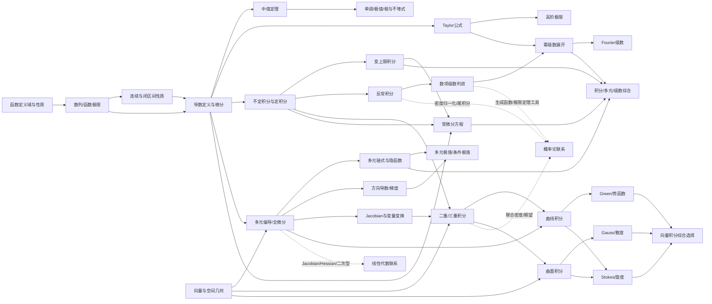

# 考研数学一高等数学全量知识点地图（2026研究版）

> **研究日期：2026年7月20日**  
> **主真题样本：2010—2026，共17套数学（一）试卷；必要时追溯1987—2009经典题。**  
> **本报告编码：官方8模块、教学10章、262个原子知识点、51类题型方法。**  
> 本报告不是官方大纲替代品。“官方明确”取自大纲条文；“真题隐含”“教材边缘”“趋势/频率”均为研究性标注。

## 研究口径、证据等级与限制

1. **范围口径**：以教育部教育考试院编、高等教育出版社出版的大纲体系为最高依据；用可访问的2025详细大纲文本镜像逐条抽取“考试内容/考试要求”；用同济八版教材核验定义和教材边界；用2010—2026真题检验实际命题。
2. **最新性说明**：截至研究日，可核验到2026招生考试管理规定与2026数学一真题；但未检索到教育考试院网站可直接检索的2026数学一详细大纲正文。因此，本报告不把机构“范围完全不变”的宣传当作官方声明，而以官方大纲连续版本、2025详细文本和2026真题交叉判断当前范围。
3. **考频口径**：一道综合题可同时标记“主考点”和多个“工具考点”；故专题次数不是互斥加总。表中“x—y/17”是人工多标签编码后的近似区间，不是教育考试院公布数据。2022公开归档的机读质量较弱，避免对该年做过细次数宣称。
4. **重要度评分**：综合直接频率、分值、跨章复用、前置依赖、失分风险和现行大纲要求。S/A/B/C/D不是官方等级。
5. **现行结构参考**：可访问的2025详细大纲文本显示试卷150分、180分钟，高等数学约60%，题型为10道单选、6道填空、6道解答（含证明）。因此高数通常对应约90分，但每年具体题目归属和分值组合可变化。

# 第一部分：结论摘要

## 1.1 最终结论

**官方口径共有8个高等数学模块**：函数、极限、连续；一元函数微分学；一元函数积分学；向量代数和空间解析几何；多元函数微分学；多元函数积分学；无穷级数；常微分方程。为直接安排复习，本报告把“函数”从极限连续中拆出，把“多元函数积分学”拆成“重积分”和“曲线/曲面积分与向量场”，形成10章。

**最核心的基础节点**不是若干孤立公式，而是：定义域与函数性质、极限与无穷小阶、链式法则、Taylor公式、定积分基本定理、区域几何表示、全微分/Jacobian、正项级数比较、方向与法向约定。它们一旦薄弱，会同时拖累多个章节。

**最容易失分的部分**集中在条件而非最终公式：等价无穷小在和差中的误用；洛必达判型与条件遗漏；中值定理未核验连续/可导/端点；闭区域漏边界和角点；重积分区域或Jacobian写错；Green/Gauss/Stokes方向、闭合性、奇点错误；幂级数端点不逐个判断；微分方程除变量漏特解。

**合理学习顺序**：函数与初等代数 → 极限与连续 → 一元微分 → 一元积分 → 向量与空间几何 → 多元微分 → 重积分 → 曲线/曲面积分 → 无穷级数；常微分方程可在一元积分后先学基础，在变上限积分、多元全微分和级数完成后再学综合。

**时间投入最高的板块**应是：极限/Taylor、中值定理与导数应用、一元积分、多元极值、重积分区域、Green/Gauss及方向、数项/幂级数、ODE分类与综合。曲率、物理应用、二次曲面细节、Euler方程、Fourier、Stokes等直接频率较低，但目标130分以上不能完全放弃。

| 教学章 | 对应官方模块 | 原子点数 | S/A点数 | C层综合点数 | 复习定位 |
| --- | --- | --- | --- | --- | --- |
| 第一章 函数基础 | 函数、极限、连续 | 15 | 13 | 0 | 基础底座 |
| 第二章 极限与连续 | 函数、极限、连续 | 30 | 26 | 4 | 基础底座 |
| 第三章 一元函数微分学 | 一元函数微分学 | 33 | 24 | 6 | 主干高频 |
| 第四章 一元函数积分学 | 一元函数积分学 | 34 | 23 | 5 | 主干高频 |
| 第五章 向量代数与空间解析几何 | 向量代数和空间解析几何 | 19 | 9 | 2 | 空间/多元主干 |
| 第六章 多元函数微分学 | 多元函数微分学 | 27 | 22 | 7 | 空间/多元主干 |
| 第七章 重积分 | 多元函数积分学 | 20 | 16 | 7 | 空间/多元主干 |
| 第八章 曲线积分、曲面积分与向量场 | 多元函数积分学 | 30 | 20 | 9 | 空间/多元主干 |
| 第九章 无穷级数 | 无穷级数 | 30 | 25 | 5 | 综合主干 |
| 第十章 常微分方程 | 常微分方程 | 24 | 18 | 5 | 综合主干 |

## 1.2 A/B/C能力层级

- **A 基础概念与基本计算**：定义、公式、直接判断、标准求导积分和单步运算；要求“看到即会、条件不漏”。
- **B 核心题型与常用方法**：方法选择、常规综合、区域转换、判敛、极值、ODE分类；要求“能独立走完标准流程”。
- **C 综合题与高难度能力**：辅助函数构造、参数临界、证明、不等式、退化情形、三大公式选择和跨章迁移；要求“能识别信号、控制计算、写出条件链”。

本报告分布：A层 **104** 项，B层 **108** 项，C层 **50** 项；重要度S/A/B/C/D分别为 **118/78/34/20/12** 项。

# 第二部分：完整知识点树

下面每个编号都对应总表中的一行，可直接作为独立复习任务。

## 第一章 函数基础

### 函数图像

- **K015｜平移、伸缩、对称与复合图像** `层级A` `重要度B` `口径：真题隐含`：能由基本图像快速得到 $f(ax+b)$、$af(x)+b$、$|f(x)|$、$f(|x|)$。

### 函数性质

- **K004｜有界性** `层级A` `重要度S` `口径：官方明确`：区分上有界、下有界、有界；会由不等式、单调性、连续性判断。
- **K005｜单调性** `层级A` `重要度S` `口径：官方明确`：按定义比较函数值；熟练用导数判定；区分严格与非严格单调。
- **K006｜奇偶性** `层级A` `重要度A` `口径：官方明确`：先检查定义域关于原点对称，再比较 $f(-x)$ 与 $f(x)$。
- **K007｜周期性与最小正周期** `层级A` `重要度B` `口径：官方明确`：会判断和、积、复合函数的周期；理解有周期不必有最小正周期。
- **K008｜复合函数性质** `层级B` `重要度A` `口径：真题隐含`：会判断复合函数的奇偶、单调、周期与有界性。

### 函数概念与表示

- **K001｜函数与对应关系** `层级A` `重要度S` `口径：官方明确`：会从“每个自变量唯一对应函数值”判断是否为函数；区分函数表达式与函数本身。

### 基本初等函数

- **K013｜指数、对数、幂函数** `层级A` `重要度S` `口径：官方明确`：掌握定义域、单调性、图像、基本恒等式及参数影响。
- **K014｜三角与反三角函数** `层级A` `重要度S` `口径：官方明确`：掌握定义域、值域、周期、奇偶、单调区间和基本恒等变换。

### 复合函数与反函数

- **K009｜复合函数** `层级A` `重要度S` `口径：官方明确`：理解复合层次并正确拆解；会处理多层链式结构。
- **K010｜反函数存在性与性质** `层级A` `重要度A` `口径：官方明确`：会用严格单调保证反函数；掌握图像关于 $y=x$ 对称。

### 定义域

- **K002｜基本初等函数定义域** `层级A` `重要度S` `口径：官方明确`：熟练处理分母非零、偶次根号内非负、对数真数正、反三角函数自变量范围。
- **K003｜复合函数定义域** `层级B` `重要度A` `口径：官方明确`：先令内层函数有定义，再要求其值落入外层函数定义域。

### 隐函数与分段函数

- **K011｜隐函数概念** `层级A` `重要度A` `口径：官方明确`：理解方程 $F(x,y)=0$ 何时局部确定 $y=f(x)$。
- **K012｜分段函数** `层级A` `重要度S` `口径：官方明确`：会分别研究各段，并在分界点用极限、函数值、左右导数拼接。

## 第二章 极限与连续

### 函数极限

- **K024｜有限点函数极限的定义** `层级A` `重要度S` `口径：官方明确`：理解去心邻域与函数值无关；会写左右极限定义。
- **K025｜左右极限与双侧极限** `层级A` `重要度S` `口径：官方明确`：会分别计算并用“左右相等”判断双侧极限。
- **K026｜无穷处与无穷函数极限** `层级A` `重要度S` `口径：官方明确`：会处理 $x\to\infty$、$x\to-\infty$ 与 $f(x)\to\infty$ 的定义和运算。
- **K027｜函数极限四则运算与复合极限** `层级A` `重要度S` `口径：官方明确`：会在条件满足时直接代入；识别不能拆分的未定式。

### 基本极限

- **K034｜第一重要极限** `层级A` `重要度S` `口径：官方明确`：掌握 $\lim_{x\to0}\sin x/x=1$ 及其变形。
- **K035｜第二重要极限与 $e$** `层级A` `重要度S` `口径：官方明确`：掌握 $(1+1/n)^n\to e$、$(1+x)^{1/x}\to e$ 及一般化。

### 大纲边界

- **K045｜柯西收敛准则与 Stolz 定理** `层级C` `重要度D` `口径：教材外延/通常不考`：知道它们不是现行数学一大纲明确方法，真题优先用大纲内工具。

### 数列极限

- **K016｜数列极限的 $\varepsilon$-$N$ 定义** `层级A` `重要度A` `口径：官方明确`：能按定义解释“任意精度最终都进入邻域”；会做最基础的定义证明。
- **K017｜收敛数列的唯一性** `层级A` `重要度S` `口径：官方明确`：理解一个数列不可能收敛到两个不同极限。
- **K018｜收敛数列有界性与保号性** `层级A` `重要度S` `口径：官方明确`：掌握收敛必有界；极限为正时充分靠后项为正。
- **K019｜子列与聚点判据** `层级B` `重要度B` `口径：真题隐含`：理解收敛数列任一子列同极限；会用两子列不同极限证明发散。
- **K020｜数列极限四则运算** `层级A` `重要度S` `口径：官方明确`：熟练处理和差积商与常数倍；商法则先检查分母极限非零。
- **K021｜夹逼准则** `层级B` `重要度A` `口径：官方明确`：会构造上下界并证明两端同极限。
- **K022｜单调有界准则** `层级B` `重要度A` `口径：官方明确`：会证明递推数列单调且有界，从而得到收敛性。
- **K023｜递推数列极限** `层级C` `重要度A` `口径：真题隐含`：会用不动点方程求候选，并用单调有界、压缩或夹逼证明存在。

### 无穷小与无穷大

- **K030｜无穷小、无穷大及互为倒数** `层级A` `重要度S` `口径：官方明确`：会在指定过程下判断；区分“无穷小量”与常数0。

### 无穷小比较

- **K031｜同阶、高阶、低阶与等价无穷小** `层级A` `重要度S` `口径：官方明确`：会用比值极限分类，并掌握 $o,O,\sim$ 的含义。
- **K032｜常用等价无穷小** `层级A` `重要度S` `口径：官方明确`：熟记并能推导 $x\to0$ 时三角、指数、对数、根式等价式。
- **K033｜等价无穷小替换规则** `层级B` `重要度S` `口径：真题隐含`：理解等价替换主要安全用于乘积和商；加减结构先提取或展开。

### 极限存在性

- **K028｜函数极限的夹逼准则** `层级B` `重要度S` `口径：官方明确`：会利用绝对值、积分界、三角界构造夹逼。
- **K029｜函数极限的序列判据（海涅定理）** `层级C` `重要度B` `口径：真题隐含`：理解函数极限存在等价于任意趋近点列的函数值都趋同一极限。

### 极限计算方法

- **K036｜代数化简、因式分解与有理化** `层级A` `重要度S` `口径：真题隐含`：会针对 $0/0$ 消去公因子、通分、共轭有理化。
- **K037｜幂指型极限的对数化** `层级B` `重要度A` `口径：真题隐含`：统一处理 $0^0,1^\infty,\infty^0$ 型。

### 连续函数性质

- **K041｜初等函数与复合函数连续性** `层级A` `重要度S` `口径：官方明确`：会在定义域内直接用连续性代入求极限。

### 连续性

- **K038｜函数在一点连续** `层级A` `重要度S` `口径：官方明确`：会用极限等于函数值判断；理解连续包含有定义、极限存在、二者相等。
- **K039｜左连续、右连续与区间连续** `层级A` `重要度A` `口径：官方明确`：会在端点和分段点使用单侧连续。
- **K040｜间断点分类** `层级A` `重要度A` `口径：官方明确`：会区分可去、跳跃、无穷和振荡间断。

### 闭区间定理

- **K042｜有界性与最大最小值定理** `层级A` `重要度S` `口径：官方明确`：理解闭区间连续函数必有界且能取到最大、最小值。
- **K043｜零点定理与介值定理** `层级B` `重要度A` `口径：官方明确`：会通过端点异号证明至少一个零点；会证明函数取某中间值。
- **K044｜一致连续性（教材扩展）** `层级C` `重要度D` `口径：教材有但大纲未单列`：知道闭区间连续蕴含一致连续；一般不作为数学一独立要求。

## 第三章 一元函数微分学

### 中值定理

- **K061｜罗尔定理** `层级B` `重要度S` `口径：官方明确`：会核验闭区间连续、开区间可导、端点等值，并构造辅助函数。
- **K062｜拉格朗日中值定理** `层级B` `重要度S` `口径：官方明确`：会把函数增量写成某点导数乘区间长度。
- **K063｜柯西中值定理** `层级C` `重要度B` `口径：官方明确`：会在两个函数增量比与洛必达证明中使用。
- **K064｜辅助函数构造** `层级C` `重要度S` `口径：真题隐含`：能从目标等式反推导数形式、端点等值或零点条件。

### 大纲边界

- **K078｜曲率中心、渐屈线与方程近似解** `层级C` `重要度D` `口径：教材有但通常不考`：知道同济教材含这些内容，但现行数学一大纲不要求渐屈线、渐伸线、二分法/牛顿迭代。

### 导数与微分概念

- **K046｜导数定义与差商极限** `层级A` `重要度S` `口径：官方明确`：会由定义求导、反推极限、判断不可导点。
- **K047｜左导数、右导数与可导判定** `层级A` `重要度S` `口径：真题隐含`：会分别计算连接点左右导数。
- **K048｜可导与连续关系** `层级A` `重要度S` `口径：官方明确`：掌握可导必连续，连续不必可导，并能给反例。
- **K049｜导数的几何与物理意义** `层级A` `重要度A` `口径：官方明确`：理解切线斜率、瞬时变化率；会写切线与法线。

### 导数应用

- **K070｜单调区间判定** `层级B` `重要度S` `口径：官方明确`：会求定义域、临界点并作导数符号表。
- **K071｜局部极值与必要/充分条件** `层级B` `重要度S` `口径：官方明确`：会用导数符号变化、一二阶条件判断极值。
- **K072｜闭区间最大值最小值** `层级B` `重要度S` `口径：官方明确`：会比较端点、内部驻点和不可导点的函数值。
- **K073｜凹凸性与拐点** `层级B` `重要度A` `口径：官方明确`：会用二阶导号判断图形弯曲方向和拐点。
- **K074｜渐近线** `层级B` `重要度B` `口径：官方明确`：会判水平、垂直、斜渐近线。
- **K075｜函数图形描绘** `层级C` `重要度B` `口径：官方明确`：综合定义域、截距、对称、单调、极值、凹凸、渐近线画草图。

### 微分

- **K059｜可微与微分定义** `层级A` `重要度A` `口径：官方明确`：理解函数增量的线性主部，掌握 $dy=f\prime(x)dx$。
- **K060｜微分运算法则与一阶形式不变性** `层级A` `重要度B` `口径：官方明确`：会用微分形式进行复合计算。

### 曲率

- **K076｜弧微分与曲率公式** `层级B` `重要度C` `口径：官方明确`：会对显函数和参数曲线计算曲率。
- **K077｜曲率圆、曲率半径** `层级C` `重要度C` `口径：官方明确`：知道曲率半径 $\rho=1/\kappa$，了解密切圆概念。

### 求导法则

- **K050｜基本求导公式** `层级A` `重要度S` `口径：官方明确`：熟练默写幂、指数、对数、三角、反三角函数导数。
- **K051｜和差积商求导** `层级A` `重要度S` `口径：官方明确`：熟练处理代数组合并控制化简。
- **K052｜复合函数链式法则** `层级A` `重要度S` `口径：官方明确`：能对多层复合逐层求导并保持结构。
- **K053｜反函数求导** `层级B` `重要度B` `口径：官方明确`：会用原函数导数取倒数并转换自变量。
- **K054｜对数求导与幂指函数求导** `层级B` `重要度A` `口径：真题隐含`：会处理 $u(x)^{v(x)}$、多因子乘除与复杂幂。
- **K055｜隐函数求导（一元）** `层级B` `重要度S` `口径：官方明确`：会对方程两边对 $x$ 求导，视 $y=y(x)$ 并带上 $y\prime$。
- **K056｜参数方程求导** `层级B` `重要度S` `口径：官方明确`：掌握一阶、二阶导数公式，并检查 $dx/dt\ne0$。

### 泰勒公式

- **K067｜Taylor公式与余项** `层级B` `重要度S` `口径：官方明确`：理解局部多项式逼近；会写Peano余项和Lagrange余项。
- **K068｜常用Maclaurin展开** `层级A` `重要度S` `口径：官方明确`：熟记指数、三角、对数、二项式的常用前若干项。
- **K069｜Taylor极限的阶数选择** `层级C` `重要度S` `口径：真题隐含`：根据分母阶数和分子消去情况决定展开深度。

### 洛必达法则

- **K065｜$0/0$ 与 $\infty/\infty$ 型** `层级B` `重要度S` `口径：官方明确`：会核验型态和可导条件，必要时多次使用。
- **K066｜其他未定式的转化** `层级B` `重要度S` `口径：官方明确`：会把 $0\cdot\infty$、$\infty-\infty$、幂指型转为商或对数。

### 高阶导数

- **K057｜高阶导数概念与基本计算** `层级A` `重要度A` `口径：官方明确`：会逐阶求导并识别周期模式。
- **K058｜莱布尼茨公式** `层级B` `重要度B` `口径：真题隐含`：会求乘积的 $n$ 阶导数，特别是一因子为低次多项式时。

## 第四章 一元函数积分学

### 几何应用

- **K106｜平面图形面积** `层级B` `重要度A` `口径：官方明确`：会按上下函数或极坐标计算面积，必要时分段。
- **K107｜旋转体体积与截面体积** `层级B` `重要度B` `口径：官方明确`：掌握圆盘/垫片法、柱壳法和已知截面积积分。
- **K108｜弧长** `层级B` `重要度C` `口径：官方明确`：会计算直角坐标、参数方程和极坐标曲线弧长。
- **K109｜旋转曲面面积** `层级B` `重要度C` `口径：官方明确`：会用弧元乘旋转周长。

### 原函数与不定积分

- **K079｜原函数概念与存在性** `层级A` `重要度A` `口径：官方明确`：理解 $F\prime=f$；区分局部/区间原函数与定积分存在。
- **K080｜不定积分与积分常数** `层级A` `重要度S` `口径：官方明确`：理解全体原函数为 $F(x)+C$。
- **K081｜基本积分公式** `层级A` `重要度S` `口径：官方明确`：熟记幂、指数、三角、反三角型积分。

### 反常积分

- **K101｜无穷区间反常积分定义** `层级A` `重要度A` `口径：官方明确`：会把无穷上限改写为有限上限极限并判收敛。
- **K102｜无界函数反常积分定义** `层级A` `重要度A` `口径：官方明确`：会在瑕点左右分别截断。
- **K103｜$p$ 型反常积分** `层级A` `重要度S` `口径：官方明确`：熟记无穷端和零端两套阈值。
- **K104｜比较判别与极限比较** `层级B` `重要度A` `口径：官方明确`：会选非负标准函数比较局部主导行为。
- **K105｜绝对收敛与条件收敛（反常积分）** `层级C` `重要度C` `口径：真题隐含`：理解绝对收敛推出收敛；振荡积分可能条件收敛。

### 变上限积分

- **K096｜变上限积分函数及连续性** `层级A` `重要度S` `口径：官方明确`：理解 $F(x)=\int_a^x f(t)dt$ 是新函数。
- **K097｜微积分基本定理与Newton–Leibniz公式** `层级A` `重要度S` `口径：官方明确`：掌握“积分与微分互逆”和用原函数算定积分。
- **K098｜复合上下限求导** `层级B` `重要度S` `口径：真题隐含`：会用链式法则处理 $\int_{\alpha(x)}^{\beta(x)} f(t)dt$。
- **K099｜含参数积分求导（Leibniz扩展）** `层级C` `重要度B` `口径：真题隐含/大纲未单列`：知道常用公式及其边界，不把它当现行大纲独立证明点。

### 和式极限

- **K100｜Riemann和极限** `层级B` `重要度A` `口径：真题隐含`：会把等距和式、偏移采样和非标准区间归一化为积分。

### 大纲边界

- **K112｜Beta/Gamma函数与特殊积分** `层级C` `重要度D` `口径：教材外延/通常不考`：知道不是现行数学一明确考点；不需背特殊函数公式。

### 定积分性质

- **K090｜线性、区间可加性与换向** `层级A` `重要度S` `口径：官方明确`：熟练拆区间、合并积分与处理上下限反向。
- **K091｜保序性、绝对值不等式与估计** `层级B` `重要度S` `口径：官方明确`：会由点态不等式得到积分不等式。
- **K092｜积分中值定理** `层级B` `重要度A` `口径：官方明确`：会把连续函数积分写成函数某点值乘区间长度；掌握加权形式。

### 定积分概念

- **K088｜定积分的Riemann和定义** `层级A` `重要度S` `口径：官方明确`：理解分割、取点、最大子区间长度趋零；会识别和式极限。
- **K089｜定积分存在性与可积函数** `层级A` `重要度B` `口径：官方明确`：掌握连续函数可积；区分原函数存在、定积分存在。

### 定积分计算

- **K093｜定积分换元法** `层级B` `重要度S` `口径：官方明确`：会同步换被积函数、微分和上下限；利用对称代换。
- **K094｜定积分分部积分** `层级B` `重要度S` `口径：官方明确`：会保留边界项并处理周期、反常端点。
- **K095｜对称性与周期性公式** `层级B` `重要度S` `口径：真题隐含`：会用奇偶、区间中心对称、周期缩短计算。

### 物理应用

- **K110｜功、液体压力、引力** `层级C` `重要度C` `口径：官方明确`：会按微元法建立一维积分模型。
- **K111｜质心、平均值与力矩** `层级C` `重要度C` `口径：官方明确`：会用加权平均思想列积分。

### 特殊函数积分

- **K085｜有理函数积分** `层级B` `重要度A` `口径：官方明确`：会多项式除法、部分分式分解并积分。
- **K086｜三角有理式积分** `层级B` `重要度B` `口径：官方明确`：掌握万能代换及利用奇偶幂降次。
- **K087｜简单无理函数积分** `层级B` `重要度C` `口径：官方明确`：会通过根式代换把若干简单无理式有理化。

### 积分方法

- **K082｜第一类换元法（凑微分）** `层级B` `重要度S` `口径：官方明确`：识别 $f(\varphi(x))\varphi\prime(x)$ 结构并整体代换。
- **K083｜第二类换元法** `层级B` `重要度A` `口径：官方明确`：会用三角、根式、倒代换消去根号或有理化。
- **K084｜分部积分法** `层级B` `重要度S` `口径：官方明确`：会按“降幂、去对数/反三角、制造递推”选 $u,dv$。

## 第五章 向量代数与空间解析几何

### 二次曲面

- **K128｜常见二次曲面识别** `层级B` `重要度B` `口径：官方明确`：识别椭球、双曲面、椭圆/双曲抛物面、锥面。

### 位置关系

- **K121｜直线与直线、平面与平面关系** `层级B` `重要度B` `口径：官方明确`：会判平行、垂直、相交、异面及夹角。
- **K122｜直线与平面关系及夹角** `层级B` `重要度B` `口径：官方明确`：会由方向向量与法向量点积判断。

### 向量基础

- **K113｜向量坐标、模与单位向量** `层级A` `重要度A` `口径：官方明确`：会由两点求向量、长度、单位化。
- **K114｜线性运算、共线与共面** `层级A` `重要度A` `口径：官方明确`：会用比例关系和线性组合判平行/共面。
- **K118｜方向数与方向余弦** `层级A` `重要度C` `口径：官方明确`：会从方向向量得到方向角余弦，反之构造方向向量。

### 向量运算

- **K115｜数量积与夹角** `层级A` `重要度S` `口径：官方明确`：会求夹角、投影与垂直条件。
- **K116｜向量积** `层级A` `重要度S` `口径：官方明确`：掌握方向、模和行列式计算。
- **K117｜混合积** `层级B` `重要度B` `口径：官方明确`：会判共面并计算平行六面体体积。

### 大纲边界

- **K131｜一般仿射坐标变换与二次曲面分类** `层级C` `重要度D` `口径：教材外延/通常不考`：知道完整主轴变换/矩阵分类属线性代数或解析几何扩展，不是高数常规要求。

### 平面与直线

- **K119｜平面方程** `层级A` `重要度A` `口径：官方明确`：会写点法式、一般式和截距式；从三点求平面。
- **K120｜空间直线方程** `层级A` `重要度A` `口径：官方明确`：会写参数式、对称式和两平面交线式。

### 曲面与曲线

- **K125｜曲面方程与截痕法** `层级A` `重要度A` `口径：官方明确`：理解方程 $F(x,y,z)=0$ 表示曲面；会用坐标平面截痕识别。
- **K126｜旋转曲面** `层级B` `重要度C` `口径：官方明确`：会由平面曲线绕坐标轴旋转写方程。
- **K127｜柱面** `层级A` `重要度B` `口径：官方明确`：理解缺少某变量表示母线平行相应坐标轴。

### 空间曲线

- **K129｜空间曲线的参数方程与一般方程** `层级A` `重要度A` `口径：官方明确`：理解一参数表示曲线；两曲面交线表示一般式。
- **K130｜空间曲线投影** `层级B` `重要度A` `口径：官方明确`：会消元并补充投影柱面/投影区域条件。

### 距离

- **K123｜点到平面与点到直线距离** `层级B` `重要度C` `口径：官方明确`：掌握公式及向量几何推导。
- **K124｜平行平面、平行直线与异面直线距离** `层级C` `重要度C` `口径：官方明确`：会用投影或混合积公式。

## 第六章 多元函数微分学

### 偏导数

- **K137｜一阶偏导数定义与计算** `层级A` `重要度S` `口径：官方明确`：固定其他变量，用一元导数定义求偏导。
- **K138｜高阶偏导与混合偏导** `层级A` `重要度S` `口径：官方明确`：会计算 $f_{xx},f_{xy},f_{yx},f_{yy}$。

### 全局最值

- **K157｜闭区域上的全局极值** `层级C` `重要度S` `口径：真题隐含`：会分别考察内部驻点、边界各段和角点。

### 全微分与可微

- **K139｜全微分定义** `层级A` `重要度S` `口径：官方明确`：理解增量的线性主部和余项按距离高阶。
- **K140｜可微、连续、偏导存在的逻辑关系** `层级A` `重要度S` `口径：官方明确`：掌握可微⇒连续且偏导存在；偏导连续是可微的充分条件。
- **K141｜可微性的定义检验** `层级C` `重要度A` `口径：真题隐含`：会减去线性主部后除以 $\rho$ 求极限。

### 切平面与法线

- **K150｜曲面切平面与法线** `层级B` `重要度S` `口径：官方明确`：会对显式/隐式曲面用梯度作法向量。
- **K151｜空间曲线切线与法平面** `层级B` `重要度A` `口径：官方明确`：会用参数导向量或两个曲面梯度叉积。

### 复合函数求导

- **K142｜一阶链式法则** `层级A` `重要度S` `口径：官方明确`：会画变量依赖图，处理一个或多个中间变量。
- **K143｜二阶复合偏导** `层级C` `重要度A` `口径：官方明确`：会在一阶链式结果上再次求导，包含二阶内层项和交叉项。
- **K144｜全微分形式不变性** `层级B` `重要度B` `口径：官方明确`：会用 $dz=f_u du+f_v dv$ 统一处理变量替换。

### 多元Taylor

- **K152｜二元函数二阶Taylor公式** `层级C` `重要度B` `口径：官方明确`：会在点附近展开到二阶并识别二次型。

### 多元函数基础

- **K132｜多元函数概念、定义域与图形** `层级A` `重要度S` `口径：官方明确`：会求二维/三维定义域并解释二元函数图形为曲面。

### 多元极限与连续

- **K133｜二重极限定义** `层级A` `重要度A` `口径：官方明确`：理解点以任意路径趋近；会用估计证明极限。
- **K134｜路径法否定二重极限** `层级B` `重要度A` `口径：真题隐含`：会选择直线、抛物线或比例路径产生不同极限。
- **K135｜极坐标估计二重极限** `层级B` `重要度S` `口径：真题隐含`：会令 $x=r\cos\theta,y=r\sin\theta$ 并找与角度无关的界。
- **K136｜多元连续性与有界闭区域性质** `层级A` `重要度S` `口径：官方明确`：会用极限等于函数值判断；知道紧区域上连续函数有界并取最值。

### 应用与联系

- **K158｜最小二乘与二次型极值联系** `层级C` `重要度D` `口径：真题隐含/跨学科`：理解平方和极小由正规方程/梯度为零得到，作为线代与高数接口。

### 方向导数与梯度

- **K148｜方向导数定义** `层级A` `重要度A` `口径：官方明确`：会沿单位方向向量参数化并求极限。
- **K149｜梯度及最大方向导数** `层级B` `重要度S` `口径：官方明确`：掌握可微时 $D_\ell f=\nabla f\cdot\ell$；最大值为梯度模。

### 无条件极值

- **K153｜驻点与必要条件** `层级B` `重要度S` `口径：官方明确`：会求梯度为零的驻点，并检查不可偏导点。
- **K154｜二元函数二阶充分条件** `层级B` `重要度S` `口径：官方明确`：掌握判别式 $D=AC-B^2$。
- **K155｜退化驻点与路径判断** `层级C` `重要度C` `口径：真题隐含`：当Hessian判别失效时，会找方向或因式分解判断。

### 条件极值

- **K156｜Lagrange乘数法** `层级B` `重要度S` `口径：官方明确`：会列 $\nabla f=\lambda\nabla g$ 与约束并解候选。

### 隐函数

- **K145｜一个方程确定一个隐函数** `层级B` `重要度S` `口径：官方明确`：掌握存在条件及一阶偏导公式。
- **K146｜方程组确定隐函数组** `层级C` `重要度B` `口径：官方明确`：会用线性方程组或Jacobian求隐函数偏导。
- **K147｜齐次函数与Euler公式** `层级B` `重要度A` `口径：真题隐含`：会识别齐次性并用Euler公式化简偏导关系。

## 第七章 重积分

### 一般变量变换

- **K168｜二重积分一般换元与Jacobian** `层级C` `重要度A` `口径：真题隐含（大纲未单列一般式）`：会在题目暗示下用 $u=u(x,y),v=v(x,y)$ 线性/非线性变换。

### 三重积分概念

- **K170｜三重积分定义与体积/质量意义** `层级A` `重要度A` `口径：官方明确`：理解体积微元求和；常量1的积分为体积。

### 二重积分性质

- **K160｜线性、区域可加与保序性** `层级A` `重要度S` `口径：官方明确`：会拆分区域、利用正负和对称估计。
- **K161｜二重积分中值定理** `层级B` `重要度C` `口径：官方明确`：理解连续函数在区域上的平均值。

### 二重积分概念

- **K159｜二重积分定义与几何/物理意义** `层级A` `重要度S` `口径：官方明确`：理解面积微元上的Riemann和；常量1的积分为区域面积。

### 二重积分综合

- **K169｜参数区域与积分最值** `层级C` `重要度A` `口径：真题隐含`：会把参数视为边界位置，用区域单调性、求导或几何解释优化。

### 几何物理应用

- **K176｜质量、质心与转动惯量** `层级B` `重要度C` `口径：官方明确`：会用密度加权积分统一建模。
- **K177｜引力与场量积分** `层级C` `重要度D` `口径：官方明确`：会写体密度元对指定点的引力分量积分。

### 坐标选择

- **K175｜直角/柱/球坐标的选择** `层级C` `重要度S` `口径：真题隐含`：根据区域对称性与被积函数结构选最简坐标。

### 大纲边界

- **K178｜反常重积分与一般测度论条件** `层级C` `重要度D` `口径：大纲未明确/通常不考`：知道无界区域/奇点重积分不属现行数学一常规核心。

### 极坐标计算

- **K166｜极坐标变换与Jacobian** `层级A` `重要度S` `口径：官方明确`：掌握 $x=r\cos\theta,y=r\sin\theta,dA=rdrd\theta$。
- **K167｜极坐标区域描述** `层级C` `重要度A` `口径：真题隐含`：会处理圆心不在原点、两圆交叠、由极坐标曲线围成区域。

### 柱坐标

- **K173｜柱坐标变换** `层级A` `重要度S` `口径：官方明确`：掌握 $x=r\cos\theta,y=r\sin\theta,z=z,dV=rdrd\theta dz$。

### 球坐标

- **K174｜球坐标变换** `层级B` `重要度A` `口径：官方明确`：掌握坐标约定与体积元。

### 直角坐标三重积分

- **K171｜投影法（先一后二）** `层级B` `重要度A` `口径：官方明确`：会把立体写成 $(x,y)\in D,z_1(x,y)\le z\le z_2(x,y)$。
- **K172｜截面法（先二后一）** `层级B` `重要度A` `口径：官方明确`：会按某坐标切片，利用截面面积或二维积分。

### 直角坐标计算

- **K162｜X型区域上的累次积分** `层级B` `重要度S` `口径：官方明确`：会写 $a\le x\le b,\varphi_1(x)\le y\le\varphi_2(x)$。
- **K163｜Y型区域上的累次积分** `层级B` `重要度S` `口径：官方明确`：会写 $c\le y\le d,\psi_1(y)\le x\le\psi_2(y)$。
- **K164｜改变二重积分次序** `层级C` `重要度S` `口径：官方明确`：会从原积分读区域、作图、重分块、重写边界。
- **K165｜利用对称性计算二重积分** `层级B` `重要度S` `口径：真题隐含`：会识别区域关于坐标轴、原点、直线 $y=x$ 对称。

## 第八章 曲线积分、曲面积分与向量场

### Gauss公式

- **K197｜Gauss散度定理** `层级B` `重要度S` `口径：官方明确`：会把闭曲面外向通量化为三重积分。
- **K198｜开曲面补面闭合** `层级C` `重要度S` `口径：真题隐含`：会添加平面盖、球面片等形成闭曲面。
- **K199｜奇点与挖球处理** `层级C` `重要度C` `口径：真题隐含`：会判断场在立体内是否光滑，必要时挖去小球。

### Green公式

- **K185｜Green公式及正向约定** `层级B` `重要度S` `口径：官方明确`：会把闭曲线积分化为二重积分，或反向转换。
- **K186｜开曲线补线闭合** `层级C` `重要度S` `口径：真题隐含`：会增加计算简单的线段/坐标轴弧段，形成闭曲线再用Green。
- **K187｜多连通区域与奇点处理** `层级C` `重要度C` `口径：真题隐含`：会判断区域内奇点并挖孔或分块。

### Stokes公式

- **K200｜Stokes公式** `层级B` `重要度A` `口径：官方明确`：会把空间闭曲线积分化为任意张成曲面的旋度通量。
- **K201｜张成曲面的选择** `层级C` `重要度A` `口径：真题隐含`：在同一边界下选法向和投影最简单的曲面。

### 公式选择

- **K205｜Green/Gauss/Stokes选择决策** `层级C` `重要度S` `口径：真题隐含`：根据积分对象维数、是否闭合和方向选择公式。

### 向量场微分算子

- **K202｜散度** `层级A` `重要度A` `口径：官方明确`：会计算并理解局部源汇强度。
- **K203｜旋度** `层级A` `重要度A` `口径：官方明确`：会用行列式计算并理解局部旋转。
- **K204｜梯度—散度—旋度恒等式边界** `层级C` `重要度C` `口径：真题隐含/教材工具`：知道 $\nabla\times\nabla u=0$、$\nabla\cdot(\nabla\times F)=0$，但不扩展复杂向量分析。

### 大纲边界

- **K208｜微分形式、de Rham理论与复积分** `层级C` `重要度D` `口径：教材外延/不考`：知道不属于数学一范围。

### 曲线积分关系

- **K184｜两类曲线积分的关系** `层级B` `重要度B` `口径：官方明确`：会用方向余弦把第二类写成第一类。

### 曲面积分关系

- **K196｜两类曲面积分的关系** `层级B` `重要度A` `口径：官方明确`：会用单位法向方向余弦转换。

### 物理应用

- **K206｜功与环流** `层级B` `重要度B` `口径：官方明确`：会把力场沿路径做功写为第二类曲线积分。
- **K207｜通量** `层级B` `重要度A` `口径：官方明确`：会把流体穿过曲面的流量写为第二类曲面积分。

### 第一类曲线积分

- **K179｜第一类曲线积分概念与性质** `层级A` `重要度B` `口径：官方明确`：理解对弧长的积分，与曲线方向无关。
- **K180｜参数方程计算第一类曲线积分** `层级B` `重要度B` `口径：官方明确`：会代入曲线参数并计算弧长因子。
- **K181｜显式曲线计算第一类曲线积分** `层级B` `重要度C` `口径：官方明确`：会对 $y=y(x)$ 或 $x=x(y)$ 使用弧长公式。

### 第一类曲面积分

- **K191｜第一类曲面积分概念与性质** `层级A` `重要度A` `口径：官方明确`：理解对面积的积分，与曲面朝向无关。
- **K192｜显式曲面投影计算** `层级B` `重要度A` `口径：官方明确`：会把 $z=z(x,y)$ 的面积元化到xy投影。
- **K193｜参数曲面面积元** `层级C` `重要度B` `口径：真题隐含/教材常规`：会用叉积求 $dS=|r_u\times r_v|dudv$。

### 第二类曲线积分

- **K182｜第二类曲线积分概念与方向性** `层级A` `重要度S` `口径：官方明确`：理解 $\int Pdx+Qdy+Rdz$ 为向量场沿切向的功。
- **K183｜参数法直接计算** `层级B` `重要度A` `口径：官方明确`：会把 $dx=x\prime dt$ 等代入并按方向定参数区间。

### 第二类曲面积分

- **K194｜第二类曲面积分概念与朝向** `层级A` `重要度S` `口径：官方明确`：理解通量积分，曲面反向积分变号。
- **K195｜投影法直接计算** `层级B` `重要度S` `口径：官方明确`：会根据朝向选择有向投影面积元。

### 路径无关与势函数

- **K188｜路径无关的等价条件** `层级B` `重要度S` `口径：官方明确`：掌握单连通区域中闭路积分为0、路径无关、存在势函数、$P_y=Q_x$ 的联系。
- **K189｜势函数求法** `层级B` `重要度A` `口径：官方明确`：会由 $u_x=P,u_y=Q$ 积分比较求 $u$。
- **K190｜端点法计算保守场线积分** `层级A` `重要度S` `口径：官方明确`：若势函数存在，直接用 $u(B)-u(A)$。

## 第九章 无穷级数

### Fourier级数

- **K234｜周期函数Fourier系数** `层级B` `重要度B` `口径：官方明确`：会按 $[-l,l]$ 或 $[-\pi,\pi]$ 公式计算 $a_0,a_n,b_n$。
- **K235｜Dirichlet收敛定理与间断点取值** `层级B` `重要度A` `口径：官方明确`：会判断Fourier级数在连续点和跳跃点的和值。
- **K236｜正弦级数与余弦级数（半区间展开）** `层级B` `重要度C` `口径：官方明确`：理解奇延拓产生正弦级数，偶延拓产生余弦级数。

### Taylor级数

- **K231｜函数展开为Taylor级数的条件** `层级B` `重要度B` `口径：官方明确`：理解Taylor级数等于函数当且仅当余项趋0。
- **K232｜五个标准Maclaurin展开及收敛域** `层级A` `重要度S` `口径：官方明确`：熟记 $e^x,\sin x,\cos x,\ln(1+x),(1+x)^\alpha$。
- **K233｜间接展开法** `层级B` `重要度A` `口径：官方明确`：通过代换、四则运算、求导积分从标准展开生成目标函数。

### 一般项级数

- **K221｜绝对收敛与条件收敛** `层级A` `重要度S` `口径：官方明确`：掌握绝对收敛⇒收敛；会分类。
- **K222｜判敛方法决策树** `层级C` `重要度S` `口径：真题隐含`：能先识别正项/交错/一般项，再选比较、比值、根值、积分或拆分。

### 交错级数

- **K220｜Leibniz判别法与误差估计** `层级B` `重要度A` `口径：官方明确`：会核验绝对值单调趋0，并估计余项。

### 函数项级数

- **K223｜收敛点、收敛域与和函数** `层级A` `重要度A` `口径：官方明确`：理解固定x后成为数项级数；会求收敛集合。

### 和函数

- **K229｜由幂级数求和函数** `层级C` `重要度A` `口径：官方明确`：会通过逐项微分/积分建立可识别函数或微分方程。
- **K230｜由和函数求数项级数和** `层级C` `重要度A` `口径：官方明确`：选择收敛域内特殊x代入，或用导数/积分组合。

### 基本级数

- **K213｜几何级数** `层级A` `重要度S` `口径：官方明确`：熟记收敛条件与和。
- **K214｜$p$ 级数** `层级A` `重要度S` `口径：官方明确`：熟记 $\sum1/n^p$ 的阈值。

### 大纲边界

- **K237｜一致收敛、Weierstrass判别与一般函数列** `层级C` `重要度D` `口径：大纲未列/通常不考`：知道不是现行数学一要求；逐项运算只对幂级数按大纲结论使用。
- **K238｜一般项级数的Dirichlet/Abel判别与凝聚判别** `层级C` `重要度D` `口径：大纲未列/通常不考`：知道未在现行大纲明确列出。

### 幂级数

- **K224｜幂级数收敛结构与半径** `层级A` `重要度S` `口径：官方明确`：理解中心内绝对收敛、外发散、端点另判。
- **K225｜收敛半径计算** `层级B` `重要度S` `口径：官方明确`：会用系数比值/根值或识别已知级数变换。
- **K226｜端点敛散性** `层级B` `重要度S` `口径：官方明确`：将端点代入原级数，分别用数项级数方法判断。

### 幂级数运算

- **K227｜逐项求导与逐项积分** `层级B` `重要度S` `口径：官方明确`：掌握收敛半径不变，端点可能改变。
- **K228｜幂级数的和、积及复合变换** `层级B` `重要度A` `口径：官方明确`：会利用已知几何级数做代换、求导、积分、乘多项式。

### 数项级数概念

- **K209｜级数、部分和与收敛定义** `层级A` `重要度S` `口径：官方明确`：会把级数收敛转化为部分和数列有极限。
- **K210｜收敛级数的基本性质** `层级A` `重要度A` `口径：官方明确`：掌握线性、去掉/增加有限项不改变敛散、分组的基本结论。
- **K211｜必要条件 $u_n\to0$** `层级A` `重要度S` `口径：官方明确`：先查通项极限，非零立即发散。

### 正项级数

- **K212｜正项级数部分和单调性** `层级A` `重要度A` `口径：官方明确`：理解正项级数收敛等价于部分和有上界。

### 正项级数判别

- **K215｜比较判别法** `层级B` `重要度S` `口径：官方明确`：会选择几何级数或p级数作为基准，注意比较方向。
- **K216｜极限比较判别法** `层级B` `重要度A` `口径：官方明确`：用通项比值极限判断同敛散。
- **K217｜比值判别法** `层级B` `重要度S` `口径：官方明确`：会算 $u_{n+1}/u_n$，特别适合阶乘、指数。
- **K218｜根值判别法** `层级B` `重要度A` `口径：官方明确`：会算 $\sqrt[n]{u_n}$，适合整体n次幂。
- **K219｜积分判别法** `层级B` `重要度A` `口径：官方明确`：会把单调正函数的级数与反常积分对应。

## 第十章 常微分方程

### Euler方程

- **K259｜Euler–Cauchy方程** `层级B` `重要度B` `口径：官方明确`：会令 $x=e^t$ 或试 $y=x^m$ 化常系数。

### 一阶方程

- **K241｜可分离变量方程** `层级A` `重要度S` `口径：官方明确`：会把含y和x的因子分到两边并积分。
- **K242｜齐次一阶方程** `层级B` `重要度A` `口径：官方明确`：识别 $y\prime=F(y/x)$，令 $y=ux$。
- **K243｜一阶线性方程与积分因子** `层级B` `重要度S` `口径：官方明确`：掌握 $y\prime+P(x)y=Q(x)$ 的公式和推导。
- **K244｜Bernoulli方程** `层级B` `重要度B` `口径：官方明确`：识别 $y\prime+P y=Q y^n$，令 $z=y^{1-n}$ 化线性。
- **K245｜全微分方程（恰当方程）** `层级B` `重要度A` `口径：官方明确`：会检验 $M_y=N_x$ 并求势函数。
- **K246｜一阶方程的适当变量代换** `层级C` `重要度A` `口径：官方明确`：识别平移、线性组合 $u=ax+by+c$、倒数等代换化为已知类型。

### 可降阶高阶方程

- **K247｜$y^{(n)}=f(x)$ 型** `层级A` `重要度B` `口径：官方明确`：连续积分n次并保留n个常数。
- **K248｜$y\prime\prime=f(x,y\prime)$ 型** `层级B` `重要度A` `口径：官方明确`：令 $p=y\prime$ 降为一阶方程，再积分求y。
- **K249｜$y\prime\prime=f(y,y\prime)$ 型** `层级C` `重要度B` `口径：官方明确`：令 $p(y)=y\prime$，利用 $y\prime\prime=p\,dp/dy$。

### 基本概念

- **K239｜微分方程、阶、解、通解与特解** `层级A` `重要度S` `口径：官方明确`：会识别阶数、验证函数是否为解、区分通解与特解。
- **K240｜初值问题** `层级A` `重要度S` `口径：官方明确`：会用初始条件确定任意常数并检查定义域。

### 大纲边界

- **K262｜常微分方程组、Laplace变换与幂级数通法** `层级C` `重要度D` `口径：大纲未列/通常不考`：知道不属于数学一高数常规要求。

### 常系数线性方程

- **K252｜二阶常系数齐次方程—不同实根** `层级A` `重要度S` `口径：官方明确`：会写特征方程并由根写通解。
- **K253｜二阶常系数齐次方程—重根** `层级A` `重要度S` `口径：官方明确`：会写 $(C_1+C_2x)e^{rx}$。
- **K254｜二阶常系数齐次方程—共轭复根** `层级A` `重要度S` `口径：官方明确`：会由 $\alpha\pm i\beta$ 写实通解。
- **K255｜高阶常系数齐次方程** `层级B` `重要度B` `口径：官方明确`：会按特征根及重数组合解。

### 应用

- **K260｜增长衰减、混合与几何建模** `层级C` `重要度A` `口径：官方明确`：能从变化率语句建立一阶ODE并用初值定常数。

### 线性方程理论

- **K250｜线性齐次方程解的叠加与结构** `层级A` `重要度A` `口径：官方明确`：理解线性组合仍是解，n阶基本解组张成通解。
- **K251｜非齐次方程通解结构** `层级A` `重要度S` `口径：官方明确`：掌握“齐次通解＋一个非齐次特解”。

### 综合题

- **K261｜ODE与变上限积分/全微分结合** `层级C` `重要度S` `口径：真题隐含`：会先对积分关系求导得到ODE，或由混合偏导相等建立ODE。

### 非齐次常系数方程

- **K256｜待定系数法—指数多项式型** `层级B` `重要度S` `口径：官方明确`：会按右端 $e^{\lambda x}P_m(x)$ 设特解，并处理共振。
- **K257｜待定系数法—三角型** `层级B` `重要度A` `口径：官方明确`：会对 $e^{\alpha x}[P_m\cos\beta x+Q_n\sin\beta x]$ 设双三角特解。
- **K258｜右端和的叠加处理** `层级B` `重要度A` `口径：官方明确`：把右端分成若干标准型分别求特解再相加。

# 第三部分：知识点总表

表中“典型真题年份”只列代表年份，不表示穷尽；“历年频率”同时考虑直接考查与工具性使用。

## 第一章 函数基础知识点总表

| 编号 | 官方模块 | 专题 | 知识点 | 子知识点/必会动作 | 层级 | 口径 | 大纲要求 | 定义/公式/结论 | 适用条件 | 常见直接题型 | 综合方向 | 识别信号 | 易错点 | 前置知识 | 典型真题年份 | 历年频率 | 重要度 | 趋势 | 推荐掌握程度 |
| --- | --- | --- | --- | --- | --- | --- | --- | --- | --- | --- | --- | --- | --- | --- | --- | --- | --- | --- | --- |
| K015 | 函数、极限、连续 | 函数图像 | 平移、伸缩、对称与复合图像 | 能由基本图像快速得到 $f(ax+b)$、$af(x)+b$、$\|f(x)\|$、$f(\|x\|)$。 | A | 真题隐含 | 会用 | 横向变换作用在自变量，纵向变换作用在函数值；$f(\|x\|)$ 由右半图像偶延拓，$\|f(x)\|$ 将负值翻到上方。 | 变换顺序按表达式层级执行；横向伸缩系数与直觉相反。 | 识图、区域描述、绝对值函数性质。 | 积分区域、单调极值、反函数图像。 | “图像”“围成区域”“绝对值” | 把横向平移符号或伸缩倍数写反。 | 基本初等函数图像 | 多年度几何题工具 | 工具型 | B | 稳定 | 能不描点画出关键零点、渐近线、对称性与单调区间。 |
| K004 | 函数、极限、连续 | 函数性质 | 有界性 | 区分上有界、下有界、有界；会由不等式、单调性、连续性判断。 | A | 官方明确 | 了解并会判定 | 在 $D$ 上有界指存在 $M>0$ 使 $\|f(x)\|\le M$；等价于同时上、下有界。 | 有界性必须相对于指定集合；局部有界不等于全局有界。 | 判断函数或数列有界；给出界。 | 单调有界准则、闭区间连续函数、级数部分和。 | “有界”“存在M”“闭区间” | 把“每点函数值有限”误作有界；忽略定义域。 | 不等式、绝对值 | 2018、2026等逻辑判断中作为工具 | 工具型高频 | S | 稳定 | 能构造界或用反例说明无界；理解“存在统一常数”。 |
| K005 | 函数、极限、连续 | 函数性质 | 单调性 | 按定义比较函数值；熟练用导数判定；区分严格与非严格单调。 | A | 官方明确 | 了解并会判定 | $x_1<x_2\Rightarrow f(x_1)\le f(x_2)$ 为单调不减；严格递增用 $<$。 | 必须说明区间；导数 $\ge0$ 只推出不减，严格递增常需排除恒零区间。 | 判断单调区间；由复合关系判断。 | 极限存在、反函数、极值、方程根、不等式。 | “单调”“唯一根”“反函数” | 用少数点代替全区间证明；把 $f\prime\ge0$ 直接写成严格增。 | 函数定义、导数 | 几乎每年直接或间接 | 高频 | S | 稳定 | 能在定义法与导数法之间切换；会处理分段与含参数单调性。 |
| K006 | 函数、极限、连续 | 函数性质 | 奇偶性 | 先检查定义域关于原点对称，再比较 $f(-x)$ 与 $f(x)$。 | A | 官方明确 | 了解 | 偶函数：$f(-x)=f(x)$；奇函数：$f(-x)=-f(x)$，前提是定义域关于原点对称。 | 零函数既奇又偶；一般函数可在对称域分解为奇部与偶部。 | 判断奇偶；利用奇偶性化积分。 | 定积分对称性、变上限积分、傅里叶级数。 | “对称区间”“$f(-x)$”“周期延拓” | 不检查定义域；把积分上限变化后的奇偶性判断反。 | 函数定义、代数变换 | 2014、2024、2025等 | 中频，工具高频 | A | 稳定 | 能熟练写出奇偶函数在 $[-a,a]$ 上积分结论，并处理复合奇偶性。 |
| K007 | 函数、极限、连续 | 函数性质 | 周期性与最小正周期 | 会判断和、积、复合函数的周期；理解有周期不必有最小正周期。 | A | 官方明确 | 了解 | 若存在 $T>0$ 使对定义域中一切适用 $x$ 有 $f(x+T)=f(x)$，则 $T$ 为周期。 | 定义域应对平移封闭；两个周期函数之和只有在周期可公度时才能直接取公倍周期。 | 求周期；周期积分；周期函数方程。 | 定积分、傅里叶级数、常系数微分方程。 | “以T为周期”“在一周期上” | 把任意公共倍数叫最小周期；忽略无最小正周期的可能。 | 三角函数、数论初步 | 2023、2025等 | 低频，工具型 | B | 稳定 | 掌握常见三角组合周期与周期积分平移不变性。 |
| K008 | 函数、极限、连续 | 函数性质 | 复合函数性质 | 会判断复合函数的奇偶、单调、周期与有界性。 | B | 真题隐含 | 会用 | 复合单调性取决于内外层单调方向；若 $g$ 的值域落入 $f$ 的单调区间，才可组合判断。 | 必须限定内层值域；外层不是全域单调时不能直接套“同增异减”。 | 抽象函数选择题；复合函数单调性。 | 反函数、极限、导数、隐函数。 | “$f$单调，$g$单调”“$f(g(x))$” | 忽略内层值域跨越外层不同单调区间。 | 单调性、定义域 | 多年度工具 | 工具型高频 | A | 稳定 | 能写出链式判断条件，不用口诀替代逻辑。 |
| K001 | 函数、极限、连续 | 函数概念与表示 | 函数与对应关系 | 会从“每个自变量唯一对应函数值”判断是否为函数；区分函数表达式与函数本身。 | A | 官方明确 | 理解 | 函数是定义域 $D$ 到数集的单值映射；相同函数必须定义域相同且对应法则相同。 | 定义域非空；“相同解析式”不必代表相同函数，须同时比较定义域。 | 判断两个函数是否相同；由关系式识别函数。 | 与极限存在、连续性、隐函数结合。 | “同一表达式”“是否为函数”“函数相同” | 只比较解析式；忽略定义域或多值关系。 | 集合、初等代数 | 工具性多年度出现 | 工具型高频 | S | 稳定 | 能在20秒内写出定义域并说明单值性；对隐式关系先判断局部是否能确定函数。 |
| K013 | 函数、极限、连续 | 基本初等函数 | 指数、对数、幂函数 | 掌握定义域、单调性、图像、基本恒等式及参数影响。 | A | 官方明确 | 掌握 | $a^x$（$a>0,a\ne1$）、$\log_a x$（$x>0$）；实幂 $x^\alpha$ 的定义域依 $\alpha$ 而异，考研常在正邻域使用 $x^\alpha=e^{\alpha\ln x}$。 | 做对数化时底数与真数须合法；含 $x^x$ 等表达式通常要求 $x>0$ 或局部单侧讨论。 | 图像性质；指数型极限；求导积分。 | 泰勒、幂指函数、微分方程。 | “$f(x)^{g(x)}$”“取对数” | 忽略实幂定义域；对负底数直接取对数。 | 初等代数 | 2010、2016、2025等 | 高频，工具型 | S | 稳定 | 基本公式零犹豫；会用对数把幂指型转为乘积极限。 |
| K014 | 函数、极限、连续 | 基本初等函数 | 三角与反三角函数 | 掌握定义域、值域、周期、奇偶、单调区间和基本恒等变换。 | A | 官方明确 | 掌握 | 熟练使用 $\sin^2x+\cos^2x=1$、和差化积、倍角/半角，以及反三角函数主值范围。 | 反三角函数复合恒等式须检查主值区间；例如 $\arcsin(\sin x)=x$ 仅在主值区间成立。 | 基本计算、积分换元、极限。 | 傅里叶级数、极坐标、参数方程。 | 出现三角有理式、反三角复合 | 把反函数恒等式无条件全域使用；周期判断错误。 | 三角恒等式 | 几乎每年作为工具 | 工具型高频 | S | 稳定 | 常用恒等式和主值范围必须记忆；能根据积分结构选代换。 |
| K009 | 函数、极限、连续 | 复合函数与反函数 | 复合函数 | 理解复合层次并正确拆解；会处理多层链式结构。 | A | 官方明确 | 了解 | 若 $g(D_g)\cap D_f$ 合适，则 $(f\circ g)(x)=f(g(x))$。 | 定义域由复合约束决定；复合一般不满足交换律。 | 拆分复合层；求值或求导前识别内外层。 | 复合求导、多元链式法则、幂级数复合展开。 | 嵌套函数、指数对数套层 | 把 $f(g(x))$ 与 $g(f(x))$ 混同；漏定义域。 | 函数定义域 | 所有年度均为工具 | 工具型高频 | S | 稳定 | 看到表达式能立即画出运算树并标出每层变量。 |
| K010 | 函数、极限、连续 | 复合函数与反函数 | 反函数存在性与性质 | 会用严格单调保证反函数；掌握图像关于 $y=x$ 对称。 | A | 官方明确 | 了解 | 一一映射才有反函数；区间上严格单调的连续函数必为一一映射，$D_{f^{-1}}=R_f$。 | 反函数值域与原函数定义域互换；$f^{-1}(x)$ 不是 $1/f(x)$。 | 求反函数；判断反函数定义域、单调性。 | 反函数求导、隐函数、变量替换。 | “反函数”“一一对应”“严格单调” | 把倒数当反函数；不交换定义域和值域。 | 单调性、值域 | 多年度工具 | 中频 | A | 稳定 | 能在区间限制下求反函数并说明存在条件。 |
| K002 | 函数、极限、连续 | 定义域 | 基本初等函数定义域 | 熟练处理分母非零、偶次根号内非负、对数真数正、反三角函数自变量范围。 | A | 官方明确 | 掌握 | 定义域由所有组成运算共同约束：分母 $\ne0$，偶次根式被开方数 $\ge0$，$\ln u$ 要求 $u>0$，$\arcsin u,\arccos u$ 要求 $\|u\|\le1$。 | 多个条件取交集；含参数时需讨论可行集是否为空。 | 求函数定义域；含参数定义域。 | 复合函数、极限、积分区间、幂级数收敛域。 | “定义域”“有意义”“所有实数” | 把根式条件写成严格大于；忘记对数真数严格为正；漏分母。 | 不等式、集合交集 | 2011、2023等作为基础工具 | 工具型高频 | S | 稳定 | 无需试错即可列全约束；能处理绝对值、复合根式和参数。 |
| K003 | 函数、极限、连续 | 定义域 | 复合函数定义域 | 先令内层函数有定义，再要求其值落入外层函数定义域。 | B | 官方明确 | 掌握 | $f(g(x))$ 的定义域为 $\{x:x\in D_g,\ g(x)\in D_f\}$。 | 不能仅把外层自变量符号机械替换；若题目只给抽象定义域，必须做集合逆像。 | 已知 $D_f,D_g$ 求 $D_{f\circ g}$。 | 与反函数、函数方程、连续性结合。 | “$f(x)$定义域为…，求$f(g(x))$” | 只求 $g(x)$ 的定义域；把 $D_f$ 当成 $x$ 的范围。 | 基本定义域、集合 | 多年度选择题工具 | 中频 | A | 稳定 | 能用“内层有定义＋内层值属于外层定义域”两行完整作答。 |
| K011 | 函数、极限、连续 | 隐函数与分段函数 | 隐函数概念 | 理解方程 $F(x,y)=0$ 何时局部确定 $y=f(x)$。 | A | 官方明确 | 了解 | 若在点附近 $F_y\ne0$ 且满足相应连续性条件，方程可局部确定可微函数 $y(x)$。 | 不是所有关系都能全局确定单值函数；隐函数存在定理在多元微分中正式使用。 | 判断局部函数关系；为隐函数求导作准备。 | 隐函数求导、曲线切线、多元极值。 | “由方程确定”“在点附近” | 未检查 $F_y\ne0$；把局部结论扩张到全局。 | 偏导数基础（后续） | 2010、2015、2026等 | 中频，工具高频 | A | 稳定 | 能说明局部存在条件，并区别“求导公式可写”与“函数确实存在”。 |
| K012 | 函数、极限、连续 | 隐函数与分段函数 | 分段函数 | 会分别研究各段，并在分界点用极限、函数值、左右导数拼接。 | A | 官方明确 | 掌握 | 分段函数的性质必须在各段与连接点分别检查；连续需左右极限等于函数值，可导需左右导数相等。 | 分界点可能属于某一段或单独定义；先看定义。 | 求参数使连续/可导；判断极值或拐点。 | 极限、连续、导数定义、中值定理。 | “分段”“参数a”“在x=0连续/可导” | 只比较两段表达式值；忘记函数值或左右导数。 | 左右极限 | 2021、2023等 | 高频 | S | 稳定 | 能按“左右极限—函数值—左右导数—符号变化”固定流程处理。 |

## 第二章 极限与连续知识点总表

| 编号 | 官方模块 | 专题 | 知识点 | 子知识点/必会动作 | 层级 | 口径 | 大纲要求 | 定义/公式/结论 | 适用条件 | 常见直接题型 | 综合方向 | 识别信号 | 易错点 | 前置知识 | 典型真题年份 | 历年频率 | 重要度 | 趋势 | 推荐掌握程度 |
| --- | --- | --- | --- | --- | --- | --- | --- | --- | --- | --- | --- | --- | --- | --- | --- | --- | --- | --- | --- |
| K024 | 函数、极限、连续 | 函数极限 | 有限点函数极限的定义 | 理解去心邻域与函数值无关；会写左右极限定义。 | A | 官方明确 | 理解 | $\lim_{x\to x_0}f(x)=A$ 指对任意 $\varepsilon>0$，存在 $\delta>0$，当 $0<\|x-x_0\|<\delta$ 时 $\|f(x)-A\|<\varepsilon$。 | 不要求 $f(x_0)$ 有定义；只研究去心邻域。 | 定义判断；极限存在与点值关系辨析。 | 连续性、可导性、间断点。 | “极限存在但函数未定义”“去心邻域” | 把 $x=x_0$ 包含进极限定义；把极限等同函数值。 | 数列极限量词 | 2023、2025逻辑题等 | 中频，理论高频 | S | 稳定 | 能用一句话严格区分“极限”“函数值”“连续”。 |
| K025 | 函数、极限、连续 | 函数极限 | 左右极限与双侧极限 | 会分别计算并用“左右相等”判断双侧极限。 | A | 官方明确 | 掌握 | $\lim_{x\to x_0}f(x)$ 存在且等于 $A$ 当且仅当 $f(x_0^-)=f(x_0^+)=A$。 | 端点问题通常只讨论定义域内的单侧连续；趋于无穷无左右之分。 | 分段函数极限；含绝对值、符号函数。 | 连续、可导、变上限积分。 | “$x\to0$”“分段”“绝对值” | 只算一侧；左右都发散但方向不同却称极限为无穷。 | 函数极限 | 几乎每年工具性 | 高频 | S | 稳定 | 遇分段点第一反应拆左右，能判有限极限与无穷极限。 |
| K026 | 函数、极限、连续 | 函数极限 | 无穷处与无穷函数极限 | 会处理 $x\to\infty$、$x\to-\infty$ 与 $f(x)\to\infty$ 的定义和运算。 | A | 官方明确 | 理解并会求 | $x\to\infty$ 描述自变量离开任意有界区间；$f(x)\to\infty$ 表示函数值最终超过任意给定正数。 | “无穷大”描述趋势，不是实数；$+\infty$ 与 $-\infty$ 方向要区分。 | 有理、根式、指数对数在无穷处极限。 | 渐近线、反常积分、级数。 | “当x趋于无穷”“无界” | 把 $\infty$ 当数参与减法；忽略正负无穷方向。 | 增长阶比较 | 各年均有工具性使用 | 高频 | S | 稳定 | 熟练比较多项式、指数、对数增长阶，并先做最高阶归一化。 |
| K027 | 函数、极限、连续 | 函数极限 | 函数极限四则运算与复合极限 | 会在条件满足时直接代入；识别不能拆分的未定式。 | A | 官方明确 | 掌握 | 有限极限满足四则运算；若 $g(x)\to u_0$ 且 $f$ 在 $u_0$ 连续，则 $f(g(x))\to f(u_0)$。 | 商法则要求分母极限非零；复合换元须保证内层值落在外层定义域且趋近方式合法。 | 直接代入型极限；复合极限。 | 连续性、等价无穷小、泰勒。 | “代入得非零有限值” | 对 $0/0$ 强行拆；内层只从一侧趋近却套双侧外极限。 | 初等函数连续性 | 所有年度 | 高频 | S | 稳定 | 先判型再选法；能明确哪些步骤依赖连续性。 |
| K034 | 函数、极限、连续 | 基本极限 | 第一重要极限 | 掌握 $\lim_{x\to0}\sin x/x=1$ 及其变形。 | A | 官方明确 | 掌握 | $\lim_{x\to0}\frac{\sin x}{x}=1$；由此得到 $\tan x/x\to1$、$\arcsin x/x\to1$ 等。 | 角度使用弧度；复合内层须趋0。 | 三角极限、参数极限。 | 等价无穷小、导数公式。 | “sin(小量)/小量” | 把角度制代入；分子分母的小量不对应。 | 三角函数 | 多年度 | 高频 | S | 稳定 | 能主动凑成标准比并控制其余因子。 |
| K035 | 函数、极限、连续 | 基本极限 | 第二重要极限与 $e$ | 掌握 $(1+1/n)^n\to e$、$(1+x)^{1/x}\to e$ 及一般化。 | A | 官方明确 | 掌握 | 若 $u\to0$ 且 $v\to\infty$，并有 $uv\to A$，在底数为正时 $(1+u)^v\to e^A$。 | 底数在邻域内必须为正以定义实幂；一般幂指型应取对数。 | $1^\infty$ 型极限；参数极限。 | 对数化、泰勒、连续复利模型。 | “底数→1，指数→∞” | 只看成 $1^\infty=1$；忽略底数正性；漏掉高阶影响。 | 指数对数 | 2010、2016、2025等 | 高频 | S | 稳定 | 能统一用 $v\ln(1+u)$ 处理并判断是否需展开到二阶。 |
| K045 | 函数、极限、连续 | 大纲边界 | 柯西收敛准则与 Stolz 定理 | 知道它们不是现行数学一大纲明确方法，真题优先用大纲内工具。 | C | 教材外延/通常不考 | 不要求 | 柯西准则、Stolz–Cesàro 可处理部分数列极限，但不在当前数学一高数要求清单中。 | 除非用于自检，不应在规范解答中依赖未列方法替代核心证明。 | 非主流辅助方法。 | 数列极限、级数。 | “Stolz”“柯西列” | 把竞赛/竞培方法当必考；不会用单调有界、夹逼或积分估计。 | 数列极限 | 近年未见独立考查 | D/不要求 | D | 边缘 | 识别即可；备考时间优先给大纲内极限、泰勒、洛必达与夹逼。 |
| K016 | 函数、极限、连续 | 数列极限 | 数列极限的 $\varepsilon$-$N$ 定义 | 能按定义解释“任意精度最终都进入邻域”；会做最基础的定义证明。 | A | 官方明确 | 理解 | $a_n\to A$ 指对任意 $\varepsilon>0$，存在 $N$，当 $n>N$ 时有 $\|a_n-A\|<\varepsilon$。 | $N$ 可依赖于 $\varepsilon$，但不能依赖于具体的 $n$；“任意”与“存在”的顺序不可交换。 | 按定义证明简单数列极限；否定极限定义。 | 收敛性质、反例构造、选择题逻辑。 | “按定义”“对任意ε”“存在N” | 量词顺序错误；把“存在ε”写成“任意ε”。 | 绝对值不等式 | 少量定义型题，长期作为理论基础 | 低频，基础工具 | A | 稳定 | 能独立证明 $1/n\to0$、$(an+b)/(cn+d)\to a/c$ 等简单例子。 |
| K017 | 函数、极限、连续 | 数列极限 | 收敛数列的唯一性 | 理解一个数列不可能收敛到两个不同极限。 | A | 官方明确 | 掌握性质 | 若 $a_n\to A$ 且 $a_n\to B$，则 $A=B$。 | 前提是同一数列在同一指标方向 $n\to\infty$。 | 判断参数；证明极限唯一。 | 递推数列极限方程的候选筛选。 | “极限存在且等于” | 由递推方程得到多个根后，误认为都是极限。 | 极限定义 | 多年度工具 | 工具型 | S | 稳定 | 会配合单调区间、初值或符号排除伪候选。 |
| K018 | 函数、极限、连续 | 数列极限 | 收敛数列有界性与保号性 | 掌握收敛必有界；极限为正时充分靠后项为正。 | A | 官方明确 | 掌握性质 | $a_n\to A$ 则 $(a_n)$ 有界；若 $A>0$，则充分大 $n$ 有 $a_n>0$。 | 有界是收敛的必要非充分条件；保号性只保证“最终”，不能保证所有项。 | 判断命题真假；估计分母不为零。 | 极限运算、级数必要条件、递推数列。 | “收敛必…”“充分大n” | 把有界当收敛；把最终性质推广到前有限项。 | 极限定义 | 2018、2026等逻辑题 | 工具型高频 | S | 稳定 | 能随时调用“收敛⇒有界”，也能举 $(-1)^n$ 反驳逆命题。 |
| K019 | 函数、极限、连续 | 数列极限 | 子列与聚点判据 | 理解收敛数列任一子列同极限；会用两子列不同极限证明发散。 | B | 真题隐含 | 会用 | 若 $a_n\to A$，则任意子列 $a_{n_k}\to A$；若找到两子列极限不同，则原数列发散。 | 两子列必须指标严格递增且趋于无穷；存在一个收敛子列不能推出原数列收敛。 | 振荡数列判敛；构造反例。 | 函数极限的序列判据、级数部分和。 | “偶数项/奇数项”“振荡” | 只看一个子列；把部分项趋势当整体趋势。 | 数列极限 | 选择题与反例中偶见 | 低频，反例工具 | B | 稳定 | 能用偶、奇子列迅速否定极限，并理解其逻辑方向。 |
| K020 | 函数、极限、连续 | 数列极限 | 数列极限四则运算 | 熟练处理和差积商与常数倍；商法则先检查分母极限非零。 | A | 官方明确 | 掌握 | 若 $a_n\to A,b_n\to B$，则和、差、积相应收敛；若 $B\ne0$，则 $a_n/b_n\to A/B$。 | 不能对 $0/0$、$\infty/\infty$ 直接分别取极限；无穷大不是普通实数。 | 有理式数列极限；拆分极限。 | 夹逼、等价、递推数列。 | “各项极限已知” | 在分母极限为0时套商法则；把不存在的分项极限拆开。 | 极限性质 | 所有年度作为工具 | 高频工具 | S | 稳定 | 能先化简、归一化再运算，避免制造不存在的分项极限。 |
| K021 | 函数、极限、连续 | 数列极限 | 夹逼准则 | 会构造上下界并证明两端同极限。 | B | 官方明确 | 掌握 | 若从某项起 $x_n\le y_n\le z_n$ 且 $x_n,z_n\to A$，则 $y_n\to A$。 | 不等式只需从某项起成立；两端必须趋于同一有限或同向无穷极限。 | 含和式、积分式、振荡因子的数列极限。 | 定积分估计、级数余项、概率极限直觉。 | “夹在”“绝对值≤”“和式难算” | 上、下界极限不同；不说明不等式成立范围。 | 不等式、极限运算 | 2012、2017、2024等工具性出现 | 中频 | A | 稳定 | 能主动用绝对值压缩振荡项，用最大/最小项估计和。 |
| K022 | 函数、极限、连续 | 数列极限 | 单调有界准则 | 会证明递推数列单调且有界，从而得到收敛性。 | B | 官方明确 | 掌握 | 单调递增且上有界，或单调递减且下有界的数列必收敛。 | 必须同时证明单调与相应方向的界；仅由递推极限方程不能证明极限存在。 | 递推数列极限；证明数列收敛。 | 不等式、函数单调性、积分递推。 | “递推定义”“证明极限存在” | 先设极限再代入，跳过存在性；界选得不封闭。 | 数学归纳法、单调性 | 2012、2018等经典综合 | 中频核心 | A | 稳定 | 形成“找不动点—构造不变区间—证明单调—求极限”的完整链。 |
| K023 | 函数、极限、连续 | 数列极限 | 递推数列极限 | 会用不动点方程求候选，并用单调有界、压缩或夹逼证明存在。 | C | 真题隐含 | 掌握方法 | 若已知 $a_n\to A$ 且递推函数连续，则 $A=\varphi(A)$；此方程只给候选，不给存在性。 | 取极限前须证明收敛或题目已给收敛；多个不动点需结合初值与不变区间筛选。 | 求递推极限；证明单调有界。 | 中值定理、积分不等式、函数迭代。 | “$a_{n+1}=\varphi(a_n)$” | 循环论证；忽略初值导致选错根。 | 单调有界、连续性 | 2012、2018及更早经典题 | 中低频，高能力价值 | A | 稳定 | 能独立处理一阶递推、分式递推和积分定义递推。 |
| K030 | 函数、极限、连续 | 无穷小与无穷大 | 无穷小、无穷大及互为倒数 | 会在指定过程下判断；区分“无穷小量”与常数0。 | A | 官方明确 | 掌握 | 若 $\alpha(x)\to0$，称其为无穷小；若 $\|f(x)\|\to\infty$，称为无穷大。非零无穷小的倒数为无穷大，反之亦然。 | 必须明确趋近过程；倒数结论要求在去心邻域非零。 | 判断无穷小阶；极限改写。 | 等价替换、级数必要条件、反常积分。 | “无穷小量”“无穷大量” | 把很小的固定数称无穷小；忽略过程。 | 极限定义 | 所有年度工具 | 高频 | S | 稳定 | 能把 $f\to A$ 改写为 $f=A+o(1)$ 并正确使用。 |
| K031 | 函数、极限、连续 | 无穷小比较 | 同阶、高阶、低阶与等价无穷小 | 会用比值极限分类，并掌握 $o,O,\sim$ 的含义。 | A | 官方明确 | 掌握 | 若 $\alpha/\beta\to c\ne0$ 为同阶；趋0则 $\alpha=o(\beta)$；趋1则 $\alpha\sim\beta$。 | $\beta$ 在去心邻域需非零；等价是同阶的特殊情形，不是相等。 | 判断无穷小阶；求参数使同阶/等价。 | 泰勒展开、导数定义、级数比较。 | “几阶无穷小”“同阶”“等价” | 把同阶误作等价；忽略系数；把 $O$ 与 $o$ 混用。 | 极限四则 | 2015、2023、2025等 | 高频 | S | 稳定 | 能从最低非零泰勒项直接判阶并保留首项系数。 |
| K032 | 函数、极限、连续 | 无穷小比较 | 常用等价无穷小 | 熟记并能推导 $x\to0$ 时三角、指数、对数、根式等价式。 | A | 官方明确 | 掌握 | $\sin x\sim x$，$\tan x\sim x$，$1-\cos x\sim x^2/2$，$e^x-1\sim x$，$\ln(1+x)\sim x$，$(1+x)^\alpha-1\sim\alpha x$，$\arcsin x\sim x$，$\arctan x\sim x$。 | 仅在相应自变量趋0时使用；复合后要求内层趋0；参数导致首项消失时需升阶。 | 乘商型极限快速计算。 | 泰勒、积分等价、微分方程局部分析。 | “趋于0的基本函数差” | 漏系数1/2或α；内层不趋0；在加减式中直接逐项替换造成消项错误。 | 基本极限 | 每年直接或间接 | 高频 | S | 稳定 | 默写无误；能用泰勒验证，遇消去立即提升展开阶数。 |
| K033 | 函数、极限、连续 | 无穷小比较 | 等价无穷小替换规则 | 理解等价替换主要安全用于乘积和商；加减结构先提取或展开。 | B | 真题隐含 | 掌握方法 | 若 $\alpha\sim\tilde\alpha$，在不发生危险消去的乘商结构中可替换；对 $\alpha-\beta$，首项可能相消，必须比较更高阶。 | 替换后整体相对误差须可控；分母不能把误差放大。 | 复杂极限方法选择；判断错误解法。 | 泰勒、洛必达、积分中值定理。 | “两个近似量相减”“首项抵消” | 把 $\sin x-x$ 直接替换为0；在和差中机械替换。 | 等价无穷小 | 2016、2025等 | 高频陷阱 | S | 稳定 | 能写出误差项或至少检查是否存在首项消去。 |
| K028 | 函数、极限、连续 | 极限存在性 | 函数极限的夹逼准则 | 会利用绝对值、积分界、三角界构造夹逼。 | B | 官方明确 | 掌握 | 在某去心邻域有 $g(x)\le f(x)\le h(x)$，且两端同趋于 $A$，则 $f(x)\to A$。 | 邻域内不等式必须成立；夹逼对象可以是绝对值形式 $\|f(x)-A\|\le\varphi(x)\to0$。 | 振荡极限；积分平均值极限。 | 定积分、微分中值定理、级数余项。 | “有界因子×无穷小”“积分区间缩短” | 只写“显然夹逼”不写上下界；估计不趋零。 | 不等式 | 2010、2017、2025等 | 高频方法 | S | 稳定 | 优先识别“有界×无穷小”和“长度×最大值”结构。 |
| K029 | 函数、极限、连续 | 极限存在性 | 函数极限的序列判据（海涅定理） | 理解函数极限存在等价于任意趋近点列的函数值都趋同一极限。 | C | 真题隐含 | 理解 | $\lim_{x\to x_0}f(x)=A$ 当且仅当对任意 $x_n\to x_0$ 且 $x_n\ne x_0$，有 $f(x_n)\to A$。 | “任意点列”是关键；构造一个反例点列可否定极限。 | 证明极限不存在；构造反例。 | 多元极限路径法、连续性逻辑。 | “沿不同路径/序列” | 用一个点列收敛来证明函数极限；只检查有限条路径后宣称存在。 | 数列极限 | 较少直接考，多元极限核心思想 | 低频，方法重要 | B | 稳定 | 掌握否定方向；证明存在仍优先用估计而非枚举路径。 |
| K036 | 函数、极限、连续 | 极限计算方法 | 代数化简、因式分解与有理化 | 会针对 $0/0$ 消去公因子、通分、共轭有理化。 | A | 真题隐含 | 会求 | 极限允许在去心邻域内用等价表达式替换；因式分解后可约去不恒为零的公因子。 | 约分只要求去心邻域非零，不要求点上有定义；有理化需同时乘共轭。 | 根式极限、有理式极限。 | 泰勒、洛必达前的预处理。 | “根号差”“高次多项式差” | 约去可能在邻域内多次为零的因子而不说明；代数错误。 | 因式分解 | 基础题常见 | 高频工具 | S | 稳定 | 能在30秒内完成常见根式共轭与最高次项归一化。 |
| K037 | 函数、极限、连续 | 极限计算方法 | 幂指型极限的对数化 | 统一处理 $0^0,1^\infty,\infty^0$ 型。 | B | 真题隐含 | 掌握方法 | 令 $y=f(x)^{g(x)}>0$，则 $\ln y=g(x)\ln f(x)$；先求右侧极限 $L$，再得 $y\to e^L$。 | 底数需在所考邻域为正；若对数极限为 $\pm\infty$，相应判断0或无穷。 | $x^x$、复合幂函数极限。 | 泰勒、洛必达、指数连续性。 | “变量底数的变量指数” | 对非正底数直接取对数；求完 $\ln y$ 忘记指数还原。 | 对数函数 | 2010、2016、2025 | 中高频 | A | 稳定 | 把所有幂指未定式先转成乘积/商，再选择展开阶数。 |
| K041 | 函数、极限、连续 | 连续函数性质 | 初等函数与复合函数连续性 | 会在定义域内直接用连续性代入求极限。 | A | 官方明确 | 掌握 | 基本初等函数在其定义域内连续；有限次四则运算与合法复合保持连续。 | 商要求分母非零；复合要求内层值落在外层连续点。 | 直接代入型极限；证明函数连续。 | 变上限积分、多元连续性。 | “初等函数”“定义域内” | 忽略分母为零或外层边界点。 | 基本函数 | 所有年度 | 高频工具 | S | 稳定 | 能说明“为什么可代入”，而非把代入当无条件规则。 |
| K038 | 函数、极限、连续 | 连续性 | 函数在一点连续 | 会用极限等于函数值判断；理解连续包含有定义、极限存在、二者相等。 | A | 官方明确 | 理解 | $f$ 在 $x_0$ 连续当且仅当 $\lim_{x\to x_0}f(x)=f(x_0)$，即 $\Delta x\to0$ 时 $\Delta y\to0$。 | 双侧连续要求两侧均在定义域内；端点通常用单侧连续。 | 判断连续；求参数补定义。 | 可导性、积分上限函数、闭区间定理。 | “连续”“补充定义”“参数” | 漏检查函数值；极限存在就称连续。 | 函数极限 | 每年基础工具 | 高频 | S | 稳定 | 能用三条件法快速判断，并会区分连续与可导。 |
| K039 | 函数、极限、连续 | 连续性 | 左连续、右连续与区间连续 | 会在端点和分段点使用单侧连续。 | A | 官方明确 | 了解 | 左连续：$f(x_0^-)=f(x_0)$；右连续类似。闭区间连续指内部连续且端点相应单侧连续。 | 端点外侧若不在定义域，无需讨论；分段函数边界归属要看定义。 | 分段参数题；闭区间定理条件核查。 | 最值、介值、积分存在性。 | “在[a,b]连续”“右连续” | 要求端点双侧连续；忽略分段点属于哪段。 | 左右极限 | 多年度工具 | 中频 | A | 稳定 | 能完整写出闭区间连续的端点条件。 |
| K040 | 函数、极限、连续 | 连续性 | 间断点分类 | 会区分可去、跳跃、无穷和振荡间断。 | A | 官方明确 | 理解 | 第一类间断点左右极限均存在：相等为可去，不等为跳跃；至少一侧极限不存在或无穷为第二类。 | “函数值错误或未定义”可形成可去间断；分类依据左右极限，不依据图像是否断开。 | 判间断点及类型；求参数消除间断。 | 反常积分、分段函数、周期延拓。 | “间断点类型”“可去” | 把无穷间断归为跳跃；只看点值。 | 左右极限 | 选择题常见 | 中频 | A | 稳定 | 遇间断点能立即列左右极限并按判定树分类。 |
| K042 | 函数、极限、连续 | 闭区间定理 | 有界性与最大最小值定理 | 理解闭区间连续函数必有界且能取到最大、最小值。 | A | 官方明确 | 理解并会用 | 若 $f\in C[a,b]$，则存在 $x_m,x_M\in[a,b]$ 使 $f(x_m)=m,f(x_M)=M$。 | 闭区间与连续缺一不可；开区间或仅有界不保证取到最值。 | 判断定理适用；证明存在最值。 | 全局最值、积分估计、多元紧集性质。 | “闭区间连续”“一定存在” | 把局部极值当全局最值；漏端点比较。 | 连续性 | 2018、2021等逻辑题 | 工具型高频 | S | 稳定 | 条件检查要形成反射：连续＋紧区间→有界且取到。 |
| K043 | 函数、极限、连续 | 闭区间定理 | 零点定理与介值定理 | 会通过端点异号证明至少一个零点；会证明函数取某中间值。 | B | 官方明确 | 理解并会用 | 若 $f\in C[a,b]$ 且 $f(a)f(b)<0$，则存在 $\xi\in(a,b)$ 使 $f(\xi)=0$；介值定理更一般。 | 只保证存在，不保证唯一；端点同号也不能推出无根。 | 证明方程有根；根区间定位。 | 单调性证明唯一根、中值定理、参数方程。 | “证明至少有一根”“端点异号” | 把存在性与唯一性混淆；函数不连续仍套零点定理。 | 连续性、不等式 | 2011、2017、2023等 | 中频核心 | A | 稳定 | 熟练构造辅助函数并用“连续＋异号＋单调”完成存在唯一性。 |
| K044 | 函数、极限、连续 | 闭区间定理 | 一致连续性（教材扩展） | 知道闭区间连续蕴含一致连续；一般不作为数学一独立要求。 | C | 教材有但大纲未单列 | 了解边界 | 一致连续要求同一个 $\delta$ 对定义域内所有点有效；Heine–Cantor：闭区间连续函数一致连续。 | 当前数学一大纲未单独列出一致连续性；不要投入大量证明训练。 | 偶见概念辨析或证明工具。 | 积分估计、函数列（但函数列一致收敛不属大纲）。 | “一致连续” | 把点态连续直接当一致连续；在无界区间误用闭区间结论。 | 连续定义 | 近十五年极少直接考 | D/边缘 | D | 弱化/边缘 | 只需理解定义差异和闭区间结论，不做复杂反例证明专题。 |

## 第三章 一元函数微分学知识点总表

| 编号 | 官方模块 | 专题 | 知识点 | 子知识点/必会动作 | 层级 | 口径 | 大纲要求 | 定义/公式/结论 | 适用条件 | 常见直接题型 | 综合方向 | 识别信号 | 易错点 | 前置知识 | 典型真题年份 | 历年频率 | 重要度 | 趋势 | 推荐掌握程度 |
| --- | --- | --- | --- | --- | --- | --- | --- | --- | --- | --- | --- | --- | --- | --- | --- | --- | --- | --- | --- |
| K061 | 一元函数微分学 | 中值定理 | 罗尔定理 | 会核验闭区间连续、开区间可导、端点等值，并构造辅助函数。 | B | 官方明确 | 理解并会用 | 若 $f\in C[a,b]$、在 $(a,b)$ 可导且 $f(a)=f(b)$，则存在 $\xi\in(a,b)$ 使 $f\prime(\xi)=0$。 | 三个条件缺一不可；结论只保证至少一点。 | 证明导数有零点；重复应用构造高阶结论。 | 方程根、中值证明、积分不等式。 | “端点值相等”“证明存在ξ使导数为0” | 不写条件；辅助函数端点不等；把ξ写成端点。 | 连续、可导 | 2011、2019、2026等 | 高频证明工具 | S | 稳定 | 会反向设计辅助函数，使目标式成为导数为零。 |
| K062 | 一元函数微分学 | 中值定理 | 拉格朗日中值定理 | 会把函数增量写成某点导数乘区间长度。 | B | 官方明确 | 理解并会用 | 若 $f\in C[a,b]$ 且在 $(a,b)$ 可导，则存在 $\xi$ 使 $f(b)-f(a)=f\prime(\xi)(b-a)$。 | ξ依赖于区间，不能随意固定；区间方向可统一排序。 | 证明不等式、唯一性、误差估计。 | 单调性、极限、积分估计、递推。 | “函数值差”“存在ξ”“估计差值” | 把不同区间产生的ξ当同一点；忽略可导条件。 | 罗尔定理 | 几乎每年作为核心工具 | 高频 | S | 稳定 | 形成识别：出现 $f(b)-f(a)$ 或差商，先考虑拉格朗日。 |
| K063 | 一元函数微分学 | 中值定理 | 柯西中值定理 | 会在两个函数增量比与洛必达证明中使用。 | C | 官方明确 | 了解并会用 | 若 $f,g$ 在闭区间连续、开区间可导且 $g\prime$ 不为0，则存在 $\xi$ 使 $[f(b)-f(a)]/[g(b)-g(a)]=f\prime(\xi)/g\prime(\xi)$。 | 需保证分母增量与 $g\prime$ 条件；不同教材条件表述略有等价变化。 | 证明比值型存在命题；特殊极限。 | 洛必达、两函数比较、积分中值。 | “两个函数增量之比” | 漏 $g\prime\ne0$；机械套用造成辅助函数更复杂。 | 拉格朗日中值定理 | 直接低频，证明工具 | 低频工具 | B | 稳定 | 理解其结构；常规证明优先选更简洁的罗尔/拉格朗日。 |
| K064 | 一元函数微分学 | 中值定理 | 辅助函数构造 | 能从目标等式反推导数形式、端点等值或零点条件。 | C | 真题隐含 | 掌握方法 | 常见策略：移项积分得到原函数；乘指数因子；除以幂函数；引入线性插值；多次罗尔降阶。 | 构造后必须核验连续可导与端点关系；不能只写“令某函数”而无动机。 | 中值定理证明题；存在性证明。 | 积分、Taylor、微分方程积分因子。 | “证明存在ξ使复杂等式成立” | 目标式没有转成 $F\prime(\xi)=0$ 或中值定理标准式；条件漏写。 | 中值定理、积分 | 2013、2017、2019、2025、2026 | 高频高难 | S | 升温/稳定高位 | 能按“目标式→移项→识别导数→定端点”反向设计，完整写证明链。 |
| K078 | 一元函数微分学 | 大纲边界 | 曲率中心、渐屈线与方程近似解 | 知道同济教材含这些内容，但现行数学一大纲不要求渐屈线、渐伸线、二分法/牛顿迭代。 | C | 教材有但通常不考 | 不要求 | 教材扩展内容不等于考试范围；大纲只明确曲率、曲率圆和曲率半径。 | 除非用于理解或学校自命题，不列为统考数学一必备。 | 边界识别。 | 数值分析。 | “渐屈线”“牛顿迭代” | 按教材章节全学导致时间错配。 | 曲率、Taylor | 近年无统考独立考查 | D/不要求 | D | 边缘 | 不安排专项训练；只保留曲率基本公式与条件。 |
| K046 | 一元函数微分学 | 导数与微分概念 | 导数定义与差商极限 | 会由定义求导、反推极限、判断不可导点。 | A | 官方明确 | 理解 | $f\prime(x_0)=\lim_{h\to0}[f(x_0+h)-f(x_0)]/h$，等价于 $\lim_{x\to x_0}[f(x)-f(x_0)]/(x-x_0)$。 | 极限必须为有限实数；函数须在点及其邻域有定义。 | 定义求导；含绝对值/积分函数在点的导数。 | 极限、连续、分段函数、参数确定。 | “按定义”“差商”“在x=0处导数” | 先套公式而忽略点处定义；把单侧导数当双侧导数。 | 函数极限、连续 | 2023、2024、2026等 | 高频核心 | S | 稳定 | 看到差商能识别导数中心点与增量；可从定义处理非标准表达式。 |
| K047 | 一元函数微分学 | 导数与微分概念 | 左导数、右导数与可导判定 | 会分别计算连接点左右导数。 | A | 真题隐含 | 掌握 | $f$ 在内点可导当且仅当左右导数都存在且相等。 | 函数在该点必须有定义；端点通常只定义单侧导数。 | 分段函数参数题；绝对值尖点。 | 连续性、极值点、拐点。 | “分段点”“\|x\|”“左右导数” | 只比较两侧导数公式而未先确保连续；漏点值。 | 左右极限 | 2021、2023等 | 高频 | S | 稳定 | 固定流程：先连续，再算左右差商或左右导数。 |
| K048 | 一元函数微分学 | 导数与微分概念 | 可导与连续关系 | 掌握可导必连续，连续不必可导，并能给反例。 | A | 官方明确 | 理解 | $f$ 在 $x_0$ 可导 $\Rightarrow f$ 在 $x_0$ 连续；逆命题不成立，如 $\|x\|$ 在0连续不可导。 | 是一点处结论；偏导存在与多元可微关系不同。 | 逻辑判断；证明连续；反例选择。 | 间断点、极值、微分。 | “可导/连续充分必要” | 把充分条件写成充要；用不可导推出不连续。 | 连续定义 | 2021、2023、2025等概念题 | 高频 | S | 稳定 | 能画出逻辑箭头并准备至少三个反例：$\|x\|$、$x^{2/3}$、分段振荡。 |
| K049 | 一元函数微分学 | 导数与微分概念 | 导数的几何与物理意义 | 理解切线斜率、瞬时变化率；会写切线与法线。 | A | 官方明确 | 了解 | 曲线 $y=f(x)$ 在 $(x_0,y_0)$ 的切线：$y-y_0=f\prime(x_0)(x-x_0)$；若 $f\prime(x_0)\ne0$，法线斜率为 $-1/f\prime(x_0)$。 | 竖直切线对应差商绝对值趋无穷，通常不称有限导数存在；法线特殊情形需单独写。 | 切线、法线、瞬时速度。 | 隐函数、参数曲线、空间切线。 | “切线”“法线”“斜率” | 点坐标代错；法线斜率在导数为0时写成无穷分数。 | 直线方程 | 2010、2023等工具 | 中频 | A | 稳定 | 能处理水平切线、竖直切线及参数曲线切线。 |
| K070 | 一元函数微分学 | 导数应用 | 单调区间判定 | 会求定义域、临界点并作导数符号表。 | B | 官方明确 | 掌握 | 区间内 $f\prime>0$ 则严格增，$f\prime<0$ 则严格减；临界点包括导数为0或不存在但函数有定义的点。 | 必须按定义域分区；$f\prime\ge0$ 推不减，严格性需进一步判断。 | 求单调区间；参数单调。 | 根的唯一性、不等式、极值。 | “单调区间”“恒增”“参数范围” | 漏不可导临界点；跨间断点合并单调区间。 | 求导、不等式 | 每年 | 高频 | S | 稳定 | 能快速作符号表并用单调性解决方程和不等式。 |
| K071 | 一元函数微分学 | 导数应用 | 局部极值与必要/充分条件 | 会用导数符号变化、一二阶条件判断极值。 | B | 官方明确 | 掌握 | 可导内点取得极值则 $f\prime=0$（Fermat必要条件）；若导数由正变负为极大、负变正为极小；若 $f\prime=0,f\prime\prime>0$ 为极小，$<0$ 为极大。 | Fermat只对可导内点；二阶充分条件要求二阶导非零，等于0时失效。 | 求极值点/极值；参数极值。 | 全局最值、积分函数、多元极值。 | “极值”“驻点”“二阶导” | 驻点必为极值；漏不可导极值点；把极值点与极值混写。 | 单调性 | 2021、2025等 | 高频 | S | 稳定 | 能用符号变化作为最稳判断，并会给 $x^3,x^4,\|x\|$ 反例。 |
| K072 | 一元函数微分学 | 导数应用 | 闭区间最大值最小值 | 会比较端点、内部驻点和不可导点的函数值。 | B | 官方明确 | 掌握 | 连续函数在闭区间必取到最值；候选来自端点、内部导数为0点及不可导点。 | 若函数不连续或区间不闭，需另判是否能取到；不是只找极值点。 | 实际最优化；参数最值。 | 积分不等式、全局极值、多元边界最值。 | “在[a,b]上的最大值” | 漏端点；只解 $f\prime=0$；候选点超定义域。 | 闭区间定理、导数 | 常见工具 | 高频 | S | 稳定 | 固定候选清单，比较函数值而非仅比较导数。 |
| K073 | 一元函数微分学 | 导数应用 | 凹凸性与拐点 | 会用二阶导号判断图形弯曲方向和拐点。 | B | 官方明确 | 掌握 | 按现行大纲常用表述：$f\prime\prime>0$ 的图形称“凹”，$f\prime\prime<0$ 称“凸”；拐点要求曲线凹凸性发生改变。 | 不同教材中“凸/凹”中文命名可能相反，应以二阶导符号和弦线不等式为准；$f\prime\prime=0$ 仅是候选。 | 求凹凸区间、拐点；概念判断。 | 差商单调性、Taylor不等式、参数曲线。 | “凹/凸”“拐点”“二阶导” | 只解二阶导等于0就判拐点；被术语翻译混淆。 | 二阶导数 | 2011、2019、2025、2026 | 中高频 | A | 稳定/概念升温 | 总用“$f\prime\prime$符号＋是否变号”表达，避免术语争议失分。 |
| K074 | 一元函数微分学 | 导数应用 | 渐近线 | 会判水平、垂直、斜渐近线。 | B | 官方明确 | 掌握 | 水平：$\lim_{x\to\pm\infty}f(x)=b$；垂直：$x\to x_0$ 一侧 $\|f(x)\|\to\infty$；斜线 $y=ax+b$：$a=\lim f(x)/x$，$b=\lim[f(x)-ax]$。 | 正负无穷两端可有不同渐近线；斜率需有限且通常非零。 | 求渐近线；图形判断。 | 极限、函数作图、积分区域。 | “渐近线”“斜渐近线” | 只求一端；先猜a导致b算错；垂直线漏单侧。 | 无穷处极限 | 2023等 | 低中频 | B | 稳定 | 三类公式熟记，能同时检查 $\pm\infty$ 与所有定义域断点。 |
| K075 | 一元函数微分学 | 导数应用 | 函数图形描绘 | 综合定义域、截距、对称、单调、极值、凹凸、渐近线画草图。 | C | 官方明确 | 会描绘 | 标准流程：定义域→对称/周期→零点与符号→一阶导符号→二阶导符号→渐近线→关键点。 | 图像为逻辑汇总，不能跳过定义域与断点；草图重结构不重比例。 | 综合作图；选图。 | 积分区域、根的个数、参数分析。 | “描绘图形”“根的个数” | 临界点次序错误；跨渐近线连线；漏端点趋势。 | 本章全部 | 直接少见，综合工具 | 低频直接/高频工具 | B | 稳定 | 能用符号表构造可靠草图，并从图像反查根与面积。 |
| K059 | 一元函数微分学 | 微分 | 可微与微分定义 | 理解函数增量的线性主部，掌握 $dy=f\prime(x)dx$。 | A | 官方明确 | 理解 | $\Delta y=A\Delta x+o(\Delta x)$ 时称可微，$dy=A\Delta x=f\prime(x)dx$；一元可微与可导等价。 | 一元结论不能机械移植到多元；$o(\Delta x)$ 是相对于 $\Delta x$ 的高阶无穷小。 | 求微分；线性近似。 | 误差估计、多元全微分、隐函数。 | “微分”“线性主部”“近似值” | 把 $dy$ 与 $\Delta y$ 完全相等；忘记高阶误差。 | 导数定义、无穷小 | 概念题与工具 | 中频 | A | 稳定 | 能写出“增量=微分+高阶无穷小”并解释近似条件。 |
| K060 | 一元函数微分学 | 微分 | 微分运算法则与一阶形式不变性 | 会用微分形式进行复合计算。 | A | 官方明确 | 掌握 | 无论 $u$ 是自变量还是可微中间变量，$d f(u)=f\prime(u)du$，称一阶微分形式不变性。 | 仅是一阶微分的形式不变；二阶微分一般不具有同样简单的不变性。 | 求复合函数微分；近似计算。 | 变量代换、全微分。 | “求dy”“微分形式不变” | 把二阶微分也直接套形式不变；漏中间变量微分。 | 链式法则 | 2026等概念背景 | 工具型 | B | 稳定 | 能在复杂关系中先写对数微分或全微分再整理。 |
| K076 | 一元函数微分学 | 曲率 | 弧微分与曲率公式 | 会对显函数和参数曲线计算曲率。 | B | 官方明确 | 了解并会算 | 显函数 $y=f(x)$：$\kappa=\|y\prime\prime\|/[1+(y\prime)^2]^{3/2}$；参数曲线：$\kappa=\|x\prime y\prime\prime-y\prime x\prime\prime\|/(x\prime^2+y\prime^2)^{3/2}$。 | 曲线需足够光滑且速度向量非零；公式给曲率大小。 | 求曲率、曲率半径。 | 参数导数、弧长、空间曲线。 | “曲率”“曲率半径” | 分母指数写错；漏绝对值；参数速度为零时硬套。 | 一二阶导数 | 近十五年极少直接 | 官方低频 | C | 弱化 | 公式会用即可，训练3—5题，不投入证明时间。 |
| K077 | 一元函数微分学 | 曲率 | 曲率圆、曲率半径 | 知道曲率半径 $\rho=1/\kappa$，了解密切圆概念。 | C | 官方明确 | 了解 | 在曲率非零处，曲率圆与曲线有二阶接触，半径 $\rho=1/\kappa$；圆心位于主法线方向。 | $\kappa=0$ 时曲率半径无穷，普通曲率圆不存在。 | 求曲率半径；简单曲率圆。 | 法线、参数曲线。 | “密切圆”“曲率圆” | 把曲率与半径相等；忽略曲率为0。 | 曲率 | 多年未直接考 | 官方低频 | C | 弱化 | 掌握定义与简单计算，不必扩展渐屈线/渐伸线。 |
| K050 | 一元函数微分学 | 求导法则 | 基本求导公式 | 熟练默写幂、指数、对数、三角、反三角函数导数。 | A | 官方明确 | 掌握 | 如 $(x^\alpha)\prime=\alpha x^{\alpha-1}$（在定义允许处），$(\ln x)\prime=1/x$，$(\arctan x)\prime=1/(1+x^2)$ 等。 | 定义域与参数条件不能忽略；$\ln\|x\|$ 的导数在 $x\ne0$ 为 $1/x$。 | 直接求导；填空。 | 所有微分应用、积分反推。 | “求导”“高阶导数” | 反三角导数符号/根式写错；幂函数定义域忽略。 | 基本初等函数 | 所有年度 | 高频工具 | S | 稳定 | 基本公式零停顿，连续20道基础求导正确率至少95%。 |
| K051 | 一元函数微分学 | 求导法则 | 和差积商求导 | 熟练处理代数组合并控制化简。 | A | 官方明确 | 掌握 | $(uv)\prime=u\prime v+uv\prime$；$(u/v)\prime=(u\prime v-uv\prime)/v^2$。 | 商法则要求分母非零；多因子可用对数求导或乘积法则推广。 | 直接求导；参数式后续计算。 | 高阶导数、单调极值。 | 多项乘积或商 | 漏一项；分母平方或符号错误。 | 基本公式 | 所有年度 | 高频工具 | S | 稳定 | 做到结构先标记再求导，减少展开导致的错误。 |
| K052 | 一元函数微分学 | 求导法则 | 复合函数链式法则 | 能对多层复合逐层求导并保持结构。 | A | 官方明确 | 掌握 | 若 $y=f(u),u=g(x)$，则 $dy/dx=f\prime(u)g\prime(x)$；多层按链相乘。 | 各层在对应点可导；定义域合法。 | 复杂复合求导；参数求解。 | 多元链式、隐函数、微分方程。 | “套娃”函数、指数对数三角复合 | 漏内层导数；把和的导数写成乘积。 | 复合函数 | 每年 | 高频工具 | S | 稳定 | 能画运算树，内层导数因子一个不少。 |
| K053 | 一元函数微分学 | 求导法则 | 反函数求导 | 会用原函数导数取倒数并转换自变量。 | B | 官方明确 | 掌握 | 若 $y=f(x)$ 在点附近可逆且 $f\prime(x_0)\ne0$，则 $(f^{-1})\prime(y_0)=1/f\prime(x_0)$，$y_0=f(x_0)$。 | 局部一一且导数非零；结果自变量是反函数的自变量。 | 抽象反函数导数；求反三角导数。 | 隐函数、参数函数。 | “反函数在某点的导数” | 在错误点取倒数；把 $x_0$ 与 $y_0$ 混淆。 | 反函数 | 样本中有工具性或零散出现；未逐题列年 | 低频直接、工具性 | B | 稳定 | 能用点对 $(x_0,y_0)$ 对齐，避免变量错位。 |
| K054 | 一元函数微分学 | 求导法则 | 对数求导与幂指函数求导 | 会处理 $u(x)^{v(x)}$、多因子乘除与复杂幂。 | B | 真题隐含 | 掌握方法 | 对正函数 $y=u^v$，$y\prime=y[v\prime\ln u+v u\prime/u]$。 | $u>0$ 保证实对数；若底数可负需按原函数定义另行讨论。 | $x^x$、变量幂求导。 | 幂指型极限、极值。 | “底数和指数都含x” | 取对数后漏乘原函数；忽略底数正性。 | 对数、链式法则 | 2025等 | 中频 | A | 稳定 | 能在10秒内识别对数求导优于直接展开。 |
| K055 | 一元函数微分学 | 求导法则 | 隐函数求导（一元） | 会对方程两边对 $x$ 求导，视 $y=y(x)$ 并带上 $y\prime$。 | B | 官方明确 | 掌握 | 若 $F(x,y)=0$ 且 $F_y\ne0$，则 $y\prime=-F_x/F_y$。 | 需要局部隐函数存在且 $F_y\ne0$；高阶导数应对关系式继续求导。 | 隐函数一阶/二阶导数；切线。 | 多元隐函数、极值、微分方程。 | “由方程确定y=y(x)” | 对含 $y$ 项求导漏 $y\prime$；提前解出导致计算膨胀。 | 链式法则 | 2010、2015、2026等 | 高频 | S | 稳定 | 优先保持隐式结构；会在指定点代入以简化。 |
| K056 | 一元函数微分学 | 求导法则 | 参数方程求导 | 掌握一阶、二阶导数公式，并检查 $dx/dt\ne0$。 | B | 官方明确 | 掌握 | $dy/dx=(dy/dt)/(dx/dt)$；$d^2y/dx^2=[d(dy/dx)/dt]/(dx/dt)$。 | 局部要求 $x\prime(t)\ne0$；二阶导数不是 $y\prime\prime(t)/x\prime\prime(t)$。 | 参数曲线二阶导数；切线、凹凸。 | 弧长、曲率、参数积分。 | “由参数方程确定”“求二阶导” | 二阶公式错；忘记再除 $dx/dt$。 | 链式法则 | 2010、2019、2020、2026 | 高频 | S | 稳定 | 二阶参数导数公式达到条件反射，先保留参数再代点。 |
| K067 | 一元函数微分学 | 泰勒公式 | Taylor公式与余项 | 理解局部多项式逼近；会写Peano余项和Lagrange余项。 | B | 官方明确 | 理解并会用 | $f(x)=\sum_{k=0}^n f^{(k)}(x_0)(x-x_0)^k/k!+R_n$；Peano余项 $o((x-x_0)^n)$，Lagrange余项 $f^{(n+1)}(\xi)(x-x_0)^{n+1}/(n+1)!$。 | Peano形式需在点有相应阶导；Lagrange余项需邻域内更高阶可导/连续条件。 | 写展开式；估计误差；求极限。 | 不等式证明、级数展开、根的存在。 | “展开到n阶”“余项”“高阶消去” | 展开阶数不足；余项阶数写错；把局部等式当全局恒等式。 | 高阶导数 | 2015、2016、2024、2026 | 高频核心 | S | 稳定高位 | 能依据消去阶数选择“最低够用阶数”，并写清 $o$ 项。 |
| K068 | 一元函数微分学 | 泰勒公式 | 常用Maclaurin展开 | 熟记指数、三角、对数、二项式的常用前若干项。 | A | 官方明确 | 掌握 | $e^x=1+x+x^2/2!+\cdots$；$\sin x=x-x^3/3!+\cdots$；$\cos x=1-x^2/2!+\cdots$；$\ln(1+x)=x-x^2/2+\cdots$；$(1+x)^\alpha=1+\alpha x+\alpha(\alpha-1)x^2/2+\cdots$。 | 做极限时是 $x\to0$ 的局部展开；幂级数收敛区间另在级数章讨论。 | 高阶极限、参数匹配。 | 等价无穷小、幂级数、微分方程。 | “求极限且低阶相消” | 符号、阶乘、二项系数错误；展开变量不是小量。 | Taylor公式 | 几乎每年 | 高频 | S | 稳定 | 至少熟记到常用三至四阶，并能把复合小量代入。 |
| K069 | 一元函数微分学 | 泰勒公式 | Taylor极限的阶数选择 | 根据分母阶数和分子消去情况决定展开深度。 | C | 真题隐含 | 掌握方法 | 先估计分母最低阶，再逐项展开分子直到出现首个不相消项；结果由首项比值决定。 | 复合展开要保留可能影响目标阶数的交叉项；不能只各展开一阶。 | 高阶$0/0$极限；参数使极限存在。 | 等价替换、洛必达、多元Taylor。 | “若干项相消”“求参数使极限有限” | 少展开一阶；过度展开增加运算错误；漏复合交叉项。 | 常用展开 | 2015、2024、2026 | 高频高难 | S | 升温 | 能先做阶数预算，避免盲目展开。 |
| K065 | 一元函数微分学 | 洛必达法则 | $0/0$ 与 $\infty/\infty$ 型 | 会核验型态和可导条件，必要时多次使用。 | B | 官方明确 | 掌握 | 在相应去心邻域可导、分母导数不为0，且导数比极限存在（有限或无穷）时，可得到原比值极限。 | 只直接适用于 $0/0$ 或 $\infty/\infty$；每次使用后须重新判型；导数比无极限时法则不提供结论。 | 复杂商极限。 | Taylor、等价无穷小、反常积分。 | “0/0”“∞/∞”“求导后简化” | 不判型；分子分母整体求导错；无限次机械求导。 | 导数、极限 | 每年工具 | 高频 | S | 稳定 | 能在10秒内判断洛必达是否适用，并与Taylor比较计算成本。 |
| K066 | 一元函数微分学 | 洛必达法则 | 其他未定式的转化 | 会把 $0\cdot\infty$、$\infty-\infty$、幂指型转为商或对数。 | B | 官方明确 | 掌握 | $0\cdot\infty$ 可改为商；$\infty-\infty$ 通分/有理化；幂指型取对数后化为乘积或商。 | 转化后必须确为 $0/0$ 或 $\infty/\infty$；对数化需底数正。 | 综合未定式极限。 | 等价无穷小、Taylor。 | “0乘无穷”“两个无穷相减” | 未转型直接求导；通分后忽略符号。 | 代数化简、对数化 | 2010、2016、2025等 | 高频 | S | 稳定 | 先用最低成本代数化简，洛必达作为候选而非默认。 |
| K057 | 一元函数微分学 | 高阶导数 | 高阶导数概念与基本计算 | 会逐阶求导并识别周期模式。 | A | 官方明确 | 掌握 | $f^{(n)}$ 为连续逐次求导所得；指数、正弦余弦高阶导数有周期/幂次结构。 | 高阶导数存在性须逐阶满足；分段点不能仅套两侧公式。 | 求指定阶导数；求某点高阶导。 | Taylor、常系数微分方程。 | “$n$阶导数”“在0点” | 把指数/三角循环索引错一位；忽略分段连接点。 | 基本求导 | 2016、2024等 | 中频 | A | 稳定 | 掌握 $e^{ax}$、$\sin ax$、$\cos ax$、$(1+x)^\alpha$ 在0点高阶导。 |
| K058 | 一元函数微分学 | 高阶导数 | 莱布尼茨公式 | 会求乘积的 $n$ 阶导数，特别是一因子为低次多项式时。 | B | 真题隐含 | 会用 | $(uv)^{(n)}=\sum_{k=0}^n\binom nk u^{(k)}v^{(n-k)}$。 | 两函数需有足够阶导数；多项式高于其次数的导数为0，可大幅截断。 | 乘积高阶导；Taylor系数。 | 幂级数、常系数ODE特解。 | “n阶导”“多项式×指数/三角” | 二项系数或阶数对应写反；不利用零项简化。 | 高阶导数、组合数 | 偶见直接，常作工具 | 低中频 | B | 稳定 | 能处理 $x^m e^{ax}$、$x^m\sin ax$ 的一般阶导。 |

## 第四章 一元函数积分学知识点总表

| 编号 | 官方模块 | 专题 | 知识点 | 子知识点/必会动作 | 层级 | 口径 | 大纲要求 | 定义/公式/结论 | 适用条件 | 常见直接题型 | 综合方向 | 识别信号 | 易错点 | 前置知识 | 典型真题年份 | 历年频率 | 重要度 | 趋势 | 推荐掌握程度 |
| --- | --- | --- | --- | --- | --- | --- | --- | --- | --- | --- | --- | --- | --- | --- | --- | --- | --- | --- | --- |
| K106 | 一元函数积分学 | 几何应用 | 平面图形面积 | 会按上下函数或极坐标计算面积，必要时分段。 | B | 官方明确 | 掌握 | 直角坐标面积 $A=\int_a^b[y_{上}-y_{下}]dx$；极坐标 $A=\frac12\int_\alpha^\beta r^2(\theta)d\theta$。 | 被积差需非负或按交点分段；极坐标需避免重复扫描。 | 曲线围成面积；参数曲线面积。 | 定积分换元、极坐标重积分。 | “围成图形面积” | 上下函数判反；交点漏解；极坐标角度范围重复。 | 函数图像、交点 | 2019等 | 中频 | A | 稳定 | 先画草图、定交点、分区间，再列积分。 |
| K107 | 一元函数积分学 | 几何应用 | 旋转体体积与截面体积 | 掌握圆盘/垫片法、柱壳法和已知截面积积分。 | B | 官方明确 | 掌握 | $V=\pi\int(R^2-r^2)dx$；壳法 $V=2\pi\int(半径)(高度)dx$；已知截面积 $A(x)$ 时 $V=\int A(x)dx$。 | 旋转轴与积分变量决定半径；区域跨轴时需分段或重审内外半径。 | 求旋转体体积。 | 重积分体积、质心。 | “绕某轴旋转”“截面面积” | 把半径写成函数值而未减旋转轴；重复计体积。 | 面积、积分 | 样本中有工具性或零散出现；未逐题列年 | 近年低中频 | B | 稳定 | 能根据区域几何选择圆盘或壳法，避免解反函数。 |
| K108 | 一元函数积分学 | 几何应用 | 弧长 | 会计算直角坐标、参数方程和极坐标曲线弧长。 | B | 官方明确 | 会求 | $s=\int_a^b\sqrt{1+(y\prime)^2}dx$；参数式 $s=\int\sqrt{x\prime(t)^2+y\prime(t)^2}dt$；极坐标 $s=\int\sqrt{r^2+(r\prime)^2}d\theta$。 | 曲线应分段光滑；参数区间避免重复描迹。 | 求弧长。 | 曲率、第一类曲线积分。 | “弧长”“参数曲线” | 漏平方根；区间重复；极坐标公式混淆。 | 导数、参数方程 | 2011等，近年低频 | 低频或工具性；样本未单列精确次数 | C | 弱化 | 公式会用，训练典型可积结构；复杂不可初等积分不强求。 |
| K109 | 一元函数积分学 | 几何应用 | 旋转曲面面积 | 会用弧元乘旋转周长。 | B | 官方明确 | 会求 | 绕x轴：$S=2\pi\int \|y\|\sqrt{1+(y\prime)^2}dx$；参数形式相应为 $2\pi\int \|y(t)\|\sqrt{x\prime^2+y\prime^2}dt$。 | 半径取到旋转轴距离的绝对值；曲线不可重复描迹。 | 旋转曲面面积。 | 第一类曲面积分。 | “曲线绕轴旋转所得曲面面积” | 漏绝对值或弧长因子；把体积公式当面积。 | 弧长 | 近十五年极少直接 | 官方低频 | C | 弱化 | 掌握公式和几何含义，少量训练即可。 |
| K079 | 一元函数积分学 | 原函数与不定积分 | 原函数概念与存在性 | 理解 $F\prime=f$；区分局部/区间原函数与定积分存在。 | A | 官方明确 | 理解 | 若在区间 $I$ 上 $F\prime(x)=f(x)$，则 $F$ 为 $f$ 的一个原函数；连续函数在区间上必有原函数，但有原函数的函数不必连续。 | 导数具有Darboux介值性质，因此有第一类跳跃间断的函数不可能是导数；“定积分存在”不推出“原函数存在”。 | 判断是否存在原函数；概念辨析。 | 变上限积分、微分方程、反例。 | “原函数是否存在”“可积是否推出” | 把黎曼可积与有原函数混同；认为原函数唯一。 | 导数、连续 | 2025等逻辑题背景 | 中频概念 | A | 稳定 | 掌握逻辑关系并能给出阶跃函数、导函数不连续的典型反例。 |
| K080 | 一元函数积分学 | 原函数与不定积分 | 不定积分与积分常数 | 理解全体原函数为 $F(x)+C$。 | A | 官方明确 | 掌握 | $\int f(x)\,dx=F(x)+C$；同一连通区间内任意两个原函数相差常数。 | 在非连通定义域上，各连通分支的常数可不同；写解答须保留 $C$。 | 直接积分；由导数反求函数。 | 微分方程通解、幂级数积分。 | “求不定积分”“已知导数” | 漏积分常数；跨不连续点用同一个常数。 | 原函数 | 所有年度工具 | 高频工具 | S | 稳定 | 基本积分准确率达到95%以上，最终答案检查求导可还原。 |
| K081 | 一元函数积分学 | 原函数与不定积分 | 基本积分公式 | 熟记幂、指数、三角、反三角型积分。 | A | 官方明确 | 掌握 | 如 $\int x^\alpha dx=x^{\alpha+1}/(\alpha+1)+C$（$\alpha\ne-1$），$\int dx/x=\ln\|x\|+C$，$\int dx/(1+x^2)=\arctan x+C$。 | 注意定义域、绝对值、参数非零条件；积分公式常可通过线性换元推广。 | 直接积分、填空。 | 微分方程、定积分。 | “求原函数”“基本型” | 漏绝对值；系数倒数错误；把求导公式符号照搬。 | 基本初等函数 | 每年 | 高频工具 | S | 稳定 | 公式零犹豫，并能通过求导反查符号与系数。 |
| K101 | 一元函数积分学 | 反常积分 | 无穷区间反常积分定义 | 会把无穷上限改写为有限上限极限并判收敛。 | A | 官方明确 | 理解并会算 | $\int_a^{\infty}f=\lim_{b\to\infty}\int_a^b f$；两侧无穷需在任意分点拆成两项且各自收敛。 | 不能用对称主值代替通常收敛；$(-\infty,\infty)$ 两端须分别收敛。 | 判敛与计算；含参数。 | 级数比较、ODE、概率密度。 | “无穷积分区间” | 直接把∞代入原函数；用奇函数对称性宣称收敛。 | 极限、定积分 | 2010、2016、2019等 | 中高频 | A | 稳定 | 书写必须有截断极限；能区分Cauchy主值与通常反常积分。 |
| K102 | 一元函数积分学 | 反常积分 | 无界函数反常积分定义 | 会在瑕点左右分别截断。 | A | 官方明确 | 理解并会算 | 若 $f$ 在 $b$ 附近无界，$\int_a^b f=\lim_{t\to b^-}\int_a^t f$；内部瑕点须拆成左右两项分别收敛。 | 左右发散相消不能算通常收敛；先找所有瑕点。 | 瑕积分计算；参数判敛。 | 比较判别、Beta型积分。 | “分母在区间内为0”“端点无界” | 不拆内部瑕点；把两个无穷抵消。 | 单侧极限 | 2010、2026等 | 中频 | A | 稳定 | 先做“区间＋瑕点扫描”，每段分别写极限。 |
| K103 | 一元函数积分学 | 反常积分 | $p$ 型反常积分 | 熟记无穷端和零端两套阈值。 | A | 官方明确 | 掌握 | $\int_1^\infty x^{-p}dx$ 收敛当且仅当 $p>1$；$\int_0^1 x^{-p}dx$ 收敛当且仅当 $p<1$。 | 端点不同阈值方向相反；先把局部行为化为标准幂。 | 快速判敛；参数范围。 | 比较判别、级数p判别。 | “在0附近像x^{-p}”“无穷处幂衰减” | 两套阈值混淆；$p=1$ 边界误判。 | 幂函数积分 | 每年工具 | 高频工具 | S | 稳定 | 看到幂型奇性立即判断阈值并关注临界 $p=1$。 |
| K104 | 一元函数积分学 | 反常积分 | 比较判别与极限比较 | 会选非负标准函数比较局部主导行为。 | B | 官方明确 | 掌握 | 对非负函数，$0\le f\le g$ 且 $\int g$ 收敛则 $\int f$ 收敛；若 $f/g\to c\in(0,\infty)$，二者同敛散。 | 需在相应端点邻域非负；符号变化时先考虑绝对值或直接计算。 | 复杂反常积分判敛。 | 无穷小等价、数项级数比较。 | “只问敛散”“端点渐近” | 比较方向用反；全区间比较而非只看瑕点邻域；忽略符号。 | p型积分、等价无穷小 | 2016、2019、2026等 | 高频方法 | A | 稳定 | 能用等价无穷小找到局部主项，不必算出积分值。 |
| K105 | 一元函数积分学 | 反常积分 | 绝对收敛与条件收敛（反常积分） | 理解绝对收敛推出收敛；振荡积分可能条件收敛。 | C | 真题隐含 | 了解并会判简单情形 | 若 $\int \|f\|$ 收敛，则 $\int f$ 收敛；逆命题不成立，如典型振荡尾积分可能条件收敛。 | 现行大纲未像数项级数那样单列术语，但比较与收敛判断中会隐含使用；一般Dirichlet判别不作为主要求。 | 判断带振荡因子的反常积分。 | Fourier、级数、概率。 | “sin x/x”“绝对值后” | 由 $f\to0$ 推出积分收敛；把条件收敛误作绝对收敛。 | 反常积分、绝对值 | 样本中有工具性或零散出现；未逐题列年 | 近年低频 | C | 稳定/边缘 | 理解概念，掌握题内可通过分部或已知估计解决的简单振荡型。 |
| K096 | 一元函数积分学 | 变上限积分 | 变上限积分函数及连续性 | 理解 $F(x)=\int_a^x f(t)dt$ 是新函数。 | A | 官方明确 | 理解 | 若 $f$ 可积，则 $F$ 连续；若 $f$ 在 $x$ 连续，则 $F\prime(x)=f(x)$。 | 即使 $f$ 在个别点不连续，$F$ 仍可能可导性需逐点判断；积分变量是哑变量。 | 求函数值、连续性、单调性。 | 导数应用、ODE、极限。 | “积分上限为x” | 把积分变量t与外变量x混用；把定值积分误当常数后忘记上限变化。 | 定积分 | 2021、2025等 | 高频核心 | S | 稳定 | 能将其作为函数进行求导、极值、奇偶与微分方程分析。 |
| K097 | 一元函数积分学 | 变上限积分 | 微积分基本定理与Newton–Leibniz公式 | 掌握“积分与微分互逆”和用原函数算定积分。 | A | 官方明确 | 掌握 | 若 $f$ 连续且 $F\prime=f$，则 $\int_a^b f(x)dx=F(b)-F(a)$；同时 $d/dx\int_a^x f(t)dt=f(x)$。 | 普通Newton–Leibniz用于连续函数（更一般条件不必深究）；反常积分需另取极限。 | 定积分计算；变上限求导。 | ODE、积分方程、极限。 | “求定积分”“求导积分” | 原函数代上下限符号错；对反常积分直接代无穷。 | 原函数、连续 | 所有年度 | 高频工具 | S | 稳定 | 基本运算绝不失分，能区分普通与反常情形。 |
| K098 | 一元函数积分学 | 变上限积分 | 复合上下限求导 | 会用链式法则处理 $\int_{\alpha(x)}^{\beta(x)} f(t)dt$。 | B | 真题隐含 | 掌握方法 | $\frac d{dx}\int_{\alpha(x)}^{\beta(x)}f(t)dt=f(\beta(x))\beta\prime(x)-f(\alpha(x))\alpha\prime(x)$（被积函数不显含x时）。 | 要求相应点连续；若被积函数还显含 $x$，需更一般Leibniz公式，但该完整定理未在大纲单列。 | 复合积分函数求导；参数确定。 | 导数极值、微分方程、隐函数。 | “上下限都是x的函数” | 下限项漏负号；漏上下限导数；被积函数含x时仍只算端点项。 | 链式法则、基本定理 | 2014、2021、2025等 | 高频 | S | 稳定 | 能一眼写出“上端减下端”，并判断是否还有积分内偏导项。 |
| K099 | 一元函数积分学 | 变上限积分 | 含参数积分求导（Leibniz扩展） | 知道常用公式及其边界，不把它当现行大纲独立证明点。 | C | 真题隐含/大纲未单列 | 会用常见情形 | 在连续性足够时，$d/dx\int_{a(x)}^{b(x)}F(x,t)dt=F(x,b)b\prime-F(x,a)a\prime+\int_a^b F_x(x,t)dt$。 | 需保证偏导连续或满足可交换求导积分的条件；统考通常给光滑初等函数，不考一般分析条件。 | 参数积分、积分定义函数求导。 | 多元微分、ODE、积分方程。 | “被积函数也含参数x” | 漏积分内偏导；无条件交换求导与积分。 | 变上限、偏导 | 偶见综合，非独立大纲点 | 低频工具 | B | 稳定 | 掌握光滑初等函数的常见应用，知道一般条件不是备考重点。 |
| K100 | 一元函数积分学 | 和式极限 | Riemann和极限 | 会把等距和式、偏移采样和非标准区间归一化为积分。 | B | 真题隐含 | 掌握方法 | 典型：$\frac1n\sum_{k=1}^n f(k/n)\to\int_0^1 f(x)dx$；一般需识别 $\Delta x$ 与采样点。 | 函数在区间上可积；若采样点有偏移但落在小区间内，极限通常相同。 | 数列和式极限；双重和式。 | 夹逼、Euler近似（不要求公式）、概率。 | “n项求和且每项含k/n” | 积分区间端点错；把 $1/n^p$ 缩放看错；索引平移影响误判。 | 定积分定义 | 2010、2017、2020等 | 中高频 | A | 稳定 | 能先写 $\Delta x$、区间和采样点三要素，再得到积分。 |
| K112 | 一元函数积分学 | 大纲边界 | Beta/Gamma函数与特殊积分 | 知道不是现行数学一明确考点；不需背特殊函数公式。 | C | 教材外延/通常不考 | 不要求 | $\Gamma, B$ 可简化部分反常积分，但未列入数学一大纲。 | 真题若出现相关积分，应能用换元、分部、对称或题设信息解决。 | 边界识别。 | 概率分布、特殊函数。 | “Gamma”“Beta” | 花大量时间记忆特殊函数；用未说明结论跳步。 | 反常积分 | 近年无独立考查 | D/不要求 | D | 边缘 | 不作为复习任务；仅在学有余力时了解。 |
| K090 | 一元函数积分学 | 定积分性质 | 线性、区间可加性与换向 | 熟练拆区间、合并积分与处理上下限反向。 | A | 官方明确 | 掌握 | $\int_a^b(\alpha f+\beta g)=\alpha\int f+\beta\int g$；$\int_a^b f+\int_b^c f=\int_a^c f$；$\int_b^a f=-\int_a^b f$。 | 函数需在相应区间可积；拆分点可在区间内任意选。 | 积分化简；分段函数积分。 | 变量上限、路径积分分段。 | “拆成两段”“上下限交换” | 区间方向符号错；被积函数不同时强行合并。 | 定积分定义 | 每年工具 | 高频工具 | S | 稳定 | 无符号失误地完成区间拼接，尤其是含变量上限与绝对值。 |
| K091 | 一元函数积分学 | 定积分性质 | 保序性、绝对值不等式与估计 | 会由点态不等式得到积分不等式。 | B | 官方明确 | 掌握 | 若 $f\le g$，则 $\int f\le\int g$；$\|\int f\|\le\int\|f\|$；若 $m\le f\le M$，则 $m(b-a)\le\int_a^b f\le M(b-a)$。 | 需在同一有向区间（通常 $a<b$）几乎处处/处处成立且可积；严格不等式需额外正测度条件。 | 估计积分、证明不等式、夹逼极限。 | 中值定理、级数比较、重积分。 | “估计”“比较”“非负函数” | 由积分大小反推点态大小；忽略区间方向。 | 不等式、可积性 | 2010、2012、2024、2026等 | 高频综合 | S | 稳定 | 能优先寻找点态界、单调界或最大最小值界。 |
| K092 | 一元函数积分学 | 定积分性质 | 积分中值定理 | 会把连续函数积分写成函数某点值乘区间长度；掌握加权形式。 | B | 官方明确 | 掌握 | 若 $f\in C[a,b]$，则存在 $\xi$ 使 $\int_a^b f=f(\xi)(b-a)$；若 $g$ 不变号，可有 $\int fg=f(\xi)\int g$。 | 基本形式要求连续；加权形式要求权函数可积且不变号。 | 积分平均值、极限、存在性证明。 | 变量上限、微分中值定理、积分不等式。 | “存在ξ使积分等于” | 把ξ当固定中点；权函数变号仍套加权定理。 | 连续、最值定理 | 2010、2019、2025等工具 | 中高频 | A | 稳定 | 理解本质是连续函数在区间上取到平均值，而非计算ξ。 |
| K088 | 一元函数积分学 | 定积分概念 | 定积分的Riemann和定义 | 理解分割、取点、最大子区间长度趋零；会识别和式极限。 | A | 官方明确 | 理解 | $\int_a^b f(x)dx$ 是所有分割与取点下Riemann和在网格趋零时的共同极限。 | 可积性要求极限与取点方式无关；连续、分段连续、单调有界函数在闭区间可积。 | 把和式极限化为定积分。 | 数列极限、双重积分和、概率期望近似。 | “$1/n\sum f(k/n)$”“分点” | 区间长度和采样点对应错；漏前面的 $\Delta x$。 | 数列极限、函数连续 | 2010、2017、2020等 | 中高频 | S | 稳定 | 能从求和上下限、采样点读出积分区间和被积函数。 |
| K089 | 一元函数积分学 | 定积分概念 | 定积分存在性与可积函数 | 掌握连续函数可积；区分原函数存在、定积分存在。 | A | 官方明确 | 理解 | 闭区间连续函数必Riemann可积；有限个间断点的有界函数通常仍可积（按常见分段连续情形）。 | 无界函数不能作普通Riemann定积分，只能按反常积分讨论；可积不保证有原函数。 | 判断可积性；概念辨析。 | 反常积分、变上限积分。 | “定积分存在”“有界但不连续” | 把有界当充分条件；把无界瑕点当普通定积分。 | 连续性 | 样本中有工具性或零散出现；未逐题列年 | 概念题低中频 | B | 稳定 | 掌握核心充分条件与反例，不深挖Riemann可积判据。 |
| K093 | 一元函数积分学 | 定积分计算 | 定积分换元法 | 会同步换被积函数、微分和上下限；利用对称代换。 | B | 官方明确 | 掌握 | 若 $x=\varphi(t)$ 单调且光滑，$\int_a^b f(x)dx=\int_\alpha^\beta f(\varphi(t))\varphi\prime(t)dt$。 | 上下限由 $a=\varphi(\alpha),b=\varphi(\beta)$ 确定；若代换非单调需分段。 | 计算定积分；对称性变换。 | 二重积分变量替换、参数积分。 | “令x=a-t”“对称区间” | 换限后又回代；忽略代换方向导致符号错。 | 不定积分换元 | 每年 | 高频 | S | 稳定 | 熟练使用 $x=a+b-t$、$x=-t$、$x=1/t$ 等对称代换。 |
| K094 | 一元函数积分学 | 定积分计算 | 定积分分部积分 | 会保留边界项并处理周期、反常端点。 | B | 官方明确 | 掌握 | $\int_a^b u v\prime dx=[uv]_a^b-\int_a^b u\prime v dx$。 | 反常积分分部时须先截断，再取极限并检查各项收敛；不能直接代入无穷端点。 | 多项式×指数/三角；积分递推。 | Fourier、反常积分、ODE。 | “积分内有乘积”“边界值简洁” | 漏边界项；无穷端点写 $e^{-\infty}=0$ 而不以极限说明。 | 分部积分 | 2018、2026等 | 高频 | S | 稳定 | 能对有界和反常情形区分书写规范。 |
| K095 | 一元函数积分学 | 定积分计算 | 对称性与周期性公式 | 会用奇偶、区间中心对称、周期缩短计算。 | B | 真题隐含 | 掌握方法 | 奇函数在 $[-a,a]$ 积分为0，偶函数为 $2\int_0^a$；$\int_a^b f(x)dx=\int_a^b f(a+b-x)dx$；周期函数整周期积分与起点无关。 | 奇偶结论要求定义域/可积区间关于0对称；周期积分需区间长度为整数周期。 | 快速定积分；抽象函数积分。 | 变量上限奇偶性、Fourier。 | “对称区间”“f(a+b-x)” | 未验证奇偶；周期区间长度不是整周期。 | 奇偶性、周期性 | 2014、2024等 | 高频工具 | S | 稳定 | 看到对称区间先做奇偶分解或对称代换。 |
| K110 | 一元函数积分学 | 物理应用 | 功、液体压力、引力 | 会按微元法建立一维积分模型。 | C | 官方明确 | 会用 | 核心是“总量=\int 局部密度×几何微元”；功 $W=\int F(x)dx$，压力用深度相关压强乘条带面积。 | 单位一致；力/压强随位置变化；引力需按距离平方并明确质量密度。 | 简单物理建模。 | 重积分、曲线/曲面积分物理意义。 | “变力做功”“压力”“引力” | 微元选错；把总量常量直接乘；单位遗漏。 | 定积分、几何 | 近年极少直接 | 官方低频 | C | 弱化 | 能写出微元与积分限；不投入复杂物理背景训练。 |
| K111 | 一元函数积分学 | 物理应用 | 质心、平均值与力矩 | 会用加权平均思想列积分。 | C | 官方明确 | 会用 | 函数平均值 $\bar f=(b-a)^{-1}\int_a^b f$；细杆质心 $\bar x=\int x\rho dx/\int\rho dx$，类似地用一阶矩除质量。 | 密度非负且总质量非零；不同几何对象的微元不同。 | 平均值、质心。 | 重积分质心、概率期望。 | “平均值”“质心”“密度” | 分子分母微元不一致；漏总质量。 | 积分中值、加权平均 | 样本中有工具性或零散出现；未逐题列年 | 近年低频 | C | 稳定低位 | 理解统一模板，为重积分与概率期望打基础。 |
| K085 | 一元函数积分学 | 特殊函数积分 | 有理函数积分 | 会多项式除法、部分分式分解并积分。 | B | 官方明确 | 掌握 | 真分式按实因式分解为一次因子幂和不可约二次因子幂，分解后归入对数、幂和反正切型。 | 先保证分子次数低于分母；重根与不可约二次因子的分子形式要完整。 | 有理函数不定/定积分。 | 反常积分、ODE特解。 | “多项式之比” | 部分分式漏项；不可约二次分子只写常数而漏一次项。 | 多项式因式分解 | 2017、2025等 | 中频 | A | 稳定 | 能对常见二、三次分母快速分解，复杂题可用待定系数。 |
| K086 | 一元函数积分学 | 特殊函数积分 | 三角有理式积分 | 掌握万能代换及利用奇偶幂降次。 | B | 官方明确 | 会求 | 对 $R(\sin x,\cos x)$ 可令 $t=\tan(x/2)$，使 $\sin x=2t/(1+t^2),\cos x=(1-t^2)/(1+t^2),dx=2dt/(1+t^2)$。 | 万能代换通用但计算可能很大；优先检查某一三角函数奇次或幂次可降。 | 三角有理积分。 | Fourier、弧长、参数积分。 | “sin、cos的有理函数” | 无脑万能代换导致高次有理式；降幂公式符号错。 | 三角恒等式 | 样本中有工具性或零散出现；未逐题列年 | 低中频 | B | 稳定 | 会按“奇次拆一项—偶次降幂—最后万能代换”选择。 |
| K087 | 一元函数积分学 | 特殊函数积分 | 简单无理函数积分 | 会通过根式代换把若干简单无理式有理化。 | B | 官方明确 | 会求 | 如含 $\sqrt[n]{ax+b}$ 可令其为新变量；含两线性式根的比值可令 $t=\sqrt{(ax+b)/(cx+d)}$。 | 只要求“大纲所称简单无理函数”；复杂椭圆积分不在范围。 | 简单根式不定积分。 | 定积分换元、反常积分。 | “线性式的根”“简单无理” | 过度扩展到不可初等积分；代换后漏解回原变量。 | 代数变换 | 样本中有工具性或零散出现；未逐题列年 | 近年低频 | C | 弱化 | 掌握常见根式有理化，遇明显非初等积分不强求原函数。 |
| K082 | 一元函数积分学 | 积分方法 | 第一类换元法（凑微分） | 识别 $f(\varphi(x))\varphi\prime(x)$ 结构并整体代换。 | B | 官方明确 | 掌握 | $\int f(\varphi(x))\varphi\prime(x)dx=\int f(u)du$，$u=\varphi(x)$。 | 需连同微分一起替换；不定积分最终回代原变量。 | 复合型不定积分；定积分换元。 | 变量上限积分、微分方程。 | “内层函数的导数在旁边” | 只换函数不换微分；定积分换元后不改上下限。 | 链式法则 | 所有年度 | 高频 | S | 稳定 | 能识别对数导数、平方和、指数复合、三角复合等常见凑微分。 |
| K083 | 一元函数积分学 | 积分方法 | 第二类换元法 | 会用三角、根式、倒代换消去根号或有理化。 | B | 官方明确 | 掌握 | 令 $x=\varphi(t)$，则 $\int f(x)dx=\int f(\varphi(t))\varphi\prime(t)dt$；常用 $x=a\sin t,a\tan t,a\sec t$。 | 代换区间应保证单值和根号符号；定积分可直接换限避免回代。 | 含 $\sqrt{a^2-x^2}$、$\sqrt{x^2+a^2}$、$\sqrt{x^2-a^2}$ 的积分。 | 面积、弧长、反常积分。 | “二次根式” | 根号化简漏绝对值；三角变量范围未选导致符号错。 | 三角恒等式 | 常见基础方法 | 中高频 | A | 稳定 | 熟练三类标准根式代换，并能比较欧拉代换是否不必要。 |
| K084 | 一元函数积分学 | 积分方法 | 分部积分法 | 会按“降幂、去对数/反三角、制造递推”选 $u,dv$。 | B | 官方明确 | 掌握 | $\int u\,dv=uv-\int v\,du$；定积分形式需同时代入边界项。 | $v$ 必须可方便求出；选择应使剩余积分更简单或形成可解方程。 | 多项式×指数/三角；对数/反三角；递推积分。 | 反常积分、Fourier系数、积分不等式。 | “乘积”“ln/arctan单独出现” | 符号错误；边界项漏；反复分部不收敛到可解形式。 | 乘积求导 | 2010、2018、2026等 | 高频 | S | 稳定 | 建立优先级：反对幂三指（经验而非定理），并会用表格法控制多次分部。 |

## 第五章 向量代数与空间解析几何知识点总表

| 编号 | 官方模块 | 专题 | 知识点 | 子知识点/必会动作 | 层级 | 口径 | 大纲要求 | 定义/公式/结论 | 适用条件 | 常见直接题型 | 综合方向 | 识别信号 | 易错点 | 前置知识 | 典型真题年份 | 历年频率 | 重要度 | 趋势 | 推荐掌握程度 |
| --- | --- | --- | --- | --- | --- | --- | --- | --- | --- | --- | --- | --- | --- | --- | --- | --- | --- | --- | --- |
| K128 | 向量代数和空间解析几何 | 二次曲面 | 常见二次曲面识别 | 识别椭球、双曲面、椭圆/双曲抛物面、锥面。 | B | 官方明确 | 了解 | 通过标准方程中平方项符号、常数与缺失项判断；双曲抛物面具有相反符号平方项。 | 标准化前先配方、移轴、缩放；考试多服务于积分区域。 | 识别图形、投影与截面。 | 三重积分、曲面积分。 | “由二次方程围成区域” | 名称与开口方向混淆；不看截痕。 | 配方法 | 样本中有工具性或零散出现；未逐题列年 | 直接低频，区域工具 | B | 稳定 | 能从方程快速判断有界性、轴向和投影范围。 |
| K121 | 向量代数和空间解析几何 | 位置关系 | 直线与直线、平面与平面关系 | 会判平行、垂直、相交、异面及夹角。 | B | 官方明确 | 掌握 | 线线看方向向量；面面看法向量；平行后再代点判断重合；线线非平行还需判是否共面。 | 空间中两条不平行直线可能异面；只看方向不够判相交。 | 位置关系、夹角。 | 距离、投影。 | “相交/异面”“夹角” | 沿用平面几何思维认为不平行必相交。 | 点积、叉积、混合积 | 样本中有工具性或零散出现；未逐题列年 | 近年低频 | B | 稳定低位 | 建立方向判别＋代点/混合积的两步流程。 |
| K122 | 向量代数和空间解析几何 | 位置关系 | 直线与平面关系及夹角 | 会由方向向量与法向量点积判断。 | B | 官方明确 | 掌握 | 线平行面：$s\cdot n=0$；线垂直面：$s\parallel n$；线面夹角 $\alpha$ 满足 $\sin\alpha=\|s\cdot n\|/(\|s\|\|n\|)$。 | 平行条件后需判直线是否在平面内；线面夹角取锐角/直角。 | 线面关系、夹角。 | 空间曲线切线与曲面法线。 | “直线与平面的夹角” | 用cos而非sin却仍称线面夹角；漏绝对值。 | 点积 | 样本中有工具性或零散出现；未逐题列年 | 低频直接 | B | 稳定 | 能从几何图快速确定使用sin或cos。 |
| K113 | 向量代数和空间解析几何 | 向量基础 | 向量坐标、模与单位向量 | 会由两点求向量、长度、单位化。 | A | 官方明确 | 理解 | $\vec a=(a_1,a_2,a_3)$，$\|a\|=\sqrt{a_1^2+a_2^2+a_3^2}$，非零向量单位化为 $a/\|a\|$。 | 零向量不能单位化；点与向量需区分。 | 求方向向量、单位法向量。 | 方向导数、曲线切向量、法向量。 | “单位向量”“由A指向B” | 方向写反；零向量除以模。 | 空间坐标 | 所有几何题工具 | 工具型高频 | A | 稳定 | 坐标运算零错误，并能从几何对象提取方向/法向量。 |
| K114 | 向量代数和空间解析几何 | 向量基础 | 线性运算、共线与共面 | 会用比例关系和线性组合判平行/共面。 | A | 官方明确 | 掌握 | $a\parallel b$ 当且仅当存在 $\lambda$ 使 $a=\lambda b$（非零情形）；三向量共面当且仅当混合积为0。 | 零向量特殊；共面结论是向量自由平移后的线性相关。 | 判平行、共面；求参数。 | 空间直线/平面、线性代数相关性。 | “平行”“共面”“参数” | 只比较一个分量比；分量为0时除法失效。 | 向量坐标 | 多年度工具 | 中频工具 | A | 稳定 | 优先写向量方程或行列式，不用危险的分量连比。 |
| K118 | 向量代数和空间解析几何 | 向量基础 | 方向数与方向余弦 | 会从方向向量得到方向角余弦，反之构造方向向量。 | A | 官方明确 | 掌握 | 若方向向量为 $(l,m,n)$，方向余弦为 $l/s,m/s,n/s$，$s=\sqrt{l^2+m^2+n^2}$，且平方和为1。 | 方向向量可乘任意非零常数；反向方向余弦同时变号。 | 空间直线方向角。 | 方向导数、曲线切线。 | “方向余弦”“与坐标轴夹角” | 未单位化；只改变部分符号。 | 单位向量 | 样本中有工具性或零散出现；未逐题列年 | 低频直接，工具性 | C | 稳定低位 | 会计算即可，不需过度训练抽象方向角。 |
| K115 | 向量代数和空间解析几何 | 向量运算 | 数量积与夹角 | 会求夹角、投影与垂直条件。 | A | 官方明确 | 掌握 | $a\cdot b=\|a\|\|b\|\cos\theta$；$a\perp b\Leftrightarrow a\cdot b=0$（非零向量夹角）。 | 夹角取 $[0,\pi]$；投影有标量投影与向量投影之分。 | 求夹角、投影、垂直参数。 | 方向导数、法向量、功。 | “夹角”“投影”“垂直” | 忘除模；方向余弦符号错。 | 向量模 | 每年工具性 | 高频工具 | S | 稳定 | 能熟练用点积把几何垂直/夹角转成代数式。 |
| K116 | 向量代数和空间解析几何 | 向量运算 | 向量积 | 掌握方向、模和行列式计算。 | A | 官方明确 | 掌握 | $a\times b$ 垂直于 $a,b$，模为 $\|a\|\|b\|\sin\theta$；方向按右手定则。 | 交换次序变号；平行时向量积为0；坐标计算注意分量符号。 | 求平面法向量、面积、切向量。 | Stokes公式、曲面积分方向。 | “法向量”“平行四边形面积” | 第二分量符号错；次序反而未变号。 | 行列式 | 曲线曲面积分常用 | 工具型高频 | S | 稳定 | 向量积坐标计算达到熟练，明确边界方向与法向对应。 |
| K117 | 向量代数和空间解析几何 | 向量运算 | 混合积 | 会判共面并计算平行六面体体积。 | B | 官方明确 | 掌握 | $[a,b,c]=(a\times b)\cdot c=\det(a,b,c)$；绝对值为体积，等于0表示共面。 | 有向体积随向量次序变号；几何体积取绝对值。 | 判共面、求体积。 | Jacobian、Gauss/Stokes方向、线性代数行列式。 | “混合积”“共面”“体积” | 忘绝对值；行列式行列次序混乱。 | 点积、叉积 | 样本中有工具性或零散出现；未逐题列年 | 低频直接 | B | 稳定 | 能将三向量关系迅速写成行列式。 |
| K131 | 向量代数和空间解析几何 | 大纲边界 | 一般仿射坐标变换与二次曲面分类 | 知道完整主轴变换/矩阵分类属线性代数或解析几何扩展，不是高数常规要求。 | C | 教材外延/通常不考 | 不要求 | 统考高数侧重标准二次曲面的识别与积分应用，不要求用二次型正交变换系统分类。 | 线性代数二次型仍可能考，但属于线性代数部分，不能从高数章节遗漏中误判。 | 范围辨析。 | 线性代数二次型。 | “旋转坐标化标准形” | 把线代二次型任务重复学成高数空间几何。 | 矩阵、二次型 | 高数中不独立考 | D/边界 | D | 边缘 | 高数只掌握标准曲面；正交变换按线性代数大纲复习。 |
| K119 | 向量代数和空间解析几何 | 平面与直线 | 平面方程 | 会写点法式、一般式和截距式；从三点求平面。 | A | 官方明确 | 掌握 | 过点 $P_0$、法向量 $n=(A,B,C)$ 的平面：$A(x-x_0)+B(y-y_0)+C(z-z_0)=0$。 | 法向量非零；三点定平面要求不共线。 | 求切平面/给定平面；参数平面。 | 多元切平面、曲面积分。 | “过点且垂直于向量”“三点确定” | 法向量与方向向量混淆；常数项代错。 | 点积 | 2010、2023等工具 | 中频 | A | 稳定 | 能在法向量和方程之间双向转换。 |
| K120 | 向量代数和空间解析几何 | 平面与直线 | 空间直线方程 | 会写参数式、对称式和两平面交线式。 | A | 官方明确 | 掌握 | 过点 $P_0$、方向向量 $s=(l,m,n)$：$(x,y,z)=P_0+t s$；分量非零时可写对称式。 | 方向分量为0时相应坐标恒定，不能写除以0；两平面交线方向为法向量叉积。 | 求直线方程；两平面交线。 | 空间曲线切线、Stokes边界。 | “过点且平行于向量”“交线” | 方向分量为0仍写连比；把法向量当方向。 | 向量、平面 | 样本中有工具性或零散出现；未逐题列年 | 低中频 | A | 稳定 | 参数式作为最稳形式，能由约束方程求交线方向。 |
| K125 | 向量代数和空间解析几何 | 曲面与曲线 | 曲面方程与截痕法 | 理解方程 $F(x,y,z)=0$ 表示曲面；会用坐标平面截痕识别。 | A | 官方明确 | 理解 | 固定一个坐标得到平面曲线截痕；对称性可由方程中变量的偶次/交换性判断。 | 一个方程在三维通常表示曲面，两个独立方程的交集通常表示曲线。 | 识别曲面、画粗略图。 | 积分区域、切平面、曲面积分。 | “曲面方程”“截面” | 把一个方程当空间曲线；截痕范围忽略。 | 函数图像 | 多元积分基础工具 | 工具型高频 | A | 稳定 | 能识别球、锥、柱、抛物面等并画出关键投影。 |
| K126 | 向量代数和空间解析几何 | 曲面与曲线 | 旋转曲面 | 会由平面曲线绕坐标轴旋转写方程。 | B | 官方明确 | 掌握 | 绕x轴旋转时把原方程中的横坐标保留、到x轴距离用 $\sqrt{y^2+z^2}$ 替代；其他轴类推。 | 原曲线所在平面和旋转轴需明确；平方后可能引入额外分支，要结合几何范围。 | 求旋转曲面方程。 | 曲面积分、旋转体。 | “绕某轴旋转” | 替换错误坐标；只将一个横向坐标平方而漏另一坐标。 | 平面曲线 | 样本中有工具性或零散出现；未逐题列年 | 低频 | C | 稳定低位 | 掌握“轴向坐标不变、垂距替换”原则。 |
| K127 | 向量代数和空间解析几何 | 曲面与曲线 | 柱面 | 理解缺少某变量表示母线平行相应坐标轴。 | A | 官方明确 | 了解 | 如 $F(x,y)=0$ 在三维表示母线平行z轴的柱面，准线为xy平面内曲线。 | “柱面”不限圆柱；缺哪个变量，沿哪个方向无限延伸。 | 识别柱面与积分区域。 | 二重/三重积分。 | “方程不含z” | 把所有柱面理解为圆柱；母线方向判断反。 | 平面曲线 | 常作区域工具 | 工具型 | B | 稳定 | 看到缺变量立即判断延伸方向。 |
| K129 | 向量代数和空间解析几何 | 空间曲线 | 空间曲线的参数方程与一般方程 | 理解一参数表示曲线；两曲面交线表示一般式。 | A | 官方明确 | 了解 | $r(t)=(x(t),y(t),z(t))$；或 $F(x,y,z)=0,G(x,y,z)=0$。 | 参数区间决定曲线段与方向；一般方程需两约束独立。 | 求切线、投影、线积分。 | 曲线积分、Stokes。 | “空间曲线C由…给出” | 漏参数范围；重复描迹。 | 参数方程 | 多年度工具 | 工具型高频 | A | 稳定 | 能在参数式与两曲面交线式间切换。 |
| K130 | 向量代数和空间解析几何 | 空间曲线 | 空间曲线投影 | 会消元并补充投影柱面/投影区域条件。 | B | 官方明确 | 会求 | 投影到xy平面通常消去z，所得方程加 $z=0$；作为积分投影域时还须保留由存在z产生的不等式。 | 代数消元可能引入多余点，需结合原方程范围；“投影曲线”与“投影柱面”区分。 | 求投影曲线；确定积分区域。 | 二重积分、曲面积分。 | “在xy平面上的投影” | 只写消元方程不写范围；把投影边界当整个投影域。 | 消元、曲面 | 重积分常用 | 中频工具 | A | 稳定 | 能用“存在z”条件确定投影不等式。 |
| K123 | 向量代数和空间解析几何 | 距离 | 点到平面与点到直线距离 | 掌握公式及向量几何推导。 | B | 官方明确 | 掌握 | 点到平面 $Ax+By+Cz+D=0$：$\|Ax_0+By_0+Cz_0+D\|/\sqrt{A^2+B^2+C^2}$；点到线可用 $\|\overrightarrow{P_0P}\times s\|/\|s\|$。 | 法向量/方向向量非零；点到线公式中的 $P_0$ 是线上任一点。 | 求最短距离。 | 条件极值、投影。 | “距离”“最短” | 平面公式漏绝对值；叉积向量取错。 | 点积、叉积 | 样本中有工具性或零散出现；未逐题列年 | 低频 | C | 稳定低位 | 会直接计算，也能用投影/最优化交叉验证。 |
| K124 | 向量代数和空间解析几何 | 距离 | 平行平面、平行直线与异面直线距离 | 会用投影或混合积公式。 | C | 官方明确 | 会求 | 平行平面先统一法向量系数再比较常数；异面直线距离为 $\|\overrightarrow{P_1P_2}\cdot(s_1\times s_2)\|/\|s_1\times s_2\|$。 | 异面公式要求方向不平行；平行直线另用点到线距离。 | 空间距离综合。 | 混合积、条件极值。 | “异面直线距离” | 不先判断关系就套公式；平面方程未归一比例。 | 混合积 | 样本中有工具性或零散出现；未逐题列年 | 近年极少直接 | C | 弱化 | 掌握公式与关系判别，训练少量典型题。 |

## 第六章 多元函数微分学知识点总表

| 编号 | 官方模块 | 专题 | 知识点 | 子知识点/必会动作 | 层级 | 口径 | 大纲要求 | 定义/公式/结论 | 适用条件 | 常见直接题型 | 综合方向 | 识别信号 | 易错点 | 前置知识 | 典型真题年份 | 历年频率 | 重要度 | 趋势 | 推荐掌握程度 |
| --- | --- | --- | --- | --- | --- | --- | --- | --- | --- | --- | --- | --- | --- | --- | --- | --- | --- | --- | --- |
| K137 | 多元函数微分学 | 偏导数 | 一阶偏导数定义与计算 | 固定其他变量，用一元导数定义求偏导。 | A | 官方明确 | 理解并会求 | $f_x(x_0,y_0)=\lim_{h\to0}[f(x_0+h,y_0)-f(x_0,y_0)]/h$，$f_y$ 类似。 | 偏导只考察坐标方向；偏导存在不能保证函数连续或可微。 | 求偏导；分段函数在原点偏导。 | 方向导数、全微分、隐函数。 | “偏导数”“固定y” | 将另一个变量也随h变化；用公式跨分段点。 | 一元导数 | 每年 | 高频 | S | 稳定 | 常规偏导熟练，特殊点回定义。 |
| K138 | 多元函数微分学 | 偏导数 | 高阶偏导与混合偏导 | 会计算 $f_{xx},f_{xy},f_{yx},f_{yy}$。 | A | 官方明确 | 掌握 | 混合偏导按求导顺序定义；在相应邻域混合二阶偏导连续时 $f_{xy}=f_{yx}$。 | 混合偏导相等需要条件，不能仅因符号看似对称；特殊点可能不等。 | 求二阶偏导；由混合偏导相等求参数/函数。 | 多元Taylor、恰当微分方程、Hessian。 | “二阶偏导”“$f_{xy}=f_{yx}$” | 求导顺序看反；无条件交换混合偏导。 | 一阶偏导 | 2011、2019、2026等 | 高频 | S | 稳定 | 能正确读下标顺序，知道连续性是常用充分条件。 |
| K157 | 多元函数微分学 | 全局最值 | 闭区域上的全局极值 | 会分别考察内部驻点、边界各段和角点。 | C | 真题隐含 | 掌握方法 | 连续函数在有界闭区域取最值；求值时内部解 $\nabla f=0$，边界可参数化、代入降维或用Lagrange，最后比较所有候选值。 | 边界可能分多段且有角点；不能只做内部Hessian。 | 三角形/圆域/曲线边界上的最值。 | 一元闭区间最值、条件极值。 | “在闭区域D上的最大最小值” | 漏边界或角点；边界重复/遗漏。 | 闭区间最值、Lagrange | 2024、2026等 | 高频综合 | S | 升温 | 建立“内部—每条边—交点/角点—比较值”的清单。 |
| K139 | 多元函数微分学 | 全微分与可微 | 全微分定义 | 理解增量的线性主部和余项按距离高阶。 | A | 官方明确 | 理解 | $\Delta z=A\Delta x+B\Delta y+o(\rho)$，$\rho=\sqrt{\Delta x^2+\Delta y^2}$；可微时 $A=f_x,B=f_y$，$dz=f_xdx+f_ydy$。 | 余项必须相对二维距离为高阶无穷小，不是分别对dx、dy；可微是全方向统一线性近似。 | 判断可微；求全微分。 | 隐函数、误差估计、切平面。 | “全微分”“线性主部”“可微” | 把存在偏导当可微；余项只沿坐标轴验证。 | 偏导、二重极限 | 2025、2026等概念背景 | 高频核心 | S | 稳定 | 能从定义检验特殊函数，并理解可微是多元微分学核心节点。 |
| K140 | 多元函数微分学 | 全微分与可微 | 可微、连续、偏导存在的逻辑关系 | 掌握可微⇒连续且偏导存在；偏导连续是可微的充分条件。 | A | 官方明确 | 理解 | 可微 $\Rightarrow$ 连续且各偏导存在；若偏导在邻域存在并在点连续，则可微；反向一般不成立。 | 偏导连续是充分非必要；偏导存在甚至所有方向导数存在仍可能不可微。 | 逻辑判断、反例。 | 方向导数、隐函数、极值。 | “偏导存在/连续/可微关系” | 把“偏导连续”误作必要条件；用坐标方向信息替代全方向。 | 连续、偏导、全微分定义 | 2010、2021、2025等 | 高频概念 | S | 稳定 | 熟记逻辑图并准备标准反例，如 $xy/\sqrt{x^2+y^2}$ 类。 |
| K141 | 多元函数微分学 | 全微分与可微 | 可微性的定义检验 | 会减去线性主部后除以 $\rho$ 求极限。 | C | 真题隐含 | 掌握方法 | 先由偏导确定候选线性主部，再检验 $[\Delta z-f_x\Delta x-f_y\Delta y]/\rho\to0$。 | 不能先假定可微；极限必须对任意路径统一成立。 | 特殊分段二元函数可微性。 | 二重极限、路径法、方向导数。 | “在原点是否可微” | 只检验连续或偏导；分母错用 $\|\Delta x\|+\|\Delta y\|$ 而不说明等价。 | 全微分定义、二重极限 | 概念选择/证明偶见 | 中频高难 | A | 稳定 | 能按“连续→偏导→余项”分层判断，不混淆必要条件。 |
| K150 | 多元函数微分学 | 切平面与法线 | 曲面切平面与法线 | 会对显式/隐式曲面用梯度作法向量。 | B | 官方明确 | 掌握 | 曲面 $F(x,y,z)=0$ 在正则点的法向量为 $\nabla F$；切平面 $\nabla F(P)\cdot(r-P)=0$。 | $\nabla F(P)\ne0$；显式 $z=f(x,y)$ 可令 $F=f-z$。 | 求切平面、法线；平行/垂直条件。 | 隐函数、方向导数、曲面积分。 | “曲面在点处切平面” | 梯度求值点错；把切向量当法向量；梯度为0仍套公式。 | 平面方程、梯度 | 2010、2023、2024等 | 高频 | S | 稳定 | 能从曲面方程直接写梯度并核验点在曲面上。 |
| K151 | 多元函数微分学 | 切平面与法线 | 空间曲线切线与法平面 | 会用参数导向量或两个曲面梯度叉积。 | B | 官方明确 | 掌握 | 参数曲线切向量为 $r\prime(t_0)$；交线 $F=0,G=0$ 的切向量可取 $\nabla F\times\nabla G$；法平面以切向量为法向。 | 相关向量需非零且两梯度不平行；参数曲线速度非零。 | 求切线、法平面。 | Stokes、曲线积分。 | “空间曲线在点处切线” | 把法平面法向量取成曲面法向；叉积顺序只影响方向不影响直线。 | 叉积、空间直线 | 2010、2021等 | 中频 | A | 稳定 | 两种表示法都能处理，优先选计算更短者。 |
| K142 | 多元函数微分学 | 复合函数求导 | 一阶链式法则 | 会画变量依赖图，处理一个或多个中间变量。 | A | 官方明确 | 掌握 | 若 $z=f(u,v),u=u(x,y),v=v(x,y)$，则 $z_x=f_u u_x+f_v v_x$，$z_y=f_u u_y+f_v v_y$。 | 各函数在对应点可微；偏导求值点必须随变量关系代入。 | 多元复合偏导；抽象函数。 | 隐函数、PDE形式计算、ODE。 | “$z=f(u,v)$，$u=…$” | 漏路径项；下标变量与求值点混乱。 | 一元链式、偏导 | 2011、2017、2025等 | 高频 | S | 稳定 | 变量树或Jacobian矩阵法二选一，确保每条路径都计入。 |
| K143 | 多元函数微分学 | 复合函数求导 | 二阶复合偏导 | 会在一阶链式结果上再次求导，包含二阶内层项和交叉项。 | C | 官方明确 | 掌握 | 二阶链式由再次逐项求导得到；矩阵形式可写 Hessian 变换加内层二阶项。 | 不能只把一阶系数平方；中间变量非线性时必须保留其二阶导。 | 求 $z_{xx},z_{xy}$；验证微分方程。 | Taylor、隐函数二阶导。 | “二阶偏导”“复合函数” | 交叉项系数2漏；求值点错；漏内层二阶导项。 | 一阶链式、高阶偏导 | 2011、2017、2025等 | 中高频 | A | 稳定 | 先写一阶再求导，复杂题用变量树逐项核对。 |
| K144 | 多元函数微分学 | 复合函数求导 | 全微分形式不变性 | 会用 $dz=f_u du+f_v dv$ 统一处理变量替换。 | B | 官方明确 | 理解 | 一阶全微分形式在可微变量代换下保持：$dz=f_xdx+f_ydy=f_udu+f_vdv$。 | 前提是相关函数可微；二阶全微分在非线性变换下不能简单保持形式。 | 求复合全微分；隐式关系。 | 恰当微分、Jacobian。 | “全微分形式不变” | 忽略du、dv继续展开；误用于二阶微分。 | 全微分、链式法则 | 2026概念题背景 | 工具型 | B | 稳定 | 能用微分法简洁处理复杂一阶链式关系。 |
| K152 | 多元函数微分学 | 多元Taylor | 二元函数二阶Taylor公式 | 会在点附近展开到二阶并识别二次型。 | C | 官方明确 | 了解并会用 | $f(P+h)=f(P)+\nabla f(P)\cdot h+\frac12 h^T H(P)h+o(\\|h\\|^2)$。 | 需要二阶可微/相应连续条件；交叉项在展开中系数为 $f_{xy}\Delta x\Delta y$（因二次型的2与1/2抵消）。 | 近似计算；极值充分条件；二重极限。 | Hessian、线性代数二次型。 | “二阶Taylor”“驻点附近” | 交叉项系数错；把一元公式逐变量相加而漏混合项。 | 高阶偏导、矩阵二次型 | 样本中有工具性或零散出现；未逐题列年 | 直接低频，极值理论工具 | B | 稳定 | 能写矩阵形式和展开形式，并据二次型正负判断局部形态。 |
| K132 | 多元函数微分学 | 多元函数基础 | 多元函数概念、定义域与图形 | 会求二维/三维定义域并解释二元函数图形为曲面。 | A | 官方明确 | 理解 | $z=f(x,y)$ 是平面区域 $D\subset\mathbb R^2$ 到实数的单值映射，其图形位于三维空间。 | 定义域由所有表达式约束取交；边界是否包含取决于严格/非严格不等式。 | 求定义域、画投影区域。 | 二重积分、极值、隐函数。 | “二元函数定义域”“图形” | 只分别求x、y范围而忽略耦合条件；把定义域画成立体。 | 一元函数定义域、平面区域 | 所有多元题基础 | 工具型高频 | S | 稳定 | 能用不等式准确描述并画出平面区域，标清边界归属。 |
| K133 | 多元函数微分学 | 多元极限与连续 | 二重极限定义 | 理解点以任意路径趋近；会用估计证明极限。 | A | 官方明确 | 理解 | $\lim_{(x,y)\to(x_0,y_0)}f=A$ 要求当距离 $\rho=\sqrt{(x-x_0)^2+(y-y_0)^2}\to0$ 时，不依赖路径地趋于A。 | 定义域内所有允许路径都要满足；只沿直线检查不能证明存在。 | 求二重极限；判断不存在。 | 连续、可微、极坐标估计。 | “(x,y)→(0,0)” | 仅查 $y=kx$ 后就宣布极限存在；迭代极限代替二重极限。 | 一元函数极限、距离 | 2010、2015等工具 | 中频 | A | 稳定 | 证明存在首选极坐标/绝对值估计；否定可找两条路径。 |
| K134 | 多元函数微分学 | 多元极限与连续 | 路径法否定二重极限 | 会选择直线、抛物线或比例路径产生不同极限。 | B | 真题隐含 | 掌握方法 | 若沿两条合法路径得到不同极限或一条路径上极限不存在，则二重极限不存在。 | 路径法只能否定，不能由有限条路径相同证明存在；路径须位于定义域内。 | 判断二重极限不存在。 | 偏导存在但不可微反例、连续性反例。 | “分子分母同次齐次”“沿不同路径” | 路径选择没有区分度；用有限条路径证明存在。 | 二重极限定义 | 概念/反例题中常用 | 中频方法 | A | 稳定 | 能按齐次次数令 $y=kx$，必要时改用 $y=kx^p$。 |
| K135 | 多元函数微分学 | 多元极限与连续 | 极坐标估计二重极限 | 会令 $x=r\cos\theta,y=r\sin\theta$ 并找与角度无关的界。 | B | 真题隐含 | 掌握方法 | 若可证明 $\|f(r,\theta)-A\|\le C r^\alpha\to0$（$\alpha>0$，C与θ无关），则二重极限为A。 | 界必须对所有角度统一；若结果保留θ依赖通常说明需进一步判断。 | 证明二重极限；判断可微余项。 | 极坐标二重积分、方向导数。 | “x²+y²”“原点附近” | 把含θ的表达式直接取固定角；漏统一有界性。 | 三角界、夹逼 | 多元题高频工具 | 工具型高频 | S | 稳定 | 能熟练用 $\|x\|,\|y\|\le r$ 和齐次阶数估计。 |
| K136 | 多元函数微分学 | 多元极限与连续 | 多元连续性与有界闭区域性质 | 会用极限等于函数值判断；知道紧区域上连续函数有界并取最值。 | A | 官方明确 | 理解 | $f$ 在点连续指 $\lim_{(x,y)\to(x_0,y_0)}f=f(x_0,y_0)$；在有界闭区域上连续则有界并取得最大、最小值。 | 区域需闭且有界；边界点按定义域内趋近。 | 判断连续；证明全局最值存在。 | 多元极值、重积分中值。 | “有界闭区域连续” | 将一元的左右极限概念照搬；漏区域紧性。 | 二重极限 | 多年度工具 | 高频工具 | S | 稳定 | 能明确“存在最值”与“求出最值”的不同任务。 |
| K158 | 多元函数微分学 | 应用与联系 | 最小二乘与二次型极值联系 | 理解平方和极小由正规方程/梯度为零得到，作为线代与高数接口。 | C | 真题隐含/跨学科 | 了解 | 二次函数极值可由梯度线性方程求候选，Hessian正定保证唯一全局极小。 | 实际线性代数题按矩阵秩/正定性处理；高数仅提供微分视角。 | 简单拟合或二次函数极值。 | 线性代数正定矩阵、概率最小二乘。 | “平方误差最小” | 只解梯度而不检查正定/边界。 | Hessian、线性方程组 | 统考高数极少直接 | D/联系 | D | 边缘 | 理解接口即可，不列为高数专项。 |
| K148 | 多元函数微分学 | 方向导数与梯度 | 方向导数定义 | 会沿单位方向向量参数化并求极限。 | A | 官方明确 | 理解 | $D_{\ell}f(P)=\lim_{t\to0}[f(P+t\ell)-f(P)]/t$，其中 $\ell$ 为单位向量。 | 方向向量必须单位化；方向导数存在不等于可微。 | 按定义求方向导数；特殊点判断。 | 梯度、可微性、最速方向。 | “沿方向l”“方向导数” | 未单位化；把梯度模直接当任意方向导数。 | 偏导、向量 | 2019、2025等 | 中频 | A | 稳定 | 能区分“给方向向量”与“给方向角”。 |
| K149 | 多元函数微分学 | 方向导数与梯度 | 梯度及最大方向导数 | 掌握可微时 $D_\ell f=\nabla f\cdot\ell$；最大值为梯度模。 | B | 官方明确 | 掌握 | $\nabla f=(f_x,f_y,f_z)$；非零梯度方向是函数增长最快方向，最大方向导数 $\|\nabla f\|$，最小为其负值。 | 点处可微；方向向量单位化；梯度为0时所有方向导数（由可微公式）为0但不必是极值。 | 求指定/最大方向导数与方向。 | 曲面法向、无约束极值、物理场。 | “最大方向导数”“增长最快” | 给出的方向未单位化；梯度为0即判极值。 | 点积、偏导 | 2013、2019、2025 | 高频 | S | 稳定 | 能在向量层面解释，不只会代公式。 |
| K153 | 多元函数微分学 | 无条件极值 | 驻点与必要条件 | 会求梯度为零的驻点，并检查不可偏导点。 | B | 官方明确 | 掌握 | 可微内点取得局部极值的必要条件是 $\nabla f=0$；驻点不一定是极值。 | 只对内点可微情形；边界极值不满足该条件也可存在。 | 求驻点、判断极值。 | Hessian、全局最值、Lagrange。 | “二元函数极值” | 把所有驻点判为极值；漏定义域边界和不可微点。 | 偏导、梯度 | 几乎每年多元大题 | 高频 | S | 稳定 | 先枚举候选，再用Hessian/方向/边界判断。 |
| K154 | 多元函数微分学 | 无条件极值 | 二元函数二阶充分条件 | 掌握判别式 $D=AC-B^2$。 | B | 官方明确 | 掌握 | 在驻点，令 $A=f_{xx},B=f_{xy},C=f_{yy}$：$D>0,A>0$ 极小；$D>0,A<0$ 极大；$D<0$ 鞍点；$D=0$ 失效。 | 函数二阶偏导在邻域足够连续；$D=0$ 必须另法判断。 | 分类驻点；含参数极值。 | 二元Taylor、线性代数正定性。 | “判别极值性质” | 只看D不看A；D=0仍给结论；混合偏导系数用错。 | 二阶偏导 | 2011、2017、2021、2026等 | 高频 | S | 稳定 | 判别表必须无误；退化情形会沿路径或高阶项分析。 |
| K155 | 多元函数微分学 | 无条件极值 | 退化驻点与路径判断 | 当Hessian判别失效时，会找方向或因式分解判断。 | C | 真题隐含 | 掌握方法 | 若驻点附近函数增量可在不同路径取正、负，则非极值（鞍点）；若可写为非负高阶主项可判极小。 | 沿有限路径同号不能证明全局同号；正面证明需统一估计或代数分解。 | D=0的极值判断。 | 多元Taylor、二重极限。 | “判别式等于0” | 看到一条路径非负就判极小；漏更高阶变号项。 | 路径法、因式分解 | 样本中有工具性或零散出现；未逐题列年 | 低频但高难 | C | 稳定 | 能通过坐标轴、直线族和主项因式分解快速寻找反例。 |
| K156 | 多元函数微分学 | 条件极值 | Lagrange乘数法 | 会列 $\nabla f=\lambda\nabla g$ 与约束并解候选。 | B | 官方明确 | 掌握 | 在正则约束 $g(x,y,z)=0$ 上，局部条件极值候选满足 $\nabla f=\lambda\nabla g$。多个约束相应引入多个乘子。 | $\nabla g\ne0$；方程给必要候选，仍需比较或借紧性判断全局最值。 | 约束极值、最短距离、最大体积。 | 空间几何、全局最值、线性代数特征值。 | “在约束…下”“最大/最小” | 漏约束方程；除变量导致漏零解；把候选自动当最值。 | 梯度、方程组 | 2015、2019、2021等 | 高频 | S | 稳定 | 能处理一个/两个约束，优先保留对称结构并检查漏解。 |
| K145 | 多元函数微分学 | 隐函数 | 一个方程确定一个隐函数 | 掌握存在条件及一阶偏导公式。 | B | 官方明确 | 掌握 | 若 $F(x,y,z)=0$ 且 $F_z\ne0$，局部可定 $z=z(x,y)$，且 $z_x=-F_x/F_z,z_y=-F_y/F_z$。 | 偏导在曲面上相应点取值；需满足隐函数定理的连续可微条件。 | 求隐函数偏导、全微分、切平面。 | 多元复合、极值、曲面法向。 | “由方程确定z=z(x,y)” | 分子偏导时把z当函数而非独立变量；公式求值点漏代。 | 偏导、隐函数概念 | 2010、2015、2026 | 高频 | S | 稳定 | 熟练在“先对独立变量偏导”与“沿隐函数全导”之间区分。 |
| K146 | 多元函数微分学 | 隐函数 | 方程组确定隐函数组 | 会用线性方程组或Jacobian求隐函数偏导。 | C | 官方明确 | 会求 | 由 $F(x,u,v)=0,G(x,u,v)=0$ 局部确定 $u(x),v(x)$，条件是关于 $(u,v)$ 的Jacobian非零；对x求导后解二元线性方程组。 | Jacobian必须在指定点非零；Cramer公式符号与变量顺序需一致。 | 隐函数组导数；参数曲线切向量。 | 线性代数、空间曲线。 | “由方程组确定u,v” | Jacobian行列顺序错；直接分别解函数导致复杂。 | 线性方程组、偏导 | 样本中有工具性或零散出现；未逐题列年 | 近年低中频 | B | 稳定 | 会用隐式求导后解线性系统，不必强求显式解。 |
| K147 | 多元函数微分学 | 隐函数 | 齐次函数与Euler公式 | 会识别齐次性并用Euler公式化简偏导关系。 | B | 真题隐含 | 会用 | 若 $f(tx,ty)=t^m f(x,y)$，则 $x f_x+y f_y=m f$；可继续求导得到高阶关系。 | 函数需可微且缩放保持在定义域；齐次次数可为实数。 | 抽象函数偏导；隐函数关系化简。 | 多元复合、ODE、尺度变换。 | “齐次函数”“$f(tx,ty)$” | 把每项次数不一致的函数误判齐次；漏次数m。 | 链式法则 | 2010、2026等题型相关 | 中频工具 | A | 稳定/升温 | 能从缩放关系对t求导并在t=1代入，不死背扩展公式。 |

## 第七章 重积分知识点总表

| 编号 | 官方模块 | 专题 | 知识点 | 子知识点/必会动作 | 层级 | 口径 | 大纲要求 | 定义/公式/结论 | 适用条件 | 常见直接题型 | 综合方向 | 识别信号 | 易错点 | 前置知识 | 典型真题年份 | 历年频率 | 重要度 | 趋势 | 推荐掌握程度 |
| --- | --- | --- | --- | --- | --- | --- | --- | --- | --- | --- | --- | --- | --- | --- | --- | --- | --- | --- | --- |
| K168 | 多元函数积分学 | 一般变量变换 | 二重积分一般换元与Jacobian | 会在题目暗示下用 $u=u(x,y),v=v(x,y)$ 线性/非线性变换。 | C | 真题隐含（大纲未单列一般式） | 会用常见变换 | $dA=\|\partial(x,y)/\partial(u,v)\|dudv$；常见变换把边界线性化或把被积函数组合变量分离。 | 变换在区域内应一一或分片一一，Jacobian不为0；必须取绝对值并变换区域。 | 斜平行四边形、椭圆、和差变量积分。 | 线性代数行列式、概率变量变换。 | “边界为x+y常数、x−y常数”“椭圆缩放” | 只变被积函数不变区域；Jacobian倒数用反；漏绝对值。 | 偏导、行列式 | 偶见高难题 | 低中频高价值 | A | 稳定 | 掌握线性变换和椭圆缩放；一般曲线坐标不作过度扩展。 |
| K170 | 多元函数积分学 | 三重积分概念 | 三重积分定义与体积/质量意义 | 理解体积微元求和；常量1的积分为体积。 | A | 官方明确 | 理解 | $\iiint_\Omega f(x,y,z)dV$；$f\ge0$ 可表示密度总量，$\iiint_\Omega1dV=V(\Omega)$。 | 区域通常有界且函数连续/可积；密度须非负。 | 体积、质量。 | 概率三维密度、Gauss公式。 | “三重积分”“立体Ω” | 体积微元与曲面微元混淆。 | 二重积分 | 每年相关题工具 | 中高频 | A | 稳定 | 能根据立体选择投影法或坐标变换。 |
| K160 | 多元函数积分学 | 二重积分性质 | 线性、区域可加与保序性 | 会拆分区域、利用正负和对称估计。 | A | 官方明确 | 掌握 | 二重积分满足线性、对不重叠区域可加、保序及 $\|\iint f\|\le\iint\|f\|$。 | 区域分割边界对积分无影响；函数在相应区域可积。 | 区域分块、比较积分。 | 积分不等式、对称性、Green公式。 | “区域由两部分组成”“比较” | 区域重叠导致重复计数；保序方向写反。 | 定积分性质 | 每年工具 | 高频工具 | S | 稳定 | 能依据图形自然拆区并避免重叠遗漏。 |
| K161 | 多元函数积分学 | 二重积分性质 | 二重积分中值定理 | 理解连续函数在区域上的平均值。 | B | 官方明确 | 了解 | 若 $f$ 在有界闭区域D连续，则存在 $(\xi,\eta)\in D$ 使 $\iint_D f=f(\xi,\eta)\,\sigma(D)$。 | D通常要求有界闭且面积正；只保证存在点，不提供其位置。 | 积分估计、平均值。 | 质心、概率期望、极限。 | “存在一点使二重积分等于” | 把该点固定为几何中心；区域面积漏乘。 | 多元连续、最值 | 样本中有工具性或零散出现；未逐题列年 | 近年低频直接 | C | 稳定低位 | 理解结论并会用于估计，不做复杂证明。 |
| K159 | 多元函数积分学 | 二重积分概念 | 二重积分定义与几何/物理意义 | 理解面积微元上的Riemann和；常量1的积分为区域面积。 | A | 官方明确 | 理解 | $\iint_D f(x,y)d\sigma$ 是区域分割上 $\sum f(\xi_i,\eta_i)\Delta\sigma_i$ 的极限；$f\ge0$ 时可解释为曲顶柱体体积。 | 极限与分割和取点无关；连续函数在有界闭区域上可积。 | 识别和式、几何体积、质量。 | 定积分、概率联合密度、曲面积分。 | “二重积分定义”“曲顶柱体” | 把 $d\sigma$ 当普通乘数；忽略区域D。 | 定积分、平面区域 | 所有重积分题基础 | 工具型高频 | S | 稳定 | 能从几何和物理两种角度解释被积函数与微元。 |
| K169 | 多元函数积分学 | 二重积分综合 | 参数区域与积分最值 | 会把参数视为边界位置，用区域单调性、求导或几何解释优化。 | C | 真题隐含 | 掌握方法 | 参数改变积分域时，优先找区域包含关系、对称性或把积分化为一元参数函数后求导。 | 积分域变化的分段点需讨论；直接对参数求导须满足边界光滑或先写累次积分。 | 区域参数最值、比较。 | 多元极值、Green公式。 | “区域D_a”“使积分最大” | 忽略参数导致区域拓扑变化；无条件对区域求导。 | 二重积分、极值 | 2021等高难综合 | 低频高难 | A | 稳定 | 先画不同参数下区域，找临界几何位置，再做解析。 |
| K176 | 多元函数积分学 | 几何物理应用 | 质量、质心与转动惯量 | 会用密度加权积分统一建模。 | B | 官方明确 | 会用 | $M=\iiint\rho dV$（平面薄片用二重积分）；质心坐标为一阶矩除质量；转动惯量为到轴距离平方乘密度积分。 | 密度非负、总质量非零；轴距公式需正确。 | 求质心、惯量。 | 概率期望/方差、线性代数惯性。 | “密度”“质心”“转动惯量” | 微元维度错；到轴距离平方写错；漏除总质量。 | 一元质心、距离 | 2010等，近年低频 | 低频或工具性；样本未单列精确次数 | C | 稳定低位 | 掌握统一模板与常见轴距，训练少量对称题。 |
| K177 | 多元函数积分学 | 几何物理应用 | 引力与场量积分 | 会写体密度元对指定点的引力分量积分。 | C | 官方明确 | 会用 | 微元质量 $dm=\rho dV$，引力大小按反平方，向量分量再乘方向余弦。 | 奇点若在物体内可能导致反常积分，常规统考多设置可积/对称情形。 | 简单对称物体引力。 | 向量场、势函数、概率。 | “引力”“吸引力” | 只算大小不分量；距离幂次错。 | 向量、三重积分 | 近年极少直接 | 官方低频 | D | 弱化 | 理解建模，不做复杂物理积分专项。 |
| K175 | 多元函数积分学 | 坐标选择 | 直角/柱/球坐标的选择 | 根据区域对称性与被积函数结构选最简坐标。 | C | 真题隐含 | 掌握方法 | 圆柱对称优先柱坐标，球/锥同心结构优先球坐标；多面体或线性边界优先直角坐标。 | 坐标对称不只看区域，也看被积函数；换坐标后仍可能需分段。 | 三重积分方法选择。 | 对称性、一般变量变换。 | “球/锥/柱”“只含距离” | 看到圆就盲用极/球坐标，反而角度复杂；不比较计算量。 | 三种坐标公式 | 所有重积分综合题 | 高频能力 | S | 稳定 | 在列式前做30秒结构判断，优先让边界与被积函数至少一方显著简化。 |
| K178 | 多元函数积分学 | 大纲边界 | 反常重积分与一般测度论条件 | 知道无界区域/奇点重积分不属现行数学一常规核心。 | C | 大纲未明确/通常不考 | 不要求 | 若题目出现通常会通过坐标变换化成大纲内一元反常积分；不要求Lebesgue积分或一般Fubini/Tonelli理论。 | 不能把无界区域积分当普通有界重积分；但无需学习测度论。 | 范围辨析。 | 概率尾积分。 | “无界区域重积分” | 过度扩展到测度论；或无视收敛性。 | 反常积分 | 近年无独立理论题 | D/边界 | D | 边缘 | 只会将简单情形化为一元反常积分并检查收敛。 |
| K166 | 多元函数积分学 | 极坐标计算 | 极坐标变换与Jacobian | 掌握 $x=r\cos\theta,y=r\sin\theta,dA=rdrd\theta$。 | A | 官方明确 | 掌握 | Jacobian绝对值为r；圆、扇形、含 $x^2+y^2$ 的区域/函数常适用。 | $r\ge0$；角区间避免重复覆盖；原点不影响积分但边界需清楚。 | 圆域、扇域、星形域二重积分。 | 三重柱坐标、一般变量替换。 | “x²+y²”“圆/扇形” | 漏Jacobian因子r；角度范围重复或遗漏。 | 三角、极坐标图形 | 2016、2024等 | 高频 | S | 稳定 | 画射线扫描，先定θ再定r；公式绝不漏r。 |
| K167 | 多元函数积分学 | 极坐标计算 | 极坐标区域描述 | 会处理圆心不在原点、两圆交叠、由极坐标曲线围成区域。 | C | 真题隐含 | 掌握方法 | 把边界代入 $x=r\cos\theta,y=r\sin\theta$，求每个θ方向的径向起止；必要时按角度分段。 | 极坐标方程可能有 $r<0$ 的表示歧义，统考通常约定r非负；扫描射线须只覆盖一次。 | 复杂区域极坐标积分。 | 区域变换、参数最优化。 | “圆与直线交域”“心形线” | 直接用0到2π造成重复；内外径切换漏分段。 | 极坐标、交点 | 高难重积分常见 | 中高频 | A | 稳定 | 能以射线法判断角度分界，先区域后计算。 |
| K173 | 多元函数积分学 | 柱坐标 | 柱坐标变换 | 掌握 $x=r\cos\theta,y=r\sin\theta,z=z,dV=rdrd\theta dz$。 | A | 官方明确 | 掌握 | 适合绕z轴对称或投影为圆域的立体；Jacobian为r。 | 角度、半径、z上下限需按扫描顺序准确描述；漏r为致命错误。 | 圆柱、圆锥、旋转抛物面三重积分。 | 极坐标二重积分、Gauss。 | “绕z轴旋转”“x²+y²” | 漏r；把z上下限写成含未积分变量的非法形式。 | 极坐标 | 2010、2026等 | 高频 | S | 稳定 | 能在不同积分次序中保持几何限合法。 |
| K174 | 多元函数积分学 | 球坐标 | 球坐标变换 | 掌握坐标约定与体积元。 | B | 官方明确 | 掌握 | 常用约定 $x=\rho\sin\varphi\cos\theta,y=\rho\sin\varphi\sin\theta,z=\rho\cos\varphi$，$dV=\rho^2\sin\varphi\,d\rho d\varphi d\theta$。 | $\varphi$ 为与正z轴夹角（需看教材约定），通常 $0\le\varphi\le\pi$；Jacobian不可漏。 | 球、球冠、圆锥内外三重积分。 | 球对称场、Gauss公式、概率正态球对称。 | “球域”“圆锥＋球” | 把φ当仰角导致sin/cos互换；漏 $\rho^2\sin\varphi$。 | 三角、球面几何 | 2026等 | 中高频 | A | 稳定/升温 | 先声明角约定，能由锥面直接读φ范围。 |
| K171 | 多元函数积分学 | 直角坐标三重积分 | 投影法（先一后二） | 会把立体写成 $(x,y)\in D,z_1(x,y)\le z\le z_2(x,y)$。 | B | 官方明确 | 掌握 | $\iiint_\Omega f dV=\iint_D\int_{z_1}^{z_2}f\,dz\,dA$。 | 投影域D由上下曲面存在条件确定；同一投影点上的竖线交集应为单区间。 | 一般立体三重积分。 | 二重积分、曲面积分投影。 | “介于两曲面之间”“在xy平面投影” | 投影域只取边界曲线而非内部；上下曲面判反。 | 空间曲面、二重积分 | 常见 | 中高频 | A | 稳定 | 先确定投影域，再写上下表面；必要时分块。 |
| K172 | 多元函数积分学 | 直角坐标三重积分 | 截面法（先二后一） | 会按某坐标切片，利用截面面积或二维积分。 | B | 官方明确 | 掌握 | $\iiint_\Omega f dV=\int_a^b\iint_{D_z}f(x,y,z)dA\,dz$，若f只依赖z可用截面积 $A(z)$。 | 截面区域随z变化，可能分段；选择使截面简单的轴。 | 旋转体、锥/球截面积分。 | 定积分截面体积、概率边缘化。 | “截面为圆/椭圆”“被积函数只含z” | 截面半径/面积写错；z范围漏。 | 平面面积 | 样本中有工具性或零散出现；未逐题列年 | 中频 | A | 稳定 | 看到分层对称立体优先尝试截面法。 |
| K162 | 多元函数积分学 | 直角坐标计算 | X型区域上的累次积分 | 会写 $a\le x\le b,\varphi_1(x)\le y\le\varphi_2(x)$。 | B | 官方明确 | 掌握 | $\iint_D f\,dA=\int_a^b\int_{\varphi_1(x)}^{\varphi_2(x)}f(x,y)\,dy\,dx$。 | 对每个固定x，竖线与区域交集应为单区间；否则需分块。 | 化二重积分为累次积分；计算。 | 换序、区域分割、三重积分投影法。 | “先对y积分”“上下曲线” | 内外限变量依赖写反；跨越图形切换点不分段。 | 平面区域、定积分 | 每年 | 高频 | S | 稳定 | 先画竖线扫描图，准确写上下边界与x投影。 |
| K163 | 多元函数积分学 | 直角坐标计算 | Y型区域上的累次积分 | 会写 $c\le y\le d,\psi_1(y)\le x\le\psi_2(y)$。 | B | 官方明确 | 掌握 | $\iint_D f\,dA=\int_c^d\int_{\psi_1(y)}^{\psi_2(y)}f(x,y)\,dx\,dy$。 | 对固定y，水平线截区域为单区间；边界需解成x关于y的函数。 | 换序；选择更易积分的次序。 | Green公式、卷积型区域。 | “先对x积分”“改变积分次序” | 只交换dx,dy不重写上下限；反函数分支漏。 | X型区域 | 2025等 | 高频 | S | 稳定 | 能够在两种扫描方向间切换，以被积函数易积性决定次序。 |
| K164 | 多元函数积分学 | 直角坐标计算 | 改变二重积分次序 | 会从原积分读区域、作图、重分块、重写边界。 | C | 官方明确 | 掌握 | 标准流程：忽略被积函数先还原不等式区域→画关键曲线与交点→按新扫描方向分块→写新限。 | 不能机械交换积分号；新方向可能需两段或更多。 | 换序计算、判断区域。 | 变上限积分、积分不等式。 | “交换积分次序”“原积分难以内层积分” | 不画图；交点漏解；新外限仍含内变量。 | 区域描述、反函数 | 2019、2025等 | 高频核心 | S | 稳定 | 能在复杂边界下准确分块，换序后所有内限只依赖外变量。 |
| K165 | 多元函数积分学 | 直角坐标计算 | 利用对称性计算二重积分 | 会识别区域关于坐标轴、原点、直线 $y=x$ 对称。 | B | 真题隐含 | 掌握方法 | 若D关于y轴对称而f关于x为奇，则积分为0；若D关于 $y=x$ 对称，可交换x,y并平均化简。 | 区域与被积函数的变换必须同时匹配；局部对称不够。 | 快速消项、比较积分。 | 极坐标、概率对称分布。 | “对称区域”“交换x,y” | 只看被积函数奇偶不看区域；对称轴判断错。 | 函数奇偶、变量替换 | 每年工具性 | 高频工具 | S | 稳定 | 列出区域对称变换，再看被积函数变号/不变。 |

## 第八章 曲线积分、曲面积分与向量场知识点总表

| 编号 | 官方模块 | 专题 | 知识点 | 子知识点/必会动作 | 层级 | 口径 | 大纲要求 | 定义/公式/结论 | 适用条件 | 常见直接题型 | 综合方向 | 识别信号 | 易错点 | 前置知识 | 典型真题年份 | 历年频率 | 重要度 | 趋势 | 推荐掌握程度 |
| --- | --- | --- | --- | --- | --- | --- | --- | --- | --- | --- | --- | --- | --- | --- | --- | --- | --- | --- | --- |
| K197 | 多元函数积分学 | Gauss公式 | Gauss散度定理 | 会把闭曲面外向通量化为三重积分。 | B | 官方明确 | 掌握 | $\oiint_{\partial\Omega}\mathbf F\cdot\mathbf n\,dS=\iiint_\Omega\nabla\cdot\mathbf F\,dV$，其中 $\nabla\cdot\mathbf F=P_x+Q_y+R_z$。 | 曲面闭合、取外侧；场在包含立体的区域内有连续一阶偏导，内部无未处理奇点。 | 闭曲面通量；三重积分转换。 | 补面、散度、物理守恒。 | “闭曲面外侧”“通量” | 开曲面直接用；内向未变号；散度分量偏导错。 | 三重积分、偏导、朝向 | 2018、2020、2021、2023、2025等 | 高频核心 | S | 稳定高位 | 公式、条件和外向零错误，能先算散度判断是否极简。 |
| K198 | 多元函数积分学 | Gauss公式 | 开曲面补面闭合 | 会添加平面盖、球面片等形成闭曲面。 | C | 真题隐含 | 掌握方法 | 原开面通量=闭曲面外向通量−补面外向通量；必须统一闭合体的外向。 | 补面的朝向由所围体决定，未必是“上侧”；场奇点需检查。 | 侧面/曲面片通量。 | Gauss、直接投影。 | “曲面的侧面/不含底面” | 补面方向错；忘减补面；闭合体选得复杂。 | Gauss、平面通量 | 2018、2023、2025等 | 高频高难 | S | 稳定 | 先画闭合体并标外法向，再列“总=原+补”。 |
| K199 | 多元函数积分学 | Gauss公式 | 奇点与挖球处理 | 会判断场在立体内是否光滑，必要时挖去小球。 | C | 真题隐含 | 会用经典情形 | 点源型场在原点无定义时不能直接Gauss覆盖原点；可挖小球并处理内边界朝向，或利用已知球面通量。 | 内边界相对于剩余区域的外向指向洞内；小球通量可能为常数而非0。 | 含奇点的闭曲面通量。 | Green多连通、物理点源。 | “除原点外”“封闭曲面包围原点” | 散度在非奇点处为0就判通量0；内边界方向错。 | Gauss条件、球坐标 | 经典低频高难 | 低频或工具性；样本未单列精确次数 | C | 稳定 | 公式前扫描分母零点，掌握单点源标准结构。 |
| K185 | 多元函数积分学 | Green公式 | Green公式及正向约定 | 会把闭曲线积分化为二重积分，或反向转换。 | B | 官方明确 | 掌握 | 若D边界L取正向（沿线行进区域在左侧），$\oint_L Pdx+Qdy=\iint_D(Q_x-P_y)dA$。 | P,Q在包含D的开区域内有连续一阶偏导；D边界分段光滑，内外边界方向规则不同。 | 闭曲线积分、二重积分转换。 | 路径无关、面积公式、开曲线补边。 | “闭曲线正向”“Pdx+Qdy” | 被积次序符号写反；顺/逆时针判断错；区域有奇点仍直接用。 | 偏导、二重积分、方向 | 2021、2025、2026等 | 高频核心 | S | 稳定高位 | 公式与正向条件零错误；用简单例子随时校验符号。 |
| K186 | 多元函数积分学 | Green公式 | 开曲线补线闭合 | 会增加计算简单的线段/坐标轴弧段，形成闭曲线再用Green。 | C | 真题隐含 | 掌握方法 | 原开曲线积分=闭合曲线积分−补线积分；补线方向必须与闭合正向一致。 | 补线不能穿越场的奇点导致条件失效；闭合区域应易描述。 | 复杂开曲线积分。 | 路径无关、面积、参数法。 | “曲线不是闭合但与线段围成区域” | 补线方向符号错；忘减补线；闭合后正向不一致。 | Green公式、直接线积分 | 2025、2026等 | 中高频高难 | S | 升温 | 看到开曲线与端点几何关系，立即比较“直接参数”和“补线Green”成本。 |
| K187 | 多元函数积分学 | Green公式 | 多连通区域与奇点处理 | 会判断区域内奇点并挖孔或分块。 | C | 真题隐含 | 掌握方法 | 若场在D内有孤立奇点，Green不能直接跨过；可挖去小圆，外边界逆时针、内边界顺时针，再取极限或直接识别环流。 | 奇点是否在区域/曲线上必须检查；小圆贡献不一定趋0。 | 含 $1/(x^2+y^2)$ 场的闭路积分。 | 复变思想（但无需复分析）、拓扑。 | “原点除外”“闭曲线绕原点” | 忽略奇点；认为偏导差为0就闭路积分必0。 | Green条件、极坐标 | 经典题型，近年低频 | 低频或工具性；样本未单列精确次数 | C | 稳定 | 养成公式前扫描分母零点；掌握单个孤立奇点的挖孔思路。 |
| K200 | 多元函数积分学 | Stokes公式 | Stokes公式 | 会把空间闭曲线积分化为任意张成曲面的旋度通量。 | B | 官方明确 | 掌握 | $\oint_{\partial\Sigma}\mathbf F\cdot d\mathbf r=\iint_\Sigma(\nabla\times\mathbf F)\cdot\mathbf n\,dS$。 | 边界方向与法向满足右手规则；场在曲面附近有连续一阶偏导；曲面可替换但边界相同且不跨奇点。 | 空间闭曲线积分。 | 选简易曲面、旋度、Green（平面特例）。 | “空间闭曲线”“正向与法向成右手系” | 旋度行列式符号错；边界方向与法向不匹配；曲线不闭合。 | 叉积、曲面积分 | 2011、2024等 | 中频核心 | A | 稳定 | 能通过选平面/圆盘替代复杂曲面，方向用右手规则核对。 |
| K201 | 多元函数积分学 | Stokes公式 | 张成曲面的选择 | 在同一边界下选法向和投影最简单的曲面。 | C | 真题隐含 | 掌握方法 | Stokes积分只依边界，可用任何满足条件的张成曲面；常把复杂曲面边界替换为平面片。 | 替换曲面必须有完全相同的有向边界，且场在两者间无奇点。 | 复杂空间曲线积分。 | Gauss、空间几何。 | “曲线是某曲面的边界” | 替换后的边界不相同；法向导致边界方向反。 | Stokes、平面方程 | 2024等 | 中频高难 | A | 稳定 | 先识别边界是否落在平面上，法向从边界方向反推。 |
| K205 | 多元函数积分学 | 公式选择 | Green/Gauss/Stokes选择决策 | 根据积分对象维数、是否闭合和方向选择公式。 | C | 真题隐含 | 掌握方法 | 平面闭曲线→Green；闭曲面通量→Gauss；空间闭曲线→Stokes。开对象常先补齐；直接参数/投影始终是备选。 | 公式适用条件、奇点与方向必须逐项核查；不能只按“看见曲线/曲面”套用。 | 综合公式选择题和大题。 | 全部曲线曲面积分。 | “闭合”“外侧”“右手方向”“平面/空间” | 公式选错维数；忽略开放性；补面后符号错。 | 三大公式、方向 | 几乎每年 | 高频核心能力 | S | 稳定高位 | 形成决策树，先问：对象是什么、闭不闭、场是否光滑、直接算是否更短。 |
| K202 | 多元函数积分学 | 向量场微分算子 | 散度 | 会计算并理解局部源汇强度。 | A | 官方明确 | 了解并会算 | $\operatorname{div}\mathbf F=P_x+Q_y+R_z$。 | 坐标系为直角坐标的标准公式；场分量需可偏导。 | 直接求散度；配合Gauss。 | ODE守恒、概率连续性方程（联系）。 | “散度”“div” | 错配偏导变量；把散度当向量。 | 偏导 | 2026等 | 中频 | A | 稳定 | 计算零错误，能预判散度常数/零时Gauss显著简化。 |
| K203 | 多元函数积分学 | 向量场微分算子 | 旋度 | 会用行列式计算并理解局部旋转。 | A | 官方明确 | 了解并会算 | $\nabla\times\mathbf F=(R_y-Q_z,\ P_z-R_x,\ Q_x-P_y)$。 | 三维向量场且分量有连续偏导；二维Green中的标量旋度是第三分量 $Q_x-P_y$。 | 直接求旋度；配合Stokes/保守场。 | 路径无关、Green。 | “旋度”“curl” | 分量符号/顺序错；把二维偏导差写反。 | 叉积、偏导 | 2016、2024等 | 中频 | A | 稳定 | 通过行列式或循环记忆并用简单场校验符号。 |
| K204 | 多元函数积分学 | 向量场微分算子 | 梯度—散度—旋度恒等式边界 | 知道 $\nabla\times\nabla u=0$、$\nabla\cdot(\nabla\times F)=0$，但不扩展复杂向量分析。 | C | 真题隐含/教材工具 | 了解 | 光滑条件下梯度场无旋，旋度场无散；这些是混合偏导相等的结果。 | 需足够光滑；逆命题受区域拓扑条件限制。 | 判断保守场、简化散度/旋度。 | 路径无关、PDE。 | “梯度场”“无旋场” | 无旋无条件推出全局势函数；忽略单连通。 | 混合偏导、势函数 | 样本中有工具性或零散出现；未逐题列年 | 低频工具 | C | 稳定 | 理解并能用于快速检查，不学习更深微分形式理论。 |
| K208 | 多元函数积分学 | 大纲边界 | 微分形式、de Rham理论与复积分 | 知道不属于数学一范围。 | C | 教材外延/不考 | 不要求 | Green/Gauss/Stokes在统考中按经典向量分析使用，不要求外微分、流形积分或留数定理。 | 不要用复杂理论替代条件检查与计算。 | 范围辨析。 | 复变函数、微分几何。 | “外微分”“留数” | 将竞赛/专业课工具当考研必备。 | 三大公式 | 统考不独立考 | D/不要求 | D | 边缘 | 完全不安排专项；把时间用于方向、奇点、补线补面与直接计算。 |
| K184 | 多元函数积分学 | 曲线积分关系 | 两类曲线积分的关系 | 会用方向余弦把第二类写成第一类。 | B | 官方明确 | 掌握 | $dx=\cos\alpha\,ds,dy=\cos\beta\,ds,dz=\cos\gamma\,ds$，故 $\int Pdx+Qdy+Rdz=\int(P\cos\alpha+Q\cos\beta+R\cos\gamma)ds$。 | 方向余弦对应有向单位切向量；第一类本身无方向。 | 类型转换、物理解释。 | Stokes、向量场。 | “单位切向量”“两类曲线积分关系” | 方向余弦符号错；把法向余弦代入。 | 向量点积、弧长 | 样本中有工具性或零散出现；未逐题列年 | 直接低频 | B | 稳定 | 理解为 $\mathbf F\cdot\mathbf T ds$，不机械背分量。 |
| K196 | 多元函数积分学 | 曲面积分关系 | 两类曲面积分的关系 | 会用单位法向方向余弦转换。 | B | 官方明确 | 掌握 | $dydz=\cos\alpha\,dS,dzdx=\cos\beta\,dS,dxdy=\cos\gamma\,dS$，故第二类为 $\iint(P\cos\alpha+Q\cos\beta+R\cos\gamma)dS$。 | 方向余弦对应选定朝向的单位法向；反向全部变号。 | 类型转换、球面法向计算。 | Gauss、通量。 | “法向量”“方向余弦” | 方向余弦未单位化；把切向方向余弦代入。 | 单位法向量、第一类积分 | 样本中有工具性或零散出现；未逐题列年 | 中频工具 | A | 稳定 | 理解为向量场法向分量乘面积。 |
| K206 | 多元函数积分学 | 物理应用 | 功与环流 | 会把力场沿路径做功写为第二类曲线积分。 | B | 官方明确 | 会用 | $W=\int_L\mathbf F\cdot d\mathbf r$；闭路功为环流，保守场闭路功为0。 | 路径方向决定正负；单位与场定义域需一致。 | 力场做功、保守力。 | 势函数、Green/Stokes。 | “变力沿曲线做功” | 把第一类积分当功；漏路径方向。 | 点积、第二类线积分 | 样本中有工具性或零散出现；未逐题列年 | 近年低频直接 | B | 稳定低位 | 能从物理语句识别第二类线积分并检查保守性。 |
| K207 | 多元函数积分学 | 物理应用 | 通量 | 会把流体穿过曲面的流量写为第二类曲面积分。 | B | 官方明确 | 会用 | $\Phi=\iint_\Sigma\mathbf F\cdot\mathbf n dS$；闭面外通量可由Gauss求。 | 法向选择决定正负；闭面通常取外向，开放面依题设。 | 流量/电通量/热流。 | 散度、Gauss。 | “穿过曲面”“流量/通量” | 用第一类面积积分；未说明法向。 | 第二类曲面积分 | 样本中有工具性或零散出现；未逐题列年 | 中频 | A | 稳定 | 能把物理方向翻译成法向朝向。 |
| K179 | 多元函数积分学 | 第一类曲线积分 | 第一类曲线积分概念与性质 | 理解对弧长的积分，与曲线方向无关。 | A | 官方明确 | 理解 | $\int_L f(x,y,z)ds$ 是沿曲线按弧长加权的总量；线性、曲线可加，反向不变。 | 曲线分段光滑，f连续；$ds\ge0$，因此无方向符号。 | 判断方向影响；弧长/线密度质量。 | 弧长、第二类曲线积分转换。 | “对弧长的曲线积分”“ds” | 改变方向误加负号；把ds与dx混同。 | 一元弧长、参数曲线 | 2011等，近年低中频 | 低频或工具性；样本未单列精确次数 | B | 稳定 | 看到ds立即判断无方向，优先参数化或利用几何弧长。 |
| K180 | 多元函数积分学 | 第一类曲线积分 | 参数方程计算第一类曲线积分 | 会代入曲线参数并计算弧长因子。 | B | 官方明确 | 掌握 | 若 $r(t)=(x(t),y(t),z(t))$，则 $ds=\|r\prime(t)\|dt$，$\int_L fds=\int_\alpha^\beta f(r(t))\|r\prime(t)\|dt$。 | 参数曲线分段光滑且不必严格单调；重复描迹会重复积分。 | 直接计算空间/平面曲线第一类积分。 | 曲线质量、质心、转动惯量。 | “曲线由参数方程给出”“ds” | 漏根号速度；参数区间重复；用有向速度代替模。 | 参数方程、弧长 | 样本中有工具性或零散出现；未逐题列年 | 低中频直接 | B | 稳定 | 能根据几何选最简参数，并检查是否重复描迹。 |
| K181 | 多元函数积分学 | 第一类曲线积分 | 显式曲线计算第一类曲线积分 | 会对 $y=y(x)$ 或 $x=x(y)$ 使用弧长公式。 | B | 官方明确 | 掌握 | $y=y(x)$ 时 $ds=\sqrt{1+y\prime(x)^2}dx$；空间曲线可选适当参数。 | x需可作为单调参数或曲线按段表示；dx的积分方向不影响最终ds但限需一致。 | 显函数曲线积分。 | 一元积分、曲率。 | “L:y=f(x)” | 漏弧长因子；跨竖直切线不分段。 | 一元导数 | 样本中有工具性或零散出现；未逐题列年 | 低频 | C | 稳定低位 | 掌握公式，优先寻找可使弧长因子简化的参数。 |
| K191 | 多元函数积分学 | 第一类曲面积分 | 第一类曲面积分概念与性质 | 理解对面积的积分，与曲面朝向无关。 | A | 官方明确 | 理解 | $\iint_\Sigma f(x,y,z)dS$ 是面密度加权总量；反转曲面朝向积分不变。 | 曲面分片光滑、f连续；$dS\ge0$。 | 曲面面积、薄壳质量。 | 第二类曲面积分关系、参数曲面。 | “对面积的曲面积分”“dS” | 因朝向改变而变号；把dS当投影面积。 | 二重积分、曲面 | 多年度工具 | 中频 | A | 稳定 | 看到dS先判断无方向，选择投影或参数化。 |
| K192 | 多元函数积分学 | 第一类曲面积分 | 显式曲面投影计算 | 会把 $z=z(x,y)$ 的面积元化到xy投影。 | B | 官方明确 | 掌握 | $dS=\sqrt{1+z_x^2+z_y^2}\,dxdy$；投影域为曲面在xy平面的投影。 | 曲面在所选方向上须单值，必要时分片；投影域范围要准确。 | 曲面面积、第一类曲面积分。 | 二重积分、切平面。 | “曲面z=f(x,y)” | 漏根号因子；投影域只取边界；选择单值性差的投影。 | 偏导、二重积分 | 2019等 | 中频 | A | 稳定 | 比较三个坐标投影，选偏导和区域最简单者。 |
| K193 | 多元函数积分学 | 第一类曲面积分 | 参数曲面面积元 | 会用叉积求 $dS=\|r_u\times r_v\|dudv$。 | C | 真题隐含/教材常规 | 会用 | 参数面 $r(u,v)$ 的面积元为两切向量叉积的模。 | 参数化正则且避免重复覆盖；参数域边界明确。 | 球面、旋转面、非显式曲面第一类积分。 | 向量积、第二类曲面积分。 | “参数曲面”“球面参数化” | 用叉积本身而非模；参数域重复覆盖。 | 向量积、参数方程 | 样本中有工具性或零散出现；未逐题列年 | 低频直接 | B | 稳定 | 掌握球面/圆柱面标准参数化，复杂面优先投影法。 |
| K182 | 多元函数积分学 | 第二类曲线积分 | 第二类曲线积分概念与方向性 | 理解 $\int Pdx+Qdy+Rdz$ 为向量场沿切向的功。 | A | 官方明确 | 理解 | $\int_L\mathbf F\cdot d\mathbf r=\int_L Pdx+Qdy+Rdz$；曲线反向，积分变号。 | 曲线有定向且分段光滑；场在曲线上连续。 | 判断方向、做功。 | Green、Stokes、势函数。 | “对坐标的曲线积分”“沿正向” | 反向不变；把P、Q、R与dx、dy、dz错配。 | 向量点积、参数曲线 | 每年相关工具 | 高频 | S | 稳定 | 看到dx/dy/dz立即关注方向和边界起终点。 |
| K183 | 多元函数积分学 | 第二类曲线积分 | 参数法直接计算 | 会把 $dx=x\prime dt$ 等代入并按方向定参数区间。 | B | 官方明确 | 掌握 | $\int_L Pdx+Qdy+Rdz=\int_\alpha^\beta[P x\prime+Q y\prime+R z\prime]dt$。 | 参数方向须与题设一致；场分量在曲线上代入。 | 开曲线、空间曲线第二类积分。 | 势函数、Stokes替代法。 | “曲线参数式”“从A到B” | 参数方向反；只代坐标不代微分；漏一分量。 | 参数方程、链式法则 | 2010、2014等 | 中频 | A | 稳定 | 对简单曲线直接法应比套公式更快，做到方向零失误。 |
| K194 | 多元函数积分学 | 第二类曲面积分 | 第二类曲面积分概念与朝向 | 理解通量积分，曲面反向积分变号。 | A | 官方明确 | 理解 | $\iint_\Sigma P\,dydz+Q\,dzdx+R\,dxdy=\iint_\Sigma\mathbf F\cdot\mathbf n\,dS$。 | 曲面须定向；闭曲面“外侧”是标准正向，开曲面需说明上/下、内/外。 | 判断朝向、通量。 | Gauss、Stokes、第一类曲面积分。 | “对坐标的曲面积分”“外侧/上侧” | 朝向反而未变号；微分项与分量错配。 | 向量点积、法向量 | 每年相关 | 高频 | S | 稳定 | 看到dydz/dzdx/dxdy立即确定对应P/Q/R及朝向。 |
| K195 | 多元函数积分学 | 第二类曲面积分 | 投影法直接计算 | 会根据朝向选择有向投影面积元。 | B | 官方明确 | 掌握 | 对 $z=z(x,y)$ 上侧，$\mathbf n dS=(-z_x,-z_y,1)dxdy$；下侧取相反，故通量为 $\iint[-Pz_x-Qz_y+R]dxdy$（在曲面上代入）。 | 曲面关于投影面单值；其他投影公式按法向分量符号确定，不宜死背而应由法向推导。 | 开曲面通量直接算。 | Gauss补面、切平面。 | “曲面上侧/下侧”“投影到xy” | 法向符号错；P/Q/R未在曲面代入；漏投影域。 | 偏导、二重积分 | 2024等 | 高频 | S | 稳定 | 用有向法向量推导，避免三套公式混淆。 |
| K188 | 多元函数积分学 | 路径无关与势函数 | 路径无关的等价条件 | 掌握单连通区域中闭路积分为0、路径无关、存在势函数、$P_y=Q_x$ 的联系。 | B | 官方明确 | 掌握 | 在单连通区域且P,Q有连续一阶偏导时，$P_y=Q_x$ 等价于 $Pdx+Qdy$ 为全微分，等价于积分只依端点。 | 单连通性和光滑条件重要；有孔区域中旋度为0未必全局路径无关。 | 判断路径无关；简化积分。 | 恰当微分方程、Green、势能。 | “与路径无关”“只与端点有关”“全微分” | 漏区域单连通；偏导交叉写反。 | 混合偏导、Green | 2010、2019、2026等工具 | 高频 | S | 稳定 | 能按条件链双向使用，并主动检查定义域是否有孔。 |
| K189 | 多元函数积分学 | 路径无关与势函数 | 势函数求法 | 会由 $u_x=P,u_y=Q$ 积分比较求 $u$。 | B | 官方明确 | 掌握 | 先对x积分：$u=\int Pdx+\phi(y)$，再与 $u_y=Q$ 比较求 $\phi$；三维类似逐变量补“常数函数”。 | 先确认恰当/局部可积；积分常数是其余变量的函数。 | 求势函数；端点代值算积分。 | 恰当方程、保守场、物理势能。 | “求原函数/势函数u” | 把积分常数写成普通常数；混合项重复积分。 | 偏导、不定积分 | 样本中有工具性或零散出现；未逐题列年 | 中频 | A | 稳定 | 熟练“积分一个分量＋比较另一个分量”，答案最后加常数。 |
| K190 | 多元函数积分学 | 路径无关与势函数 | 端点法计算保守场线积分 | 若势函数存在，直接用 $u(B)-u(A)$。 | A | 官方明确 | 掌握 | $\int_A^B du=u(B)-u(A)$，与具体路径无关。 | A、B须在同一连通分支；路径位于定义域内。 | 复杂路径积分快速计算。 | 微分方程、物理功。 | “积分与路径无关”“从A到B” | 端点顺序反；跨越定义域孔洞/分支。 | 势函数 | 样本中有工具性或零散出现；未逐题列年 | 高频工具 | S | 稳定 | 优先检查保守性，能节省大量参数计算。 |

## 第九章 无穷级数知识点总表

| 编号 | 官方模块 | 专题 | 知识点 | 子知识点/必会动作 | 层级 | 口径 | 大纲要求 | 定义/公式/结论 | 适用条件 | 常见直接题型 | 综合方向 | 识别信号 | 易错点 | 前置知识 | 典型真题年份 | 历年频率 | 重要度 | 趋势 | 推荐掌握程度 |
| --- | --- | --- | --- | --- | --- | --- | --- | --- | --- | --- | --- | --- | --- | --- | --- | --- | --- | --- | --- |
| K234 | 无穷级数 | Fourier级数 | 周期函数Fourier系数 | 会按 $[-l,l]$ 或 $[-\pi,\pi]$ 公式计算 $a_0,a_n,b_n$。 | B | 官方明确 | 了解并会算 | 在 $[-\pi,\pi]$：$a_n=\pi^{-1}\int_{-\pi}^{\pi}f(x)\cos nx\,dx$，$b_n=\pi^{-1}\int f(x)\sin nx\,dx$，级数常数项为 $a_0/2$。 | 周期和区间长度决定系数；分段函数需按段积分。 | 求Fourier系数、展开。 | 定积分分部、奇偶性。 | “以2π为周期”“Fourier级数” | 常数项漏1/2；归一化系数错；分段积分限错。 | 三角正交、定积分 | 2012、2023、2024、2025等 | 中频 | B | 稳定低位 | 公式准确，能用奇偶性先砍掉一半系数。 |
| K235 | 无穷级数 | Fourier级数 | Dirichlet收敛定理与间断点取值 | 会判断Fourier级数在连续点和跳跃点的和值。 | B | 官方明确 | 了解 | 满足Dirichlet条件时，Fourier级数在连续点收敛到f(x)，在跳跃点收敛到左右极限平均 $[f(x^-)+f(x^+)]/2$。 | 周期延拓的端点左右极限要按周期连接；定理条件通常为分段光滑/有限极值与间断。 | 求特定点级数和；利用展开求数项和。 | 周期延拓、端点处理。 | “在x=π处级数的和” | 端点只取区间内左极限，忘周期延拓右极限；把函数值当和值。 | 左右极限、周期 | 2023、2024、2025等 | 中频 | A | 稳定 | 先画一个周期延拓，再取左右平均。 |
| K236 | 无穷级数 | Fourier级数 | 正弦级数与余弦级数（半区间展开） | 理解奇延拓产生正弦级数，偶延拓产生余弦级数。 | B | 官方明确 | 了解 | 在 $(0,l)$ 给定函数，奇延拓到 $(-l,l)$ 得仅正弦项，偶延拓得仅余弦项。 | 端点和值按延拓后的周期函数左右极限平均；延拓方式改变边界行为。 | 半区间Fourier展开。 | 奇偶性、周期延拓。 | “展开为正弦/余弦级数” | 奇偶延拓反；系数归一化错。 | Fourier系数、奇偶性 | 样本中有工具性或零散出现；未逐题列年 | 近年低频 | C | 弱化 | 掌握流程和系数公式，训练3—5道典型分段函数。 |
| K231 | 无穷级数 | Taylor级数 | 函数展开为Taylor级数的条件 | 理解Taylor级数等于函数当且仅当余项趋0。 | B | 官方明确 | 理解 | 形式Taylor级数由各阶导数决定；函数在邻域等于其Taylor级数需 $R_n(x)\to0$。无穷次可导本身不充分。 | 当前大纲明确要求掌握展开条件；不能把所有光滑函数都等同其Taylor级数。 | 判断能否展开；理论辨析。 | Taylor公式、解析函数。 | “能否展开为幂级数”“余项” | 无穷可导即解析；只写形式级数不验区间。 | Taylor余项 | 样本中有工具性或零散出现；未逐题列年 | 低频概念但重要 | B | 稳定 | 知道典型反例存在，常用初等函数按标准展开直接使用。 |
| K232 | 无穷级数 | Taylor级数 | 五个标准Maclaurin展开及收敛域 | 熟记 $e^x,\sin x,\cos x,\ln(1+x),(1+x)^\alpha$。 | A | 官方明确 | 掌握 | $e^x,\sin x,\cos x$ 全实轴收敛；$\ln(1+x)=\sum_{n\ge1}(-1)^{n-1}x^n/n$ 在 $(-1,1]$；二项式级数通常 $\|x\|<1$，端点依α判。 | 二项式系数为广义组合数；端点不能统一背成同一结果。 | 直接展开、极限、求和。 | 微分方程、Fourier、数值近似。 | “展开成x的幂级数” | 符号与阶乘错；漏收敛域；二项系数写错。 | Taylor公式、幂级数 | 每年工具 | 高频 | S | 稳定 | 展开式与核心收敛域默写无误，至少能写前4项和一般项。 |
| K233 | 无穷级数 | Taylor级数 | 间接展开法 | 通过代换、四则运算、求导积分从标准展开生成目标函数。 | B | 官方明确 | 掌握 | 常见流程：选母式→把内变量替换为 $\varphi(x)$→乘除简单因子→必要时逐项微分/积分→确定收敛域。 | 复合后要求 $\|\varphi(x)\|$ 落在母式收敛域；除法需分母常数项非零并控制展开阶数。 | 有理、反三角、复合函数展开。 | 极限、ODE幂级数解法（仅简单）。 | “利用已知展开” | 只写形式不写收敛区间；复合变量阶数预算错。 | 标准展开、幂级数运算 | 样本中有工具性或零散出现；未逐题列年 | 高频 | A | 稳定 | 能从几何、对数、二项式母式生成常考函数。 |
| K221 | 无穷级数 | 一般项级数 | 绝对收敛与条件收敛 | 掌握绝对收敛⇒收敛；会分类。 | A | 官方明确 | 理解 | 若 $\sum\|u_n\|$ 收敛则 $\sum u_n$ 绝对收敛；若原级数收敛而绝对值级数发散，则条件收敛。 | 逆命题不成立；条件收敛级数的重排性质不作为计算核心但需知道不能随意重排。 | 判断绝对/条件收敛；逻辑题。 | 幂级数端点、Fourier。 | “绝对收敛/条件收敛” | 只判原级数收敛就称绝对；把绝对值内和拆错。 | 正项判别、交错判别 | 2023、2025等 | 高频 | S | 稳定 | 固定流程：先判绝对值；若不绝对，再判原级数。 |
| K222 | 无穷级数 | 一般项级数 | 判敛方法决策树 | 能先识别正项/交错/一般项，再选比较、比值、根值、积分或拆分。 | C | 真题隐含 | 掌握方法 | 优先级常为：通项趋0检查→绝对值→结构识别；阶乘用比值，n次幂用根值，幂/对数用比较或积分，交错再用Leibniz。 | 没有万能顺序；临界值1时必须更换方法；一般项不能未经绝对值直接用正项判别。 | 综合判敛。 | Taylor、反常积分、极限。 | “判断级数敛散性” | 方法乱用；在比值法极限1处反复变形；只判一半。 | 本章全部判别法 | 每年核心能力 | 高频能力 | S | 稳定 | 看到通项30秒内选出首选与备用方法，并完整分类。 |
| K220 | 无穷级数 | 交错级数 | Leibniz判别法与误差估计 | 会核验绝对值单调趋0，并估计余项。 | B | 官方明确 | 掌握 | 若 $a_n\downarrow0$，则 $\sum(-1)^{n-1}a_n$ 收敛，且截断余项绝对值不超过首个舍去项。 | 只需最终单调；符号严格交错；该法只给收敛，不给绝对收敛。 | 交错级数判敛、近似误差。 | 条件收敛、Taylor交错级数。 | “(-1)^n”“交错” | 只看趋0不看单调；由Leibniz判定绝对收敛。 | 单调性、必要条件 | 2021、2025等 | 中高频 | A | 稳定 | 判敛后必须再检查绝对值级数，完成绝对/条件分类。 |
| K223 | 无穷级数 | 函数项级数 | 收敛点、收敛域与和函数 | 理解固定x后成为数项级数；会求收敛集合。 | A | 官方明确 | 理解 | $\sum u_n(x)$ 在使数项级数收敛的x上定义和函数 $S(x)$；所有收敛点组成收敛域。 | 收敛域可不是区间（一般函数项级数）；幂级数则有特殊区间结构。 | 求收敛域；定义和函数。 | 幂级数、Fourier级数。 | “函数项级数收敛域” | 把逐点收敛与一致收敛混淆；不固定x就套数项判别。 | 数项级数 | 2021等 | 中频 | A | 稳定 | 能把问题转成含参数x的数项级数并分情况。 |
| K229 | 无穷级数 | 和函数 | 由幂级数求和函数 | 会通过逐项微分/积分建立可识别函数或微分方程。 | C | 官方明确 | 会求 | 把 $S(x)=\sum a_nx^n$ 变换为 $S\prime$、积分或代数关系，解出S并用 $S(0)$ 定常数。 | 操作仅在收敛区间内；所得闭式的定义域不等于原级数收敛域。 | 求幂级数和函数。 | ODE、函数方程、积分。 | “求和函数S(x)” | 得到闭式后忘写收敛区间；常数由初值求错。 | 逐项运算、微分方程 | 2018、2020、2025等 | 中高频 | A | 稳定 | 能识别系数递推与导数关系，完整给出“闭式＋收敛域”。 |
| K230 | 无穷级数 | 和函数 | 由和函数求数项级数和 | 选择收敛域内特殊x代入，或用导数/积分组合。 | C | 官方明确 | 会求 | 若已得 $S(x)$，在端点合法时可代入目标x；含n因子可用 $xS\prime(x)$，含 $1/(n+k)$ 可用积分。 | 特殊点必须属于收敛域；端点交换极限需按题目与级数性质核查。 | 求含n、n²、分母n+k的级数和。 | Taylor展开、概率矩。 | “求数项级数的和” | 代入发散端点；指标平移漏前项。 | 和函数、端点判敛 | 2013、2025等 | 中频高难 | A | 稳定 | 先把目标系数模式匹配到求导/积分算子。 |
| K213 | 无穷级数 | 基本级数 | 几何级数 | 熟记收敛条件与和。 | A | 官方明确 | 掌握 | $\sum_{n=0}^\infty aq^n$ 在 $\|q\|<1$ 时和为 $a/(1-q)$，$\|q\|\ge1$ 发散（除退化a=0）。 | 注意起始指数与首项；比值可为负。 | 直接求和、比较、幂级数。 | 常系数ODE、概率分布。 | “等比”“q^n” | 把公比符号忽略；首项/起始项错。 | 数列等比和 | 每年工具 | 高频 | S | 稳定 | 能快速调整起始项并用于函数展开。 |
| K214 | 无穷级数 | 基本级数 | $p$ 级数 | 熟记 $\sum1/n^p$ 的阈值。 | A | 官方明确 | 掌握 | $\sum_{n=1}^\infty n^{-p}$ 收敛当且仅当 $p>1$。 | $p=1$ 调和级数发散；与零端反常积分阈值不要混淆。 | 参数判敛、比较基准。 | 积分判别、反常积分。 | “与1/n^p同阶” | 阈值方向记反；临界p=1误判。 | 幂函数 | 每年工具 | 高频 | S | 稳定 | 作为正项比较的第一标准模型。 |
| K237 | 无穷级数 | 大纲边界 | 一致收敛、Weierstrass判别与一般函数列 | 知道不是现行数学一要求；逐项运算只对幂级数按大纲结论使用。 | C | 大纲未列/通常不考 | 不要求 | 函数项级数的一致收敛、M判别、交换极限的一般定理属于数学分析扩展。 | 不要用未要求的统一收敛理论替代幂级数内部逐项运算结论。 | 范围辨析。 | 数学分析。 | “一致收敛” | 为解决幂级数题学习整套数学分析证明，投入产出低。 | 函数项级数 | 近年无独立考查 | D/不要求 | D | 边缘 | 不安排专项，仅知道逐项运算在收敛区间内部合法。 |
| K238 | 无穷级数 | 大纲边界 | 一般项级数的Dirichlet/Abel判别与凝聚判别 | 知道未在现行大纲明确列出。 | C | 大纲未列/通常不考 | 不要求 | Dirichlet、Abel、Cauchy凝聚可判更一般级数，但考研数学一常规题可由列明方法或题设解决。 | Fourier的Dirichlet收敛定理是大纲内容，不要与数项级数Dirichlet判别混淆。 | 范围辨析。 | 反常积分、Fourier。 | “Dirichlet判别法” | 把同名定理混淆；用超纲判别跳过条件。 | 基本判别法 | 近年未独立考 | D/不要求 | D | 边缘 | 识别名称即可；优先熟练比较、比值、根值、积分、Leibniz。 |
| K224 | 无穷级数 | 幂级数 | 幂级数收敛结构与半径 | 理解中心内绝对收敛、外发散、端点另判。 | A | 官方明确 | 理解 | $\sum a_n(x-x_0)^n$ 存在收敛半径R：$\|x-x_0\|<R$ 绝对收敛，$\|x-x_0\|>R$ 发散，端点单独判断。 | R可为0或∞；端点不能由半径判定。 | 求收敛区间/域。 | 比值/根值、条件收敛。 | “幂级数”“收敛半径” | 求出R后忘检端点；中心不在0时区间错位。 | 数项级数 | 2011、2022、2026等 | 高频 | S | 稳定 | 固定三步：求R→写开区间→逐端点代回原级数。 |
| K225 | 无穷级数 | 幂级数 | 收敛半径计算 | 会用系数比值/根值或识别已知级数变换。 | B | 官方明确 | 掌握 | 若 $\lim\|a_{n+1}/a_n\|=L$，则 $R=1/L$；更一般 $R=1/\limsup\sqrt[n]{\|a_n\|}$。 | 题中可能缺项或只含偶次/倍数次，不能机械按相邻非零系数；可令新变量。 | 含阶乘/偶次项幂级数半径。 | 复合变量、导数积分运算。 | “只含x^{2n}”“系数含n!” | 把变量因子漏进比值；缺项时错误套相邻系数公式。 | 比值/根值判别 | 每年相关 | 高频 | S | 稳定 | 对稀疏幂次先令 $t=(x-x_0)^m$ 或直接对通项做根值。 |
| K226 | 无穷级数 | 幂级数 | 端点敛散性 | 将端点代入原级数，分别用数项级数方法判断。 | B | 官方明确 | 掌握 | 半径只确定开区间；左右端点可分别绝对、条件收敛或发散，组合独立。 | 必须代入原始通项，不能只看简化过程中丢失的符号/系数。 | 求收敛区间、绝对/条件集合。 | 交错、p级数。 | “收敛区间包含端点吗” | 两个端点一起判；只写“待定”不完成。 | 数项判敛 | 2011、2022、2026等 | 高频 | S | 稳定 | 每端点独立写一行，明确绝对/条件/发散。 |
| K227 | 无穷级数 | 幂级数运算 | 逐项求导与逐项积分 | 掌握收敛半径不变，端点可能改变。 | B | 官方明确 | 掌握 | 在 $\|x-x_0\|<R$ 内可逐项求导/积分；新级数半径仍为R，端点需重新判。 | 操作结论在收敛区间内部成立；积分常数需由初值确定。 | 求和函数、展开式、数项和。 | 微积分基本定理、ODE。 | “对幂级数逐项积分/求导” | 沿用原端点结论；逐项积分漏常数；指数错位。 | 幂级数结构、求导积分 | 2020、2025等 | 高频 | S | 稳定 | 熟练做指标平移并通过初值确定常数。 |
| K228 | 无穷级数 | 幂级数运算 | 幂级数的和、积及复合变换 | 会利用已知几何级数做代换、求导、积分、乘多项式。 | B | 官方明确 | 掌握 | 在公共收敛区间内可线性组合；Cauchy乘积系数为卷积和。统考常通过 $1/(1-x)$ 及其导数/积分生成。 | 乘积端点与收敛性需谨慎；代换后收敛域同步变换。 | 求展开式、和函数。 | 数值级数求和、ODE。 | “由已知展开求…” | 只变表达式不变收敛域；指标起点错。 | 几何级数、逐项运算 | 样本中有工具性或零散出现；未逐题列年 | 高频 | A | 稳定 | 以几何级数为母式，熟练生成 $1/(1-x)^m$、对数等。 |
| K209 | 无穷级数 | 数项级数概念 | 级数、部分和与收敛定义 | 会把级数收敛转化为部分和数列有极限。 | A | 官方明确 | 理解 | $\sum_{n=1}^\infty u_n$ 的部分和 $S_N=\sum_{n=1}^N u_n$；若 $S_N\to S$，级数收敛且和为S。 | 级数不是“无穷项直接相加”，所有性质基于部分和极限；改变有限项不影响敛散性但改变和。 | 判断定义、求部分和极限。 | 数列极限、幂级数、概率。 | “级数和”“部分和” | 把通项极限当级数和；忽略起始项对和的影响。 | 数列极限 | 所有级数题基础 | 工具型高频 | S | 稳定 | 能在定义、部分和、通项之间准确切换。 |
| K210 | 无穷级数 | 数项级数概念 | 收敛级数的基本性质 | 掌握线性、去掉/增加有限项不改变敛散、分组的基本结论。 | A | 官方明确 | 掌握 | 收敛级数线性组合收敛；改变有限项不改敛散；按保持原顺序的有限分组不改和。 | 两个发散级数相加可能收敛，不能由和的敛散反推各自；条件收敛级数任意重排不在常规性质内。 | 逻辑判断、化简级数。 | 绝对收敛、幂级数运算。 | “删去前若干项”“两级数相加” | 由 $\sum(u_n+v_n)$ 收敛推出两者各自收敛；随意重排条件收敛级数。 | 极限线性 | 2025等逻辑题 | 中频 | A | 稳定 | 掌握性质的单向逻辑并准备反例。 |
| K211 | 无穷级数 | 数项级数概念 | 必要条件 $u_n\to0$ | 先查通项极限，非零立即发散。 | A | 官方明确 | 掌握 | 若 $\sum u_n$ 收敛，则 $u_n\to0$；逆命题不成立，调和级数是标准反例。 | 只是否定工具，$u_n\to0$ 后仍需判别；条件收敛与绝对收敛均满足。 | 快速判发散；概念判断。 | 反常积分、无穷小。 | “通项不趋0” | 看到通项趋0就判收敛。 | 数列极限 | 每年工具 | 高频 | S | 稳定 | 所有判敛题第一步检查通项极限。 |
| K212 | 无穷级数 | 正项级数 | 正项级数部分和单调性 | 理解正项级数收敛等价于部分和有上界。 | A | 官方明确 | 掌握 | 若 $u_n\ge0$，则部分和单调不减；因此级数收敛当且仅当部分和有上界。 | 允许有限个负项可先去掉；“有界”指统一上界。 | 证明正项级数收敛/发散。 | 比较判别、积分判别。 | “正项级数”“部分和有界” | 只证单调不证有界；把通项有界当部分和有界。 | 单调有界准则 | 多年度理论工具 | 中频 | A | 稳定 | 能从积分/不等式给部分和统一上界。 |
| K215 | 无穷级数 | 正项级数判别 | 比较判别法 | 会选择几何级数或p级数作为基准，注意比较方向。 | B | 官方明确 | 掌握 | 对非负项，$0\le u_n\le v_n$ 且 $\sum v_n$ 收敛则 $\sum u_n$ 收敛；$u_n\ge v_n\ge0$ 且 $\sum v_n$ 发散则 $\sum u_n$ 发散。 | 只需从充分大n成立；比较方向必须与目标结论匹配。 | 含根式/对数正项级数判敛。 | 反常积分比较、夹逼。 | “可估计为”“大小比较” | 用收敛的小级数下界证明收敛；比较对象选得太粗。 | 不等式、基本级数 | 每年 | 高频 | S | 稳定 | 能根据主导项快速选基准并写清“充分大n”。 |
| K216 | 无穷级数 | 正项级数判别 | 极限比较判别法 | 用通项比值极限判断同敛散。 | B | 官方明确 | 掌握 | 若 $u_n,v_n>0$ 且 $u_n/v_n\to c\in(0,\infty)$，则两级数同敛散。 | c=0或∞时有单向扩展，使用需明确；比较项最终为正。 | 复杂正项通项判敛。 | 等价无穷小、Taylor。 | “通项渐近于” | 比值取反后错误解释0/∞；忽略正项条件。 | 数列极限、p级数 | 样本中有工具性或零散出现；未逐题列年 | 高频 | A | 稳定 | 能用Taylor/最高阶项找到等价基准。 |
| K217 | 无穷级数 | 正项级数判别 | 比值判别法 | 会算 $u_{n+1}/u_n$，特别适合阶乘、指数。 | B | 官方明确 | 掌握 | 若极限 $\rho<1$ 则收敛，$\rho>1$ 或为∞则发散；$\rho=1$ 失效。 | 正项级数；使用上极限形式可更一般但不要求；极限等于1必须换方法。 | 阶乘、指数、幂级数半径。 | 根值判别、概率组合项。 | “n!、a^n、连乘” | ρ=1仍下结论；比值方向导致代数膨胀。 | 数列极限 | 每年工具 | 高频 | S | 稳定 | 看到阶乘优先比值法，临界1立即转比较/积分/Taylor。 |
| K218 | 无穷级数 | 正项级数判别 | 根值判别法 | 会算 $\sqrt[n]{u_n}$，适合整体n次幂。 | B | 官方明确 | 掌握 | 若 $\sqrt[n]{u_n}\to\rho<1$ 则收敛，$\rho>1$ 则发散，$\rho=1$ 失效。 | 正项；若通项含多层幂，先取对数可简化。 | 含 $(a_n)^n$ 的级数判敛。 | 幂指极限、幂级数半径。 | “整体的n次方” | 根号只作用部分；ρ=1误判。 | 数列根式极限 | 样本中有工具性或零散出现；未逐题列年 | 中频 | A | 稳定 | 能在比值与根值间选使结构最简者。 |
| K219 | 无穷级数 | 正项级数判别 | 积分判别法 | 会把单调正函数的级数与反常积分对应。 | B | 官方明确 | 掌握 | 若 $f$ 在 $[1,\infty)$ 连续、正、单调递减，且 $u_n=f(n)$，则 $\sum u_n$ 与 $\int_1^\infty f(x)dx$ 同敛散。 | 正、连续、最终单调递减是常用条件；还可得到余项上下界。 | 含对数幂的级数判敛。 | 反常积分、余项估计。 | “1/[n(ln n)^p]” | 不检查单调正；积分下限穿过ln奇点。 | 反常积分 | 样本中有工具性或零散出现；未逐题列年 | 中频 | A | 稳定 | 掌握 $1/[n(\ln n)^p]$ 的阈值并会写积分换元。 |

## 第十章 常微分方程知识点总表

| 编号 | 官方模块 | 专题 | 知识点 | 子知识点/必会动作 | 层级 | 口径 | 大纲要求 | 定义/公式/结论 | 适用条件 | 常见直接题型 | 综合方向 | 识别信号 | 易错点 | 前置知识 | 典型真题年份 | 历年频率 | 重要度 | 趋势 | 推荐掌握程度 |
| --- | --- | --- | --- | --- | --- | --- | --- | --- | --- | --- | --- | --- | --- | --- | --- | --- | --- | --- | --- |
| K259 | 常微分方程 | Euler方程 | Euler–Cauchy方程 | 会令 $x=e^t$ 或试 $y=x^m$ 化常系数。 | B | 官方明确 | 掌握 | 典型 $x^2y\prime\prime+axy\prime+by=f(x)$；齐次可试 $y=x^m$ 得指标方程，或令 $t=\ln\|x\|$。 | 在不跨越x=0的区间求解；$x^m$ 实义与根类型需处理。 | Euler齐次/简单非齐次。 | 幂函数、变量代换。 | “x²y″+axy′+by” | 把它当常系数直接列r²+…；忽略x=0奇点。 | 链式法则、常系数ODE | 2016、2021等 | 低中频 | B | 稳定低位 | 掌握标准变换及齐次指标方程，训练典型题。 |
| K241 | 常微分方程 | 一阶方程 | 可分离变量方程 | 会把含y和x的因子分到两边并积分。 | A | 官方明确 | 掌握 | $y\prime=f(x)g(y)$ 可写 $dy/g(y)=f(x)dx$ 后积分。 | 除以 $g(y)$ 前要单独检查 $g(y)=0$ 给出的常值解；积分后注意绝对值和定义域。 | 求通解/初值解。 | 变量上限积分、建模。 | “右端为x函数×y函数” | 除掉常值解；漏积分常数；隐式解不检查分支。 | 不定积分 | 样本中有工具性或零散出现；未逐题列年 | 高频 | S | 稳定 | 固定先查平衡解，再分离积分。 |
| K242 | 常微分方程 | 一阶方程 | 齐次一阶方程 | 识别 $y\prime=F(y/x)$，令 $y=ux$。 | B | 官方明确 | 掌握 | 令 $u=y/x$，则 $y\prime=u+xu\prime$，通常化为可分离方程。 | 通常在 $x\ne0$ 区间；“齐次一阶方程”不要与线性齐次方程混淆。 | 求齐次一阶方程通解。 | 变量代换、曲线族。 | “只含y/x或x/y” | 令u=y/x后漏 $u$ 项；把两种齐次概念混淆。 | 链式法则、可分离 | 样本中有工具性或零散出现；未逐题列年 | 中频 | A | 稳定 | 能通过同次齐次分子分母识别并选 $y=ux$ 或 $x=vy$。 |
| K243 | 常微分方程 | 一阶方程 | 一阶线性方程与积分因子 | 掌握 $y\prime+P(x)y=Q(x)$ 的公式和推导。 | B | 官方明确 | 掌握 | 积分因子 $\mu=e^{\int Pdx}$，则 $(\mu y)\prime=\mu Q$，$y=e^{-\int Pdx}[\int Qe^{\int Pdx}dx+C]$。 | P,Q在所求区间连续；不定积分常数可吸收，避免重复常数。 | 一阶线性通解/特解。 | 中值辅助函数、积分方程、建模。 | “y′+P(x)y=Q(x)” | 积分因子指数符号错；右侧未乘μ；常数处理混乱。 | 分部/变上限积分 | 2013、2019、2025等 | 高频 | S | 稳定 | 会公式也会从 $(\mu y)\prime$ 推导，降低记忆错误。 |
| K244 | 常微分方程 | 一阶方程 | Bernoulli方程 | 识别 $y\prime+P y=Q y^n$，令 $z=y^{1-n}$ 化线性。 | B | 官方明确 | 掌握 | $n\ne0,1$ 时令 $z=y^{1-n}$，得到 $z\prime+(1-n)Pz=(1-n)Q$。 | 变换可能除以y，需检查 $y=0$ 是否为解；实幂定义域需注意。 | Bernoulli通解。 | 一阶线性、可分离。 | “y的非一次幂” | 指数 $1-n$ 写错；漏零解；变换后系数漏乘。 | 链式法则、一阶线性 | 样本中有工具性或零散出现；未逐题列年 | 低中频 | B | 稳定 | 能一眼识别并准确化成线性方程。 |
| K245 | 常微分方程 | 一阶方程 | 全微分方程（恰当方程） | 会检验 $M_y=N_x$ 并求势函数。 | B | 官方明确 | 掌握 | $M(x,y)dx+N(x,y)dy=0$ 若 $M_y=N_x$（在合适单连通区域），则存在 $F$ 使 $dF=Mdx+Ndy$，通解 $F(x,y)=C$。 | M,N有连续偏导且区域条件合适；积分“常数”是另一变量函数。 | 求恰当方程通解。 | 路径无关、Green、混合偏导。 | “Mdx+Ndy=0”“全微分” | 交叉偏导写反；求势函数时漏变量函数。 | 势函数、偏导 | 2026等综合 | 中频 | A | 升温 | 把它与保守场统一理解，势函数求法完全熟练。 |
| K246 | 常微分方程 | 一阶方程 | 一阶方程的适当变量代换 | 识别平移、线性组合 $u=ax+by+c$、倒数等代换化为已知类型。 | C | 官方明确 | 会用 | 当方程只通过某个线性组合或比例出现时，把该组合设为新变量，并用链式法则写导数。 | 代换需可逆或至少能回到原变量；常值解与奇异分支需检查。 | 非标准一阶方程。 | 齐次、可分离、线性。 | “反复出现ax+by”“平移后齐次” | 盲目代换不减少变量；链式导数系数漏。 | 链式法则、方程结构 | 2018、2024等 | 中频高难 | A | 稳定 | 形成结构识别：重复组合、比例、乘积、倒数。 |
| K247 | 常微分方程 | 可降阶高阶方程 | $y^{(n)}=f(x)$ 型 | 连续积分n次并保留n个常数。 | A | 官方明确 | 掌握 | 逐次积分：$y^{(n-1)}=\int fdx+C_1$，直到y。 | 每次积分产生独立常数；初值可逐阶确定。 | 直接高阶方程。 | Taylor、物理运动学。 | “最高阶导数只等于x函数” | 漏常数或常数项幂次；积分次数不足。 | 不定积分 | 样本中有工具性或零散出现；未逐题列年 | 低中频 | B | 稳定 | 逐阶积分并在每步保留常数。 |
| K248 | 常微分方程 | 可降阶高阶方程 | $y\prime\prime=f(x,y\prime)$ 型 | 令 $p=y\prime$ 降为一阶方程，再积分求y。 | B | 官方明确 | 掌握 | 设 $p(x)=y\prime$，则 $p\prime=f(x,p)$；先求p，再由 $y\prime=p(x)$ 积分。 | 两阶段各有常数；p的解区间与y一致。 | 不显含y的二阶方程。 | 一阶方程分类。 | “方程不含y” | 求出p后忘再积分；常数少一个。 | 一阶ODE | 样本中有工具性或零散出现；未逐题列年 | 中频 | A | 稳定 | 看到不含y立即令p=y′。 |
| K249 | 常微分方程 | 可降阶高阶方程 | $y\prime\prime=f(y,y\prime)$ 型 | 令 $p(y)=y\prime$，利用 $y\prime\prime=p\,dp/dy$。 | C | 官方明确 | 掌握 | 当方程不显含x，设 $p=p(y)$，则 $y\prime\prime=dp/dx=(dp/dy)(dy/dx)=p p_y$。 | 变换中若除以p，需检查p=0对应常值/匀速分支；求p(y)后再分离 $dy/dx=p(y)$。 | 不显含x的二阶方程。 | 能量积分、力学模型。 | “方程不含x” | 把 $y\prime\prime$ 写成 $dp/dy$ 而漏p；漏p=0解。 | 链式法则、可分离 | 样本中有工具性或零散出现；未逐题列年 | 低中频高难 | B | 稳定 | 公式熟记并会完整两次降阶。 |
| K239 | 常微分方程 | 基本概念 | 微分方程、阶、解、通解与特解 | 会识别阶数、验证函数是否为解、区分通解与特解。 | A | 官方明确 | 了解 | 含未知函数及其导数的方程称微分方程；最高导数阶为阶数。通解通常含与阶数相同数量的任意常数，特解由附加条件确定。 | “含n个常数”是常规非奇异方程的经验结构，不是对所有方程无条件定义；解须在区间上满足方程。 | 判断阶数、验证解、识别通解。 | 初值问题、线性方程结构。 | “通解”“特解”“几阶” | 把任意一个解称通解；常数数量不足/冗余。 | 导数、不定积分 | 所有ODE题基础 | 工具型高频 | S | 稳定 | 能代回方程检查，明确解的定义区间。 |
| K240 | 常微分方程 | 基本概念 | 初值问题 | 会用初始条件确定任意常数并检查定义域。 | A | 官方明确 | 理解 | 初值问题给出 $y(x_0),y\prime(x_0),\dots$；将其代入通解或求解过程中确定常数。 | 初值点需在解的定义区间；隐式通解可能有多分支，需选满足初值的分支。 | 求满足初值的特解。 | 存在唯一性直觉、建模。 | “满足y(0)=…” | 解出常数后不写最终函数；跨越奇点扩展解。 | 通解、函数定义域 | 每年常见 | 高频 | S | 稳定 | 能快速定常数并验证初值和原方程。 |
| K262 | 常微分方程 | 大纲边界 | 常微分方程组、Laplace变换与幂级数通法 | 知道不属于数学一高数常规要求。 | C | 大纲未列/通常不考 | 不要求 | 线性ODE系统、Laplace变换、一般变参数法、Frobenius法不在现行数学一明确范围。 | 个别真题出现两个未知量关系通常可消元成大纲内单方程，不要求系统理论。 | 范围辨析。 | 线性代数、工程数学。 | “Laplace变换”“方程组矩阵指数” | 按工程数学课程全学导致备考失焦。 | 常系数ODE | 近年无独立考查 | D/不要求 | D | 边缘 | 不安排专项；专注大纲列出的可解类型与综合建模。 |
| K252 | 常微分方程 | 常系数线性方程 | 二阶常系数齐次方程—不同实根 | 会写特征方程并由根写通解。 | A | 官方明确 | 掌握 | $y\prime\prime+py\prime+qy=0$，特征根 $r_1\ne r_2\in\mathbb R$ 时 $y=C_1e^{r_1x}+C_2e^{r_2x}$。 | 系数为常数；根与特征多项式对应。 | 求齐次通解、初值解。 | 非齐次方程、稳定性。 | “常系数二阶线性齐次” | 特征方程系数/符号错。 | 二次方程、指数求导 | 每年相关 | 高频 | S | 稳定 | 特征根分类零失误。 |
| K253 | 常微分方程 | 常系数线性方程 | 二阶常系数齐次方程—重根 | 会写 $(C_1+C_2x)e^{rx}$。 | A | 官方明确 | 掌握 | 二重实根r时，两个线性无关解为 $e^{rx},xe^{rx}$。 | x因子来自重数；高重根推广为 $x^k e^{rx}$。 | 齐次通解。 | 高阶常系数方程。 | “特征根重根” | 仍写两个相同指数解；漏x。 | 线性无关 | 样本中有工具性或零散出现；未逐题列年 | 高频工具 | S | 稳定 | 重数m对应 $e^{rx}$ 乘 $1,x,\dots,x^{m-1}$。 |
| K254 | 常微分方程 | 常系数线性方程 | 二阶常系数齐次方程—共轭复根 | 会由 $\alpha\pm i\beta$ 写实通解。 | A | 官方明确 | 掌握 | $y=e^{\alpha x}(C_1\cos\beta x+C_2\sin\beta x)$。 | $\beta>0$；系数符号与特征根实虚部对应。 | 振荡型通解、初值。 | Fourier、控制/振动联系。 | “判别式小于0” | 漏指数包络；β符号/频率错。 | Euler公式直觉、三角 | 样本中有工具性或零散出现；未逐题列年 | 高频工具 | S | 稳定 | 从根到解形式无需推导停顿。 |
| K255 | 常微分方程 | 常系数线性方程 | 高阶常系数齐次方程 | 会按特征根及重数组合解。 | B | 官方明确 | 会求 | 对 $a_n y^{(n)}+\cdots+a_0y=0$，每个实根/复根按重数生成相应基本解。 | 特征多项式需能因式分解；复根成共轭对。 | 三/四阶简单常系数方程。 | 线性代数特征多项式类比。 | “某些高于二阶的常系数方程” | 漏解数量导致常数不足；重数判断错。 | 二阶根分类、多项式 | 样本中有工具性或零散出现；未逐题列年 | 低频 | B | 稳定低位 | 掌握可因式分解的典型题，不练复杂高次求根。 |
| K260 | 常微分方程 | 应用 | 增长衰减、混合与几何建模 | 能从变化率语句建立一阶ODE并用初值定常数。 | C | 官方明确 | 会用 | “变化率正比于现量”给 $y\prime=ky$；混合问题用流入率−流出率；几何曲线条件常把切线斜率写成y′。 | 单位、符号和初始条件一致；模型适用范围要说明。 | 应用题、曲线族。 | 定积分物理、概率指数分布。 | “变化率与…成正比”“切线满足…” | 比例常数符号错；流出浓度用初始浓度；解出后不检物理范围。 | 一阶ODE、单位分析 | 2015、2019、2021等 | 中频综合 | A | 稳定 | 能从文字识别状态量、变化率、净输入和初值。 |
| K250 | 常微分方程 | 线性方程理论 | 线性齐次方程解的叠加与结构 | 理解线性组合仍是解，n阶基本解组张成通解。 | A | 官方明确 | 理解 | 线性齐次算子 $L[y]=0$ 满足叠加；n个线性无关解的线性组合给通解。 | 叠加只对线性齐次方程；非齐次解不能任意线性组合仍满足原方程。 | 判断解结构、求通解。 | 线性代数线性无关、常系数方程。 | “若y1,y2为解” | 把非齐次特解相加；忽略线性无关。 | 线性代数、导数 | 概念题工具 | 中频 | A | 稳定 | 能区分齐次解空间与非齐次解集的仿射结构。 |
| K251 | 常微分方程 | 线性方程理论 | 非齐次方程通解结构 | 掌握“齐次通解＋一个非齐次特解”。 | A | 官方明确 | 理解 | 若 $L[y]=f$，则通解 $y=y_h+y_p$；任意两个非齐次解之差是齐次解。 | 前提是同一个线性算子和同一右端；特解只需一个。 | 由若干解构造新解；求通解。 | 叠加原理、待定系数。 | “非齐次特解”“两解之差” | 把两个特解都加到通解；右端不同仍相减。 | 齐次结构 | 选择题与大题常用 | 高频工具 | S | 稳定 | 能利用解的差/线性组合快速处理抽象线性ODE题。 |
| K261 | 常微分方程 | 综合题 | ODE与变上限积分/全微分结合 | 会先对积分关系求导得到ODE，或由混合偏导相等建立ODE。 | C | 真题隐含 | 掌握方法 | 积分方程常通过微积分基本定理求导降为ODE；全微分条件 $M_y=N_x$ 可产生未知单变量函数的ODE。 | 求导前检查初值/积分下限提供的附加条件；求解后代回原积分关系排除多余解。 | 积分方程、恰当微分＋ODE。 | 变上限积分、偏导、势函数。 | “未知函数出现在积分内外”“存在全微分” | 求导丢失积分常数/原约束；解ODE后不回代。 | 基本定理、恰当方程 | 2013、2025、2026等 | 高频综合 | S | 升温 | 固定流程：求导建方程→从原式取初值→解ODE→回代核验。 |
| K256 | 常微分方程 | 非齐次常系数方程 | 待定系数法—指数多项式型 | 会按右端 $e^{\lambda x}P_m(x)$ 设特解，并处理共振。 | B | 官方明确 | 掌握 | 试探 $y_p=x^s e^{\lambda x}Q_m(x)$，其中s为λ作为特征根的重数，$Q_m$ 为同次一般多项式。 | 多项式系数必须一般化，不可只设同形单项；共振乘x的次数等于根重数。 | 非齐次特解与通解。 | 幂级数、线性算子。 | “右端为多项式×e^{λx}” | 漏共振x^s；多项式降次；把齐次项重复留在特解中。 | 齐次特征根、求导 | 2015、2016等 | 高频 | S | 稳定 | 先查λ是否为特征根，再定试探形式。 |
| K257 | 常微分方程 | 非齐次常系数方程 | 待定系数法—三角型 | 会对 $e^{\alpha x}[P_m\cos\beta x+Q_n\sin\beta x]$ 设双三角特解。 | B | 官方明确 | 掌握 | 试探含同阶一般多项式分别乘 $\cos\beta x,\sin\beta x$，并乘 $x^s$，s为 $\alpha+i\beta$ 的特征根重数。 | 即使右端只有sin或cos，也通常要两者都设；共振按复根判断。 | 正弦余弦强迫方程。 | 振动、Fourier。 | “右端含sin/cos” | 只设一种三角函数；共振未乘x。 | 齐次复根、求导 | 样本中有工具性或零散出现；未逐题列年 | 中频 | A | 稳定 | 双三角试探与共振检查形成固定流程。 |
| K258 | 常微分方程 | 非齐次常系数方程 | 右端和的叠加处理 | 把右端分成若干标准型分别求特解再相加。 | B | 官方明确 | 掌握 | 线性性给出：若 $L[y_i]=f_i$，则 $L[\sum y_i]=\sum f_i$。 | 各分量的特解中齐次重复项可省；最终只加一次齐次通解。 | 复杂非齐次方程。 | 叠加原理。 | “右端是多项式、指数、三角的和” | 每部分都加齐次通解导致常数冗余；漏某一项。 | 非齐次结构 | 样本中有工具性或零散出现；未逐题列年 | 常见 | A | 稳定 | 拆右端、分型、最后统一加 $y_h$。 |

# 第四部分：题型方法库

以下51类不是“题目目录”，而是方法决策单元。训练时应先遮住“标准流程”，只依据题干信号选法。

## T01 定义域与复合函数

- **典型特征**：表达式含分母、根式、对数、反三角或抽象复合；常以选择/填空出现。
- **识别信号**：“有意义”“定义域为”“已知f的定义域，求f(g(x))”。
- **标准流程**：①列内层自身约束；②列内层值落入外层定义域；③取交集；④含参数时按临界点分段；⑤检查集合非空。
- **可替代方法**：画数轴、不等式符号表、集合逆像。
- **方法选择条件**：抽象复合优先集合逆像；具体表达式优先逐层约束。
- **容易失败的方法**：只看最外层；把外层定义域直接当x范围；漏严格不等式。
- **常见变式**：含参数、嵌套根式、反函数定义域、幂级数复合收敛域。
- **组合章节**：函数性质、极限、幂级数。
- **典型年份**：多年度工具性
- **难度**：★☆☆☆☆
- **建议训练量**：基础15—20题＋参数5题

## T02 分段点连续与可导参数

- **典型特征**：分界点两侧表达式不同，要求连续、可导或二阶可导并求参数。
- **识别信号**：“在x=0处连续/可导”“确定a,b”。
- **标准流程**：①算左右极限和点值，先解连续条件；②算左右导数，解可导条件；③二阶问题再逐侧求导；④回代核验。
- **可替代方法**：直接用导数定义；Taylor匹配低阶系数。
- **方法选择条件**：表达式复杂或含绝对值时定义法更稳；解析展开明显时用系数匹配。
- **容易失败的方法**：跳过连续直接比导数；把某段公式在分界点直接代入；漏左右。
- **常见变式**：积分定义函数、参数方程拼接、连续但不可导反例。
- **组合章节**：极限、导数定义、Taylor。
- **典型年份**：2021、2023、2024
- **难度**：★★☆☆☆
- **建议训练量**：专项20题

## T03 常规极限方法选择

- **典型特征**：极限可呈0/0、∞/∞、0·∞、∞−∞或直接代入型。
- **识别信号**：代入后出现未定式；含基本小量、根式、积分或幂指。
- **标准流程**：①先判趋近过程与型态；②代数化简；③乘商看等价无穷小；④高阶消去用Taylor；⑤商型可比较洛必达；⑥振荡/积分用夹逼；⑦最后核验条件。
- **可替代方法**：变量代换、导数定义、积分中值定理。
- **方法选择条件**：低阶结构用等价；需要系数/高阶用Taylor；连续可导商且求导变简单用洛必达。
- **容易失败的方法**：见0/0即洛必达；加减中机械等价；展开阶数不足。
- **常见变式**：含参数使极限有限、含绝对值单侧、积分平均值、数列和式。
- **组合章节**：Taylor、导数、积分、级数。
- **典型年份**：2010—2026几乎每年
- **难度**：★★☆☆☆
- **建议训练量**：混合50—80题

## T04 幂指型极限

- **典型特征**：底数和指数均变化，常见 $1^\infty,0^0,\infty^0$。
- **识别信号**：“$f(x)^{g(x)}$”“$x^x$”“底数趋1”。
- **标准流程**：①确认底数在邻域为正；②令y为原式并取ln；③求 $g\ln f$ 的极限；④用等价/Taylor/洛必达；⑤指数还原；⑥处理±∞。
- **可替代方法**：改写为第二重要极限；直接Taylor指数。
- **方法选择条件**：结构可化 $(1+u)^v$ 且uv易求时用重要极限；否则统一对数化。
- **容易失败的方法**：把 $1^\infty$ 当1；非正底数强取ln；忘还原。
- **常见变式**：参数底数、指数积分、两层指数。
- **组合章节**：极限、对数、Taylor。
- **典型年份**：2010、2016、2025
- **难度**：★★☆☆☆
- **建议训练量**：专项15—20题

## T05 递推数列极限

- **典型特征**：给初值和 $a_{n+1}=\varphi(a_n)$，求极限或证收敛。
- **识别信号**：“递推定义”“证明数列收敛”“求lim a_n”。
- **标准流程**：①解不动点方程找候选；②由初值构造不变区间；③证明单调或压缩；④由单调有界得收敛；⑤代入连续递推求极限；⑥排除其他根。
- **可替代方法**：夹逼、误差递推、数学归纳。
- **方法选择条件**：能证单调有界时最规范；有收缩比时用误差估计。
- **容易失败的方法**：先设极限再代入，循环论证；不筛多个不动点。
- **常见变式**：分式递推、根式递推、积分递推。
- **组合章节**：极限、单调性、不等式。
- **典型年份**：2012、2018及早期经典
- **难度**：★★★☆☆
- **建议训练量**：专项15题

## T06 导数定义反求极限/函数值

- **典型特征**：差商形式不标准，可能中心点或增量被变换。
- **识别信号**：“已知f在某点可导”“极限含f(a+h)-f(a)”。
- **标准流程**：①识别分子函数增量；②把分母凑成自变量增量；③提取尺度系数；④必要时加减中间项；⑤使用导数与连续性。
- **可替代方法**：Taylor一阶展开、拉格朗日中值定理。
- **方法选择条件**：只给可导而不给高阶信息时定义法最稳。
- **容易失败的方法**：把不同中心的差商直接认作导数；漏尺度因子。
- **常见变式**：复合增量、绝对值、积分函数差商。
- **组合章节**：极限、连续、变上限积分。
- **典型年份**：2023、2024
- **难度**：★★☆☆☆
- **建议训练量**：专项20题

## T07 隐函数与参数方程高阶导数

- **典型特征**：函数未显式解出，要求一阶/二阶导或切线。
- **识别信号**：“由方程确定”“参数方程”“求d²y/dx²”。
- **标准流程**：隐函数：对x全导→解y′→再全导求y″→指定点早代入简化；参数式：先求dy/dx，再对t求导并除以dx/dt。
- **可替代方法**：局部显式求解、对数求导。
- **方法选择条件**：显式解很复杂时保持隐式；参数二阶严格按链式公式。
- **容易失败的方法**：隐式求导漏y′；参数二阶写成y″(t)/x″(t)。
- **常见变式**：多元隐函数偏导、曲线切线、极值。
- **组合章节**：导数、多元微分、空间几何。
- **典型年份**：2010、2015、2026
- **难度**：★★☆☆☆
- **建议训练量**：专项20—25题

## T08 中值定理存在性证明

- **典型特征**：要求证明存在 $\xi$ 使含函数值、导数或积分的等式成立。
- **识别信号**：“证明至少存在一点ξ”“端点条件”“导数等于某表达式”。
- **标准流程**：①目标式移到一边；②反向识别为F′(ξ)=0、差商或两个增量比；③构造F；④选区间；⑤核验连续、可导、端点关系；⑥引用罗尔/拉格朗日/柯西并代回。
- **可替代方法**：Taylor公式、积分中值定理、单调性。
- **方法选择条件**：目标为导数零用罗尔；函数值差/区间长用拉格朗日；两增量比用柯西。
- **容易失败的方法**：先套定理再找函数；构造后端点不等；不同ξ混用。
- **常见变式**：多次罗尔、高阶导零点、带积分辅助函数、指数积分因子。
- **组合章节**：导数、积分、ODE。
- **典型年份**：2013、2017、2019、2025、2026
- **难度**：★★★★☆
- **建议训练量**：分型30—40题

## T09 单调性与不等式证明

- **典型特征**：证明 $f(x)\ge g(x)$ 或参数不等式，通常可转差函数。
- **识别信号**：“证明不等式”“对所有x成立”“最佳常数”。
- **标准流程**：①移项构造h；②找等号点；③求h′并判号，必要时再求h″；④从等号点向两侧推；⑤检查定义域和端点；⑥最佳常数再找取等条件。
- **可替代方法**：Taylor余项、积分保序、均值定理。
- **方法选择条件**：全区间导数符号清楚用单调；局部高阶接触用Taylor；积分型用点态比较。
- **容易失败的方法**：只在一个区间判号；等号点未处理；用数值图像代证明。
- **常见变式**：含参数、对数指数不等式、积分不等式。
- **组合章节**：极限、中值定理、积分。
- **典型年份**：2012、2024、2026
- **难度**：★★★☆☆
- **建议训练量**：专项30题

## T10 Taylor高阶极限

- **典型特征**：低阶项相消，洛必达次数多；常含参数匹配。
- **识别信号**：分母为x^m；分子由多个初等函数差组成；“极限存在且非零”。
- **标准流程**：①做阶数预算；②只展开到首个可能不消项；③复合小量保留交叉项；④合并同阶系数；⑤除以分母首项；⑥参数题令低阶系数为0。
- **可替代方法**：多次洛必达、等价无穷小。
- **方法选择条件**：相消超过一阶或含参数时Taylor最优；只需首阶且无相减时等价更快。
- **容易失败的方法**：展开过少或过多；复合展开漏二次项；o项阶数不统一。
- **常见变式**：指数对数复合、根式、积分函数、幂指。
- **组合章节**：极限、无穷小、幂级数。
- **典型年份**：2015、2016、2024、2026
- **难度**：★★★☆☆
- **建议训练量**：专项35—50题

## T11 函数性态综合

- **典型特征**：同时问单调、极值、凹凸、拐点、渐近线或根数。
- **识别信号**：“讨论函数性态”“判断选项”“画图/根的个数”。
- **标准流程**：①定义域与间断；②一阶导零点/不存在点及符号表；③二阶导候选与变号；④无穷/断点极限求渐近线；⑤合成草图；⑥用图/单调判断根数。
- **可替代方法**：直接不等式、参数分类。
- **方法选择条件**：选择题可用反例/局部信息排除；解答题用完整符号表。
- **容易失败的方法**：只解导数方程不判变号；拐点只看二阶导为0；漏端点。
- **常见变式**：变上限积分函数、参数函数、差商单调性。
- **组合章节**：极限、导数、中值定理。
- **典型年份**：2011、2023、2025、2026
- **难度**：★★★☆☆
- **建议训练量**：综合20—30题

## T12 不定积分方法识别

- **典型特征**：被积式可呈复合导数、乘积、有理式、三角有理式或根式。
- **识别信号**：“求原函数/不定积分”；结构比题面长度更重要。
- **标准流程**：①化简与拆项；②查基本公式/凑微分；③乘积判断分部；④有理函数部分分式；⑤根式/三角选择换元；⑥求导验算。
- **可替代方法**：参数微分法通常非大纲核心；特殊函数不强求。
- **方法选择条件**：有内层导数优先换元；对数/反三角乘多项式优先分部；纯有理优先部分分式。
- **容易失败的方法**：无脑万能代换；过早展开；漏积分常数与绝对值。
- **常见变式**：递推积分、定积分同结构、ODE积分。
- **组合章节**：导数、代数、三角。
- **典型年份**：各年基础工具
- **难度**：★★☆☆☆
- **建议训练量**：基础80—120题

## T13 定积分对称变换

- **典型特征**：积分区间对称或被积函数在 $x\mapsto a+b-x$ 下互补。
- **识别信号**：“[-a,a]”“f(x)+f(a−x)”或周期。
- **标准流程**：①检查奇偶/中心对称/周期；②做 $x=a+b-t$ 或 $x=-t$；③把原式与变换式相加平均；④处理绝对值与分段。
- **可替代方法**：直接求原函数、分部积分。
- **方法选择条件**：抽象函数或原函数难求时对称法优先。
- **容易失败的方法**：只看函数局部奇偶；变换上下限符号错；周期长度不匹配。
- **常见变式**：变上限积分奇偶、Fourier系数、二重积分对称。
- **组合章节**：函数性质、级数。
- **典型年份**：2014、2024
- **难度**：★★☆☆☆
- **建议训练量**：专项20题

## T14 变上限积分函数综合

- **典型特征**：函数由积分定义，问导数、极值、零点、极限或ODE。
- **识别信号**：“F(x)=∫…”“积分上限含x”。
- **标准流程**：①识别上下限与被积函数是否显含x；②用基本定理/Leibniz求导；③若求极值作导数符号；④若求极限考虑中值/洛必达/Taylor；⑤用下限给初值。
- **可替代方法**：交换积分次序、积分中值定理。
- **方法选择条件**：被积函数不显含参数用端点公式；显含参数时加积分内偏导项。
- **容易失败的方法**：下限项漏负号；把积分变量当外变量；求导丢初值。
- **常见变式**：微分方程、奇偶性、中值定理、积分不等式。
- **组合章节**：极限、导数、ODE。
- **典型年份**：2021、2025、2026
- **难度**：★★★☆☆
- **建议训练量**：专项30—40题

## T15 Riemann和极限

- **典型特征**：含 $\sum_{k=1}^n f(k/n)$ 或非标准分点，求n趋无穷。
- **识别信号**：前因子像区间长度/n；采样点呈a+k(b−a)/n。
- **标准流程**：①把每项写成f(采样点)Δx；②识别区间与分割；③核对缩放幂；④写定积分；⑤再计算或估计。
- **可替代方法**：夹逼估计、Euler求和思想（不需公式）。
- **方法选择条件**：函数连续、等距采样时直接Riemann和；结构不完全标准可先代数归一化。
- **容易失败的方法**：区间端点/Δx错；索引平移过度影响；把双重和当单积分。
- **常见变式**：二重Riemann和、概率期望近似。
- **组合章节**：数列极限、定积分、重积分。
- **典型年份**：2010、2017、2020
- **难度**：★★★☆☆
- **建议训练量**：专项20—25题

## T16 反常积分判敛与计算

- **典型特征**：积分区间无穷或被积函数在端点/内部无界。
- **识别信号**：“反常积分是否收敛”“上限∞”“分母在区间为0”。
- **标准流程**：①扫描无穷端与所有瑕点；②逐段截断写极限；③只判敛散时找局部等价主项并与p型比较；④求值时先在有限区间积分；⑤每段分别取极限；⑥说明收敛后再合并。
- **可替代方法**：分部积分、换元、绝对收敛判断。
- **方法选择条件**：端点主导幂明显用比较；原函数易求用定义直接；振荡型先考虑分部/绝对值。
- **容易失败的方法**：∞直接代原函数；内部瑕点不拆；左右发散相消当收敛。
- **常见变式**：含参数阈值、与级数比较、ODE边界条件。
- **组合章节**：极限、定积分、级数。
- **典型年份**：2010、2016、2019、2026
- **难度**：★★★☆☆
- **建议训练量**：专项30题

## T17 积分不等式证明

- **典型特征**：要求比较两个积分、给上下界或证明含积分表达式非负。
- **识别信号**：“证明∫…≤…”“f单调/凸”“积分平均”。
- **标准流程**：①尝试点态比较；②利用单调性给区间上界/下界；③用积分中值定理；④构造变上限函数并求导；⑤需要乘积比较时考虑Chebyshev/Cauchy型思想但用大纲内推导；⑥写等号条件。
- **可替代方法**：Taylor余项、分部积分、中值定理。
- **方法选择条件**：能点态比较时最短；含变上限用函数法；含导数条件用分部/中值。
- **容易失败的方法**：由积分不等式反推点态；忽略被积函数符号；等号条件漏。
- **常见变式**：参数最优常数、积分与和式、二重积分不等式。
- **组合章节**：导数、中值定理、重积分。
- **典型年份**：2010、2012、2024、2026
- **难度**：★★★★☆
- **建议训练量**：专项25—35题

## T18 定积分几何/物理建模

- **典型特征**：面积、旋转体、弧长、曲面面积、功、压力、质心。
- **识别信号**：“围成面积”“绕轴旋转”“变力”“密度”。
- **标准流程**：①画图/标坐标和变量；②选微元方向；③写局部量（宽、高、半径、密度）；④总量=∫局部量；⑤定上下限；⑥检查量纲和非负性。
- **可替代方法**：重积分建模、参数曲线。
- **方法选择条件**：区域易表示为函数差用一元积分；旋转轴导致反函数复杂时考虑壳法。
- **容易失败的方法**：不画图；半径未减旋转轴；微元维数错；重复计数。
- **常见变式**：参数曲线面积、变密度、分段区域。
- **组合章节**：函数图像、定积分、重积分。
- **典型年份**：2011、2019及经典题
- **难度**：★★★☆☆
- **建议训练量**：每类8—12题

## T19 空间直线、平面与距离

- **典型特征**：给点、方向/法向或交线，求方程、夹角、位置关系、距离。
- **识别信号**：“过点且平行/垂直”“两平面交线”“异面直线”。
- **标准流程**：①把几何条件翻译成方向/法向；②用点积判垂直、叉积求共同法向/方向、混合积判共面；③写参数式/点法式；④关系判断后再套距离公式。
- **可替代方法**：Lagrange乘数求最短距离。
- **方法选择条件**：线性几何直接用向量法；复杂最短距离可用极值法交叉验证。
- **容易失败的方法**：法向与方向混淆；空间中不平行就判相交；分量为0仍写连比。
- **常见变式**：曲面切平面、空间曲线切线、Stokes。
- **组合章节**：向量代数、多元微分。
- **典型年份**：2010、2021、2023
- **难度**：★★☆☆☆
- **建议训练量**：专项20题

## T20 多元复合函数偏导

- **典型特征**：多个中间变量，要求一阶/二阶偏导或验证关系。
- **识别信号**：“z=f(u,v), u=…,v=…”“求z_xx”。
- **标准流程**：①画变量依赖图；②一阶偏导沿所有路径相加；③标明f的偏导求值点；④二阶在一阶结果上再求导；⑤核对交叉项与内层二阶项。
- **可替代方法**：全微分法、Jacobian矩阵法。
- **方法选择条件**：一阶复杂关系用全微分简洁；二阶用变量树逐项更稳。
- **容易失败的方法**：漏路径；把f_u当常数；二阶只平方一阶系数。
- **常见变式**：齐次函数、坐标变换、隐函数。
- **组合章节**：一元链式、高阶偏导。
- **典型年份**：2011、2017、2025
- **难度**：★★★☆☆
- **建议训练量**：专项25—35题

## T21 多元隐函数偏导

- **典型特征**：由一个方程或方程组隐式确定函数，求偏导/全微分。
- **识别信号**：“F(x,y,z)=0确定z=z(x,y)”或Jacobian非零。
- **标准流程**：单方程：先核验F_z≠0→用 $z_x=-F_x/F_z$ 等→指定点代入。方程组：对独立变量求导→得到关于未知偏导的线性方程组→解之。
- **可替代方法**：全微分法、局部显式求解。
- **方法选择条件**：方程组/复杂关系优先隐式求导；显式可轻易解出时可直接链式。
- **容易失败的方法**：计算F_x时错误把z当函数；Jacobian顺序/符号错；漏存在条件。
- **常见变式**：切平面、条件极值、ODE。
- **组合章节**：偏导、线性方程组。
- **典型年份**：2010、2015、2026
- **难度**：★★★☆☆
- **建议训练量**：专项20题

## T22 多元连续、偏导、可微与方向导数辨析

- **典型特征**：选择题给若干性质问蕴含关系，或特殊分段函数在原点判断。
- **识别信号**：“偏导存在”“所有方向导数存在”“可微/连续”。
- **标准流程**：①画逻辑箭头：可微⇒连续且偏导存在；偏导邻域连续⇒可微；②特殊点先连续，再偏导，再按定义检可微；③方向导数逐方向；④需要否定时选路径。
- **可替代方法**：构造标准反例库。
- **方法选择条件**：抽象逻辑题用反例排除；具体函数用极坐标/路径估计。
- **容易失败的方法**：偏导存在就判连续/可微；有限条路径相同就证极限；方向向量未单位化。
- **常见变式**：二重极限、梯度、极值。
- **组合章节**：极限、偏导、全微分。
- **典型年份**：2010、2021、2025、2026
- **难度**：★★★★☆
- **建议训练量**：概念20题＋反例10题

## T23 方向导数与梯度

- **典型特征**：求给定方向、最大方向导数或增长最快方向。
- **识别信号**：“沿向量a方向”“最大变化率”。
- **标准流程**：①求指定点梯度；②把方向向量单位化；③点积得方向导数；④最大值为梯度模，方向为梯度单位向量；⑤梯度为0时单独解释。
- **可替代方法**：按方向导数定义参数化。
- **方法选择条件**：函数可微时用梯度；特殊点可微未知时回定义。
- **容易失败的方法**：不单位化；梯度为0就判极值；求值点代错。
- **常见变式**：曲面法向、Lagrange、物理场。
- **组合章节**：向量点积、偏导。
- **典型年份**：2013、2019、2025
- **难度**：★★☆☆☆
- **建议训练量**：专项15—20题

## T24 切平面、法线与空间曲线切线

- **典型特征**：曲面或两曲面交线在点处求切线/切平面/法平面。
- **识别信号**：“在点P处切平面”“交线的切线”。
- **标准流程**：曲面F=0：先核点在面上→求∇F(P)→写切平面。交线F=G=0：切向量=∇F×∇G→写直线；法平面以切向量为法向。
- **可替代方法**：参数曲线用r′(t)。
- **方法选择条件**：有参数式优先r′；隐式交线优先梯度叉积。
- **容易失败的方法**：梯度为0仍套；法平面/切平面名称混淆；叉积为0未处理。
- **常见变式**：隐函数、方向导数、Stokes。
- **组合章节**：向量、偏导、空间几何。
- **典型年份**：2010、2021、2023
- **难度**：★★☆☆☆
- **建议训练量**：专项20题

## T25 二元无条件极值

- **典型特征**：求驻点并分类，可能含参数或Hessian退化。
- **识别信号**：“二元函数的极值”“驻点性质”。
- **标准流程**：①求定义域与一阶偏导；②解∇f=0；③每点算A,B,C,D=AC−B²；④D>0结合A定极大/小，D<0鞍点；⑤D=0用高阶主项/路径；⑥列极值。
- **可替代方法**：配方、代数因式分解、二元Taylor。
- **方法选择条件**：二次/多项式可配方；一般平滑函数用Hessian。
- **容易失败的方法**：驻点即极值；只看D不看A；D=0硬判。
- **常见变式**：隐函数极值、参数极值、ODE构造。
- **组合章节**：偏导、Taylor、二次型。
- **典型年份**：2011、2017、2021、2026
- **难度**：★★★☆☆
- **建议训练量**：专项25—30题

## T26 条件极值与闭区域全局最值

- **典型特征**：目标函数受曲线/曲面约束，或在三角形、圆域等闭区域上求最值。
- **识别信号**：“在约束…下”“在闭区域D上”。
- **标准流程**：条件极值：列∇f=λ∇g＋g=0，解全候选且不随意除变量。闭区域：内部驻点→每段边界降维/Lagrange→角点→比较函数值。
- **可替代方法**：消元降维、几何不等式、配方。
- **方法选择条件**：约束易显式解出且降维简单用代入；对称/多变量用Lagrange。
- **容易失败的方法**：漏约束方程；除变量漏零解；闭区域只查内部。
- **常见变式**：最短距离、最大体积、线性代数Rayleigh商。
- **组合章节**：一元最值、向量、空间几何。
- **典型年份**：2015、2019、2024、2026
- **难度**：★★★★☆
- **建议训练量**：专项30题

## T27 二重积分换序

- **典型特征**：给累次积分要求换序或原次序内层难积。
- **识别信号**：上下限中外变量混合；“改变积分次序”。
- **标准流程**：①只看上下限写区域不等式；②画边界和交点；③沿新方向扫描；④找边界切换点分块；⑤写新外限常数、新内限只含外变量；⑥检查覆盖一次。
- **可替代方法**：直接区域分块、交换积分与变上限。
- **方法选择条件**：换序后内层可积或区域更简单时值得换。
- **容易失败的方法**：只交换dxdy；不画图；新外限含内变量；漏分段。
- **常见变式**：积分不等式、参数区域、Green。
- **组合章节**：平面区域、定积分。
- **典型年份**：2019、2025
- **难度**：★★★☆☆
- **建议训练量**：专项25题

## T28 二重积分极坐标

- **典型特征**：区域含圆、扇形、心形或被积函数含x²+y²。
- **识别信号**：“圆域”“x²+y²”“极坐标”。
- **标准流程**：①画区域；②射线扫描定θ范围；③代边界求r内外限；④代被积函数；⑤乘Jacobian r；⑥利用角度对称。
- **可替代方法**：直角坐标、一般变量变换。
- **方法选择条件**：区域/函数至少一方径向明显简化时用；偏心圆可能需角度分段。
- **容易失败的方法**：漏r；角度重复；内外径写反；r取负。
- **常见变式**：三重柱坐标、概率径向分布。
- **组合章节**：极坐标、三角。
- **典型年份**：2016、2024
- **难度**：★★★☆☆
- **建议训练量**：专项30题

## T29 三重积分坐标选择

- **典型特征**：立体由平面、柱面、锥面、球面/抛物面围成。
- **识别信号**：“球/锥/柱”“绕轴对称”“求体积/质心”。
- **标准流程**：①画截面和投影；②比较直角投影、柱坐标、球坐标；③选使边界与被积函数最简者；④明确扫描次序；⑤写Jacobian；⑥用对称性消奇项。
- **可替代方法**：截面法、先一后二投影法。
- **方法选择条件**：圆柱轴对称→柱；同心球锥→球；多面体→直角；被积函数只依某坐标→截面法。
- **容易失败的方法**：只因出现球就用球坐标；球坐标角约定错；漏Jacobian。
- **常见变式**：Gauss、概率三维密度。
- **组合章节**：空间曲面、二重积分。
- **典型年份**：2010、2015、2026
- **难度**：★★★☆☆
- **建议训练量**：专项25—30题

## T30 二重/三重积分一般变量变换

- **典型特征**：边界为x±y常数、椭圆或线性组合，标准坐标很繁。
- **识别信号**：“令u=x+y,v=x−y”或区域为斜平行四边形。
- **标准流程**：①从边界重复组合选u,v；②解回x,y；③算 $|∂(x,y)/∂(u,v)|$；④把区域变为矩形/圆；⑤变被积函数；⑥检查一一性与覆盖。
- **可替代方法**：区域分块、线性代数矩阵法。
- **方法选择条件**：边界与被积函数都含同一组合时收益最高。
- **容易失败的方法**：Jacobian取反；只变函数不变域；漏绝对值；变换多对一。
- **常见变式**：概率随机变量变换、线性代数行列式。
- **组合章节**：偏导、行列式。
- **典型年份**：经典低频综合
- **难度**：★★★★☆
- **建议训练量**：专项10—15题

## T31 第一类曲线积分

- **典型特征**：积分符号含ds，问弧长、质量或加权弧长。
- **识别信号**：“对弧长的曲线积分”“线密度”。
- **标准流程**：①判断与方向无关；②选参数；③代曲线坐标；④算 $ds=|r′(t)|dt$；⑤定参数区间防重复；⑥利用对称性。
- **可替代方法**：显函数弧长公式、几何弧长×常值。
- **方法选择条件**：曲线参数自然时参数法；被积函数在曲线上恒定时先化简。
- **容易失败的方法**：反向变号；漏速度模；重复描迹。
- **常见变式**：弧长、质心、转动惯量。
- **组合章节**：参数曲线、一元积分。
- **典型年份**：2011及经典题
- **难度**：★★☆☆☆
- **建议训练量**：专项15题

## T32 第二类曲线积分直接法

- **典型特征**：开曲线或参数曲线，Pdx+Qdy(+Rdz)。
- **识别信号**：“从A到B沿L”“曲线由参数式给出”。
- **标准流程**：①按方向选参数；②写dx,dy,dz；③代场分量和曲线；④合并成一元积分；⑤检查反向符号。
- **可替代方法**：势函数端点法、补线Green、Stokes。
- **方法选择条件**：路径简单/不闭合且场非保守时直接法；先检查势函数是否更快。
- **容易失败的方法**：参数方向反；漏微分；坐标代入与分量错配。
- **常见变式**：做功、空间曲线、参数方程。
- **组合章节**：向量场、积分。
- **典型年份**：2010、2014
- **难度**：★★☆☆☆
- **建议训练量**：专项20题

## T33 Green公式处理闭曲线积分

- **典型特征**：平面闭曲线正向，计算 $\oint_L P\,dx+Q\,dy$，直接参数化困难。
- **识别信号**：“正向闭曲线”“边界L”“围成区域D”。
- **标准流程**：①核验闭合、分段光滑、正向及P,Q偏导连续；②算 $Q_x-P_y$；③用Green变成二重积分；④利用区域对称/极坐标；⑤若区域有孔，逐边界定向或挖洞处理。
- **可替代方法**：直接参数化、势函数、补曲线。
- **方法选择条件**：旋度简单且区域易积分时Green最快；场为保守场则势函数更快。
- **容易失败的方法**：忘记正向；把被积式的P,Q放反；区域有奇点仍直接套；内边界方向错。
- **常见变式**：面积公式、路径无关、二重积分、带孔区域。
- **组合章节**：偏导、二重积分、曲线方向。
- **典型年份**：2011、2017、2025及经典题
- **难度**：★★★★☆
- **建议训练量**：专项25题

## T34 开曲线补线后用Green公式

- **典型特征**：原曲线不闭合，但补一条直线/坐标轴后边界简单。
- **识别信号**：“沿开弧从A到B”“曲线与弦围成区域”。
- **标准流程**：①选补线使区域与补线积分最简；②确定闭曲线总方向；③写原线积分=闭线积分−补线积分（方向统一）；④Green算闭线；⑤直接算补线。
- **可替代方法**：直接参数法、势函数端点法。
- **方法选择条件**：补线必须显著简化区域或积分；若场保守直接端点法。
- **容易失败的方法**：补线方向与闭曲线方向不一致；只补线不减回；区域穿过奇点。
- **常见变式**：二重积分、定积分、面积公式。
- **组合章节**：Green公式、参数直线。
- **典型年份**：2019、2026
- **难度**：★★★★★
- **建议训练量**：专项20—25题

## T35 路径无关与势函数

- **典型特征**：问积分是否与路径无关、闭路积分是否为零或求端点积分。
- **识别信号**：“与路径无关”“存在势函数/原函数”“任意闭曲线”。
- **标准流程**：①确认定义域；②检查单连通与分量偏导连续；③二维验 $P_y=Q_x$，三维验curl=0；④积分一个分量并补只含其他变量的函数；⑤用其余分量定补函数；⑥端点代势函数。
- **可替代方法**：Green/分段直接积分。
- **方法选择条件**：定义域单连通时curl=0可直接判；有孔区域要额外检查绕孔闭路。
- **容易失败的方法**：只看交叉偏导不看定义域；势函数漏“只含另一个变量”的项；端点顺序反。
- **常见变式**：全微分、恰当方程、Green。
- **组合章节**：偏导、单连通区域。
- **典型年份**：2014、2019及经典题
- **难度**：★★★★☆
- **建议训练量**：专项20题

## T36 第一类曲面积分

- **典型特征**：积分符号含dS，求面积、质量、质心或通量模相关量。
- **识别信号**：“对面积的曲面积分”“面密度”“曲面面积”。
- **标准流程**：①判断与法向无关；②选投影面；③把曲面写成单值图形或参数化；④用 $dS=\sqrt{1+z_x^2+z_y^2}\,dxdy$ 等；⑤确定投影域；⑥利用对称性。
- **可替代方法**：参数曲面叉积模、几何面积。
- **方法选择条件**：显函数面优先投影；球/锥等自然参数面可参数化。
- **容易失败的方法**：把dS当dxdy；投影面选到多值；漏上下两片；错误考虑方向。
- **常见变式**：曲面面积、质心、二重积分。
- **组合章节**：偏导、二重积分、曲面表示。
- **典型年份**：2019及经典题
- **难度**：★★★☆☆
- **建议训练量**：专项15—20题

## T37 第二类曲面积分直接法

- **典型特征**：计算 $\iint_\Sigma P\,dy\,dz+Q\,dz\,dx+R\,dx\,dy$，曲面为开面或易投影。
- **识别信号**：“上侧/下侧/外侧”“开曲面Σ”。
- **标准流程**：①确定法向侧；②选投影面；③若z=z(x,y)，按上侧用 $(-z_x,-z_y,1)dxdy$，下侧取反；④代P,Q,R；⑤写投影域并积分。
- **可替代方法**：参数曲面向量面积元、补面Gauss、Stokes。
- **方法选择条件**：单值图形且投影简单时直接；开面能补成简单闭面时Gauss常更快。
- **容易失败的方法**：法向符号错；把第一类面积元公式套来；分量与投影微元错配。
- **常见变式**：通量、Gauss、空间几何。
- **组合章节**：偏导、二重积分、法向。
- **典型年份**：2024及经典题
- **难度**：★★★★☆
- **建议训练量**：专项20题

## T38 Gauss公式处理闭曲面与补面

- **典型特征**：闭曲面外侧通量，或开曲面可补成闭曲面。
- **识别信号**：“封闭曲面外侧”“上半球/侧面”“补底面”。
- **标准流程**：①核验闭合、分片光滑、场在体内一阶偏导连续；②算div；③Gauss变三重积分；④若原面开口，选补面并统一外法向；⑤原面通量=闭面通量−补面通量；⑥检查奇点。
- **可替代方法**：直接投影、对称性、挖小球处理奇点。
- **方法选择条件**：闭体简单且散度简单时Gauss；补面要使补面通量易算。
- **容易失败的方法**：开面直接套；补面法向错；体内含场奇点仍套；漏减补面。
- **常见变式**：三重积分、散度、物理通量。
- **组合章节**：三重积分、法向、偏导。
- **典型年份**：2018、2021、2023、2025
- **难度**：★★★★★
- **建议训练量**：专项25—30题

## T39 Stokes公式处理空间曲线积分

- **典型特征**：空间闭曲线的第二类线积分，边界属于某曲面。
- **识别信号**：“空间闭曲线”“从某方向看为正向”“曲面边界”。
- **标准流程**：①选最简单跨越曲面；②按右手规则匹配曲线与法向；③算curl；④用 $\iint_\Sigma (\nabla\times F)\cdot n\,dS$；⑤选投影/参数化；⑥若curl恒定可化投影面积。
- **可替代方法**：直接参数化；换成同边界的平面；Green作为平面特例。
- **方法选择条件**：曲线复杂但可选简单曲面时Stokes；曲线本身参数很简单也可直算。
- **容易失败的方法**：曲线方向与法向不匹配；选原复杂曲面而非任意同边界曲面；curl分量算错。
- **常见变式**：曲面投影、叉积、Green。
- **组合章节**：旋度、曲面法向、空间曲线。
- **典型年份**：2011、2024及经典题
- **难度**：★★★★☆
- **建议训练量**：专项20题

## T40 Green、Gauss、Stokes选择决策

- **典型特征**：向量积分综合题，需要先识别维数、积分对象与边界是否闭合。
- **识别信号**：“闭曲线/闭曲面/空间边界”“正向/外侧”。
- **标准流程**：①识别对象：平面线积分→Green；闭曲面通量→Gauss；空间闭曲线→Stokes；②非闭对象考虑补线/补面；③先查场奇点和区域拓扑；④比较直接法与公式后积分维数/复杂度；⑤统一方向。
- **可替代方法**：直接参数/投影、势函数。
- **方法选择条件**：选择标准不是“看到闭就套”，而是条件合法且转换后更简单。
- **容易失败的方法**：公式串台；不检查光滑/奇点/方向；转换后积分更难仍硬套。
- **常见变式**：多重积分、空间几何、向量场。
- **组合章节**：三大公式及直接法。
- **典型年份**：综合命题贯穿近年
- **难度**：★★★★★
- **建议训练量**：综合30题

## T41 数项级数判敛决策

- **典型特征**：给一般项，判断正项、变号或任意项级数收敛性。
- **识别信号**：“讨论敛散性”“绝对/条件收敛”。
- **标准流程**：①先验 $u_n\to0$；②识别正项/交错/任意项；③正项先等价与比较，再比值/根值，含积分型再积分判别；④变号先判绝对收敛，再用Leibniz；⑤参数题分临界值。
- **可替代方法**：Cauchy准则、分组/拆项、积分估计。
- **方法选择条件**：阶乘指数→比值；n次方整体→根值；有理/对数幂→比较或积分；交错且单调→Leibniz。
- **容易失败的方法**：通项趋零就判收敛；比值极限=1硬判；只判原级数不判绝对值。
- **常见变式**：反常积分、幂级数端点、Taylor余项。
- **组合章节**：极限、等价、反常积分。
- **典型年份**：几乎每年直接或工具出现
- **难度**：★★★★★
- **建议训练量**：专项60题

## T42 幂级数收敛半径与端点

- **典型特征**：给系数或含参数的幂级数，求收敛区间/域。
- **识别信号**：“收敛半径”“收敛域”“端点”。
- **标准流程**：①中心化为 $(x-x_0)^n$；②用系数比值/根值得R；③写开区间；④两个端点逐个代入原级数判敛；⑤多项/偶次幂先换元再映回；⑥复合变量检查多解区间。
- **可替代方法**：Cauchy-Hadamard、与已知级数比较。
- **方法选择条件**：系数比值极限存在用比值；稀疏/幂次复杂用根值或换元。
- **容易失败的方法**：把端点自动含入；中心错；换元后只给u区间；忽略绝对值。
- **常见变式**：数项级数、函数项级数、Taylor。
- **组合章节**：数项级数判敛、极限。
- **典型年份**：2011、2017、2023、2026
- **难度**：★★★★★
- **建议训练量**：专项35—40题

## T43 幂级数和函数与数值级数求和

- **典型特征**：由级数系数求和函数，或计算一个具体无穷和。
- **识别信号**：系数含 $1/n,1/(n+k),n$；“求和函数/级数的和”。
- **标准流程**：①识别基本几何级数；②通过逐项求导/积分/乘x/移位把目标变为基本型；③在收敛区间内操作；④用初值定积分常数；⑤数值和代目标x，若在端点需另证。
- **可替代方法**：拆项、生成函数、微分方程法。
- **方法选择条件**：有n因子用求导；有1/(n+k)用积分；递推系数可构造和函数ODE。
- **容易失败的方法**：忘积分常数；操作后收敛半径不变但端点需重判；错位首项。
- **常见变式**：定积分、微分方程、Taylor。
- **组合章节**：幂级数运算、一元积分。
- **典型年份**：2020、2023、2024及经典题
- **难度**：★★★★☆
- **建议训练量**：专项25—30题

## T44 Taylor/Maclaurin展开与函数展开

- **典型特征**：把函数展成幂级数、求系数或用展开算极限/证明。
- **识别信号**：“展开成x的幂级数”“Maclaurin”“系数”。
- **标准流程**：①选最近基本展开；②代换自变量并控制区间；③乘除/求导/积分；④整理同次幂；⑤需要严格等号时说明收敛域或余项趋零；⑥求系数可只保留目标阶。
- **可替代方法**：Taylor公式直接求导、复合展开、系数比较。
- **方法选择条件**：基本函数复合优先代换；目标低阶系数用有限Taylor而非全展开。
- **容易失败的方法**：只写形式展开不写范围；阶数不足；忽略复合后偶/奇次；把渐近式当全局恒等式。
- **常见变式**：极限、积分、微分方程、幂级数。
- **组合章节**：Taylor公式、基本展开。
- **典型年份**：2015、2021、2023、2025
- **难度**：★★★★★
- **建议训练量**：专项40题

## T45 Fourier级数与半区间展开

- **典型特征**：周期函数或给定区间函数求Fourier系数、和函数或某数值级数。
- **识别信号**：“以2l为周期”“正弦/余弦级数”“半区间展开”。
- **标准流程**：①确定周期与积分区间；②先看奇偶性；③写 $a_0,a_n,b_n$；④分部积分并识别系数结构；⑤用Dirichlet结论写连续点值、跳点半和；⑥半区间按奇/偶延拓。
- **可替代方法**：利用已知展开、Parseval（不属核心要求，谨慎）。
- **方法选择条件**：偶函数只余弦、奇函数只正弦；分段函数按段积分。
- **容易失败的方法**：常数项漏1/2；端点取原值而非左右极限半和；周期尺度nπ/l错。
- **常见变式**：数值级数求和、分段函数、积分。
- **组合章节**：分部积分、三角正交。
- **典型年份**：2011、2021、2023、2024、2025
- **难度**：★★★☆☆
- **建议训练量**：专项20—25题

## T46 一阶微分方程分类与求解

- **典型特征**：给一阶方程，需在可分离、齐次、线性、Bernoulli、恰当/可化恰当间选法。
- **识别信号**：出现 $y/x$、$y′+P(x)y=Q(x)$、$y^n$、Mdx+Ndy=0。
- **标准流程**：①先整理并识别类型；②可分离直接分变量；③齐次令y=ux；④线性用积分因子；⑤Bernoulli令z=y^{1-n}；⑥恰当验M_y=N_x并求势函数；⑦代初值并检查被除掉的特解。
- **可替代方法**：变量互换x(y)、特殊代换、观察法。
- **方法选择条件**：按结构选最直接法；同时满足多类时选运算最短者。
- **容易失败的方法**：未识别类型就硬凑；除以y漏y=0；积分常数写法错；初值跨奇点。
- **常见变式**：变上限积分、函数性质、建模。
- **组合章节**：积分、导数、隐函数。
- **典型年份**：2011、2012、2018、2019、2024
- **难度**：★★★★★
- **建议训练量**：专项45题

## T47 可降阶高阶微分方程

- **典型特征**：高阶方程缺y、缺x或只含y的高阶导。
- **识别信号**：“不显含y”“不显含x”“y^{(n)}=f(x)”。
- **标准流程**：①只含x与高阶导：逐次积分；②缺y：令p=y′，把y″看p′；③缺x：令p(y)=y′，用y″=p dp/dy；④求p后再解一阶；⑤每次积分保留常数。
- **可替代方法**：能量积分、变量代换。
- **方法选择条件**：缺哪个变量决定替换；边界/初值可逐层定常数。
- **容易失败的方法**：把p′混为dp/dy；少积分常数；变换中除p漏常值解。
- **常见变式**：物理运动、积分、相平面直觉。
- **组合章节**：一阶方程、链式法则。
- **典型年份**：2010、2022及经典题
- **难度**：★★★☆☆
- **建议训练量**：专项20题

## T48 常系数线性微分方程

- **典型特征**：二阶或高阶常系数齐次/非齐次方程。
- **识别信号**：“特征方程”“右端为多项式×指数×正弦余弦”。
- **标准流程**：①先解齐次特征方程；②按实根/重根/共轭根写通解；③非齐次按右端型设特解；④若试探型与齐次重复乘x^s；⑤代入定系数；⑥叠加并代初值。
- **可替代方法**：复数法、算子法（仅作简化工具）、变换变量。
- **方法选择条件**：低阶多项式可直接待定；指数三角乘积用复指数或成对试探。
- **容易失败的方法**：重根漏x因子；共振乘x次数错；特解重复写任意常数；非齐次叠加漏项。
- **常见变式**：函数极限/有界性、幂级数、物理振动。
- **组合章节**：代数方程、求导。
- **典型年份**：2010、2016、2023
- **难度**：★★★★☆
- **建议训练量**：专项35题

## T49 Euler方程与变量变换

- **典型特征**：系数含 $x^2y″,xy′,y$ 的齐次尺度结构。
- **识别信号**：“Euler方程”“等幂系数”。
- **标准流程**：①在x>0（或分区间）令x=e^t；②用 $xy′=D_ty$、$x^2y″=D_t(D_t-1)y$；③化常系数方程；④求解后换回t=ln|x|；⑤处理定义区间。
- **可替代方法**：直接试 $y=x^m$ 解齐次，非齐次再变换。
- **方法选择条件**：纯齐次可直接幂函数试探；含复杂右端优先t=ln|x|。
- **容易失败的方法**：忘定义域；二阶变换少了−D项；换回时指数/对数错。
- **常见变式**：常系数方程、幂函数。
- **组合章节**：链式法则、常系数ODE。
- **典型年份**：2021及经典题
- **难度**：★★☆☆☆
- **建议训练量**：专项10—15题

## T50 微分方程与积分/全微分综合

- **典型特征**：未知函数以积分定义、混合偏导或全微分关系出现，最终导出ODE。
- **识别信号**：“由积分方程确定”“混合偏导相等”“存在全微分”。
- **标准流程**：①先用变上限求导或 $F_{xy}=F_{yx}$ 消去积分/势函数；②整理成标准ODE；③分类求通解；④代原条件/初值；⑤回代检查积分常数和定义域。
- **可替代方法**：交换积分次序、构造辅助函数。
- **方法选择条件**：积分上限含未知函数时先链式求导；恰当性常给出ODE约束。
- **容易失败的方法**：未经可微条件就交换混合偏导；求完ODE不回代；漏初始积分常数。
- **常见变式**：变上限积分、多元微分、恰当方程。
- **组合章节**：积分基本定理、偏导、ODE。
- **典型年份**：2014、2023、2026
- **难度**：★★★★★
- **建议训练量**：综合20—25题

## T51 反例构造与命题真假判断

- **典型特征**：选择题给出概念蕴含、充分必要条件或“必然成立”陈述。
- **识别信号**：“一定/必然/充分/必要”“存在但不连续/不可导”。
- **标准流程**：①把命题写成P⇒Q；②先查已知定理方向与条件；③要证真给严格链；④要证假优先调用反例库：分段尖点、振荡、绝对值、无界导数、偏导存在但不可微、条件收敛；⑤逐条核定义。
- **可替代方法**：构造参数族、图像直觉后严格验证。
- **方法选择条件**：全称命题找一个反例即可；存在命题需给具体对象并验证全部条件。
- **容易失败的方法**：凭图形印象；反例不满足题设；把逆命题当原定理；忽略端点/定义域。
- **常见变式**：连续可导、级数、极值、方向导数。
- **组合章节**：基本定义、经典反例库。
- **典型年份**：2023、2025、2026
- **难度**：★★★★★
- **建议训练量**：每章穿插20题

# 第五部分：真题考频分析

## 5.1 频率标签与重要度规则

- **高频**：近17卷中直接主考约9次以上，或虽不单独成题但几乎每卷作为工具。
- **中频**：直接主考约5—8次；**低频**：约1—4次。
- **工具型高频**：单独成题不多，但在多章综合中反复使用，例如Taylor、链式法则、区域表示。
- **趋势**：比较2010—2020与2021—2026的单位试卷出现密度和题型角色，只做定性判断。
- **S**：几乎不可失守；**A**：高频核心；**B**：常规重要；**C**：低频但仍在大纲；**D**：边缘/通常不考。

| 模块 | 专题 | 直接考查估计 | 工具性出现 | 常见分值 | 频率 | 重要度 | 趋势 | 依据 |
| --- | --- | --- | --- | --- | --- | --- | --- | --- |
| 函数、极限与连续 | 函数概念、定义域与性质 | 5—7/17 | 几乎每卷 | 5分，或作为后续题的入口条件 | 中频／工具型高频 | S | 稳定；抽象逻辑题略升温 | 分段函数、定义域、奇偶单调、函数关系建立常嵌入极限、积分与证明题。 |
| 函数、极限与连续 | 极限计算与存在性 | 13—15/17 | 每卷 | 5—10分；综合题中可占关键步骤 | 高频 | S | 稳定高位 | 等价无穷小、Taylor、洛必达、夹逼、数列与函数极限反复出现。 |
| 函数、极限与连续 | 连续、间断点、闭区间性质 | 6—8/17 | 高 | 5分或证明题条件 | 中高频 | A | 概念辨析升温 | 左右连续、分段参数、介值定理和反例题近年更受重视。 |
| 一元函数微分学 | 求导、微分、隐函数与参数方程 | 11—13/17 | 每卷 | 5—10分 | 高频 | S | 稳定高位 | 导数定义、高阶导、隐式与参数二阶导是稳定计算入口。 |
| 一元函数微分学 | 中值定理与构造性证明 | 7—9/17 | 高 | 10—12分证明题 | 高频核心 | S | 近六年偏强 | 存在点、零点链、多次Rolle、积分辅助函数是压轴常见结构。 |
| 一元函数微分学 | 单调、极值、凹凸、渐近线、作图 | 10—12/17 | 高 | 5—10分 | 高频 | S | 稳定；反例型增加 | 常与变上限积分、参数函数、不等式和根的个数结合。 |
| 一元函数积分学 | 不定积分与定积分计算 | 12—14/17 | 每卷 | 5—12分 | 高频 | S | 稳定高位 | 换元、分部、对称、分段、有理化是所有积分模块的运算基础。 |
| 一元函数积分学 | 变上限积分与Riemann和 | 8—10/17 | 高 | 5—10分 | 高频 | A | 近年稳定偏强 | 常与奇偶性、极值、微分方程、积分方程组合。 |
| 一元函数积分学 | 反常积分与参数敛散 | 6—8/17 | 中高 | 5—10分 | 中高频 | A | 稳定 | 比较、等价、分部积分、与级数对应是常见考法。 |
| 一元函数积分学 | 几何与物理应用 | 2—4/17 | 低 | 5—10分 | 低频 | C | 弱化但仍在大纲 | 面积、体积、弧长仍需会；压力、引力、质心等更偏边缘。 |
| 向量与空间解析几何 | 向量运算、直线平面与距离 | 4—6/17 | 高 | 5分或多元题前置 | 中频／工具型 | B | 稳定低位 | 直接题不密集，但切平面、Stokes、曲面积分高度依赖。 |
| 向量与空间解析几何 | 曲面、空间曲线、投影与二次曲面 | 3—5/17 | 中高 | 5—10分 | 低中频 | B | 稳定低位 | 常作为重积分区域、曲面法向、交线切线的几何载体。 |
| 多元函数微分学 | 复合函数、全微分与隐函数 | 10—12/17 | 高 | 5—10分 | 高频 | S | 近年升温 | 链式法则、Jacobian条件、混合偏导、全微分综合频繁。 |
| 多元函数微分学 | 方向导数、梯度、切平面与法线 | 7—9/17 | 中高 | 5—10分 | 中高频 | A | 稳定 | 常与空间几何、最速方向、曲线曲面交线结合。 |
| 多元函数微分学 | 无条件、条件与闭区域极值 | 10—12/17 | 高 | 10—12分 | 高频核心 | S | 近年偏强 | Hessian、退化点、Lagrange、边界与角点构成稳定综合题。 |
| 多元函数积分学 | 二重积分与换序／极坐标 | 11—13/17 | 高 | 5—12分 | 高频 | S | 稳定高位 | 区域识别、换序、对称和变量变换是重积分核心。 |
| 多元函数积分学 | 三重积分与柱／球坐标 | 7—9/17 | 中高 | 5—12分 | 中高频 | A | 稳定 | 立体扫描、截面法、球柱坐标和对称性轮换命题。 |
| 多元函数积分学 | 曲线积分、Green与路径无关 | 8—10/17 | 高 | 10—12分 | 高频 | S | 补线Green升温 | 直接法、势函数、开曲线补线、带孔区域是主要变式。 |
| 多元函数积分学 | 曲面积分、Gauss与通量 | 8—10/17 | 高 | 10—12分 | 高频 | S | 稳定高位 | 法向、补面、散度、三重积分组合度高。 |
| 多元函数积分学 | Stokes、散度、旋度 | 3—5/17 | 中 | 5—12分 | 低中频 | B | 间歇出现 | 单独频率低于Green/Gauss，但一旦出现常为综合题。 |
| 无穷级数 | 数项级数与绝对／条件收敛 | 8—10/17 | 高 | 5—10分 | 高频 | A | 概念逻辑题升温 | 判敛法选择、参数临界、绝对与条件收敛是稳定考点。 |
| 无穷级数 | 幂级数收敛域、运算与和函数 | 8—10/17 | 中高 | 5—12分 | 高频 | S | 稳定偏强 | 端点逐判、逐项积分求导、数值和与ODE组合。 |
| 无穷级数 | Taylor展开 | 7—9/17 | 每卷 | 5—10分或极限工具 | 工具型高频 | S | 稳定高位 | 虽不总以“级数题”出现，但极限、证明、积分都依赖。 |
| 无穷级数 | Fourier级数 | 4—6/17 | 低 | 5分，偶有10分 | 中低频 | B | 稳定低位 | 奇偶性、半区间延拓、跳点半和轮换出现。 |
| 常微分方程 | 一阶方程分类与求解 | 7—9/17 | 中高 | 5—10分 | 中高频 | A | 稳定 | 可分离、线性、齐次、Bernoulli、恰当是必备类型。 |
| 常微分方程 | 高阶线性、可降阶与Euler | 5—7/17 | 中 | 5—10分 | 中频 | B | 稳定低位 | 常系数非齐次为主，可降阶和Euler间歇考查。 |
| 常微分方程 | ODE与积分／多元全微分综合 | 5—7/17 | 中高 | 10—12分 | 中频综合 | A | 近年升温 | 由变上限积分、混合偏导或建模导出方程，区分度较高。 |

## 5.2 2010—2026年度高数标签矩阵

| 年份 | 高数主标签 | 备注 |
| --- | --- | --- |
| 2010 | 极限；隐函数/多元微分；反常积分；二重积分Riemann和；参数方程二阶导；定积分；曲线积分；三重积分质心；常系数ODE；变上限积分；幂级数；切平面 | 早期经典综合结构较完整。 |
| 2011 | 拐点；幂级数端点；多元极值条件；积分比较；弧长；一阶ODE；多元复合；Stokes；指数型极限；根的个数；积分不等式；二重积分 | 向量积分与级数并重。 |
| 2012 | 微分方程填空；不等式证明；多元极值；极限与积分常规题 | 公开文本质量有限，标签按可核验题面与多源解析编码。 |
| 2013 | 变上限积分；二重积分；分部积分；幂级数与ODE；多元极值；中值定理证明 | 证明与积分综合突出。 |
| 2014 | 积分/极限；隐函数最大值；多元链式求导导出ODE；曲线积分/势函数 | 多元微分与ODE组合典型。 |
| 2015 | 极限；定积分对称；隐函数微分；三重积分；Taylor/等价；ODE几何；梯度与条件极值 | 坐标与多元极值覆盖较全。 |
| 2016 | 极限；旋度；隐函数微分；高阶导/Taylor；二重极坐标；常系数ODE与反常积分 | Taylor与向量场均有代表题。 |
| 2017 | 多元复合；Riemann和；隐函数极值；中值定理证明；幂级数 | 构造证明与多元链式法则明显。 |
| 2018 | 积分方法；条件优化；曲面积分/Gauss；一阶ODE；递推与极限 | 曲面积分和最优化综合度高。 |
| 2019 | 一阶ODE与凹凸；梯度/最大方向导数；曲面面积；反常积分/面积；开曲线积分 | 概念、几何应用与向量积分结合。 |
| 2020 | 极限；参数方程二阶导；ODE与反常积分；多元极值；曲线积分；幂级数和函数 | 典型综合方法齐全。 |
| 2021 | 连续/可导/极值逻辑；多元全微分；Taylor；Riemann和；反常积分；参数二阶导；Euler方程；曲面积分/Gauss；变上限积分；函数项级数；空间曲线/条件极值；二重积分/Green | 新题型结构实施后，知识覆盖密度高。 |
| 2022 | 极限、微分、积分、多元与ODE常规模块 | 当前公开归档的可机读文本不完整，本报告不对该年做过细次数宣称。 |
| 2023 | 斜渐近线；常系数ODE有界性；分段可导参数；绝对收敛逻辑；等价无穷小；切平面；Fourier；周期函数积分；ODE建模与变上限最值；多元极值；Gauss；中值/Taylor证明 | 概念判断和构造性证明较强。 |
| 2024 | 变上限积分奇偶；曲面方向；幂级数系数和；导数定义极限；指数型极限；多元二阶导；Fourier；一阶ODE代换；二重极坐标；切平面/闭域最值；Taylor/积分不等式；Stokes | 方向、条件与方法选择要求高。 |
| 2025 | 变上限积分/极值/拐点；级数绝对与条件/Taylor；逻辑关系与反例；二重积分换序；x^x极限；Fourier；方向导数；Green；有理定积分；链式法则与ODE；中值证明；Gauss | 反例意识、条件辨析明显。 |
| 2026 | 多元隐函数与微分不变性；幂级数收敛域；凹凸与差商反例；三重球坐标；级数敛散；Taylor极限；参数二阶导；反常积分；多元极值；恰当/混合偏导与ODE；开曲线补线Green；定积分不等式与Rolle链 | 题面再次强调概念逻辑、方法选择和跨章节综合。 |

## 5.3 结论性趋势

1. **稳定高位**：极限、导数应用、一元积分、多元链式/极值、二重积分、幂级数。
2. **综合度上升**：变上限积分与函数性质/ODE；多元隐函数与全微分；开曲线补线Green；定积分不等式与中值定理链。
3. **概念辨析升温**：连续/可导/极值、凹凸与差商、绝对/条件收敛、偏导/可微/方向导数等。
4. **低频但高风险**：Stokes、Fourier、Euler方程、曲率、物理应用。一旦命中，未复习者通常接近整题丢分。
5. **弱化不等于删除**：大纲仍列的内容必须至少掌握标准定义、条件和一类基本题。

# 第六部分：知识依赖图

## 6.1 最关键基础节点

- **函数定义域与初等函数性质**：所有极限、求导、积分、级数收敛域的合法性底座。
- **极限与无穷小阶**：连续、导数定义、Taylor、反常积分、级数判敛的共同语言。
- **链式法则**：一元复合、参数方程、多元复合、隐函数、ODE变量变换的枢纽。
- **Taylor公式**：高阶极限、局部不等式、级数展开、Hessian退化分析的桥梁。
- **定积分基本定理与变上限积分**：积分—导数—ODE之间的核心接口。
- **区域/边界的几何表示**：重积分换序、坐标变换、Green/Gauss/Stokes的共同前置。
- **全微分、梯度与Jacobian**：多元链式、隐函数、极值、变量变换的核心节点。
- **正项级数比较与极限方法**：数项级数、幂级数端点、反常积分的共同判敛基础。
- **方向与法向约定**：第二类曲线/曲面积分及三大公式的高风险节点。

## 6.2 薄弱会连锁失分的节点

- **极限/Taylor薄弱**：会同时影响导数定义、连续判定、反常积分、级数和证明题。
- **链式法则薄弱**：会同时影响参数方程、隐函数、多元复合、变量变换和ODE。
- **区域几何薄弱**：会同时影响二重换序、三重积分、Green、Gauss、曲面积分。
- **方向与法向薄弱**：会在第二类线/面积分和三大公式中反复丢符号。
- **正项比较薄弱**：会同时影响反常积分、数项级数和幂级数端点。

## 6.3 可后学或暂降优先级

曲率圆、复杂物理应用、二次曲面细分类、投影曲线细节、Euler方程、Fourier、Stokes可在主干完成后集中突破；但不能把“大纲内低频”误作“删除”。一致连续一般理论、Stolz、Beta/Gamma、Laplace变换等可不进入统考主线。

## 6.4 与线性代数、概率论的联系

- **线性代数**：Jacobian本质是局部线性变换的行列式；Hessian与二次型判定相连；梯度/法向、Lagrange乘子与向量正交相连；线性ODE解空间与线性相关性相连。
- **概率论**：一维/多维积分对应密度归一化与分布函数；反常积分对应尾部；二重积分区域对应联合概率；变量变换对应Jacobian；级数/幂级数与生成函数、期望展开相关。

# 第七部分：复习优先级

| 阶段 | 核心任务 | 熟练度目标 | 过关判据 | 建议占总复习时间 |
| --- | --- | --- | --- | --- |
| 零基础阶段 | 函数与初等代数补缺；极限定义与常用等价；基本求导、基本积分；坐标与向量；数列/级数基本语言。 | 能不看表写出基本公式；单步题正确率≥85%；每一步能写成立条件。 | 30道基础混合题限时90分钟，定义域/极限/求导/积分正确率≥80%，错题中“公式不会”类不超过2道。 | 约25% |
| 基础完成阶段 | 完成10章一轮；掌握中值定理、Taylor、变上限、反常积分、多元链式、重积分坐标、级数判敛、ODE分类。 | 看到题干能在30秒内说出候选方法；常规计算题步骤完整。 | 按章测试平均≥75%；51类题型中至少35类能独立完成标准题；条件检查漏项率<10%。 | 约25% |
| 强化阶段 | 建立题型决策树；训练中值证明、积分不等式、多元极值、区域变换、三大公式选择、幂级数和函数、ODE综合。 | 同题能比较两种方法；复杂计算能分块验算；综合题至少拿到70%过程分。 | 高数综合卷（按约90分配置）稳定≥65分；12道证明/综合题至少8道能独立写完。 | 约25% |
| 真题阶段 | 2010—2026逐年限时；每题做“主考点＋工具考点＋失分原因＋替代法”四标签复盘。 | 能识别命题变形，不依赖章节提示；时间分配稳定。 | 最近10套高数部分滚动均分达到目标分的90%；二刷错题复错率<15%；每套至少留15分钟全卷检查。 | 约20% |
| 冲刺阶段 | 回归大纲边界、公式条件、反例库与错题；保持计算手感；做少量全真模拟。 | S/A点无结构性盲区；长题会止损，先保基础与中档分。 | 连续3套模拟中，基础题非智力失分≤5分；高数部分时间不失控；能口述所有高频方法选择信号。 | 约5% |

## 7.1 每阶段的训练纪律

1. 每道错题至少标记一种原因：概念、条件、方法选择、计算、表达、时间。
2. 复盘不只抄答案，要写“题干信号→候选方法→排除理由→最终方法”。
3. 对S/A知识点采用间隔复习；对C/D知识点采用“标准题模板＋真题命中”策略。
4. 真题阶段保留原题年份，不把改编题当原真题统计。

# 第八部分：查漏补缺清单

## 8.1 262个原子知识点清单

### 第一章 函数基础

- [ ] **K015 [B/A] 平移、伸缩、对称与复合图像**：能由基本图像快速得到 $f(ax+b)$、$af(x)+b$、$|f(x)|$、$f(|x|)$。
- [ ] **K004 [S/A] 有界性**：区分上有界、下有界、有界；会由不等式、单调性、连续性判断。
- [ ] **K005 [S/A] 单调性**：按定义比较函数值；熟练用导数判定；区分严格与非严格单调。
- [ ] **K006 [A/A] 奇偶性**：先检查定义域关于原点对称，再比较 $f(-x)$ 与 $f(x)$。
- [ ] **K007 [B/A] 周期性与最小正周期**：会判断和、积、复合函数的周期；理解有周期不必有最小正周期。
- [ ] **K008 [A/B] 复合函数性质**：会判断复合函数的奇偶、单调、周期与有界性。
- [ ] **K001 [S/A] 函数与对应关系**：会从“每个自变量唯一对应函数值”判断是否为函数；区分函数表达式与函数本身。
- [ ] **K013 [S/A] 指数、对数、幂函数**：掌握定义域、单调性、图像、基本恒等式及参数影响。
- [ ] **K014 [S/A] 三角与反三角函数**：掌握定义域、值域、周期、奇偶、单调区间和基本恒等变换。
- [ ] **K009 [S/A] 复合函数**：理解复合层次并正确拆解；会处理多层链式结构。
- [ ] **K010 [A/A] 反函数存在性与性质**：会用严格单调保证反函数；掌握图像关于 $y=x$ 对称。
- [ ] **K002 [S/A] 基本初等函数定义域**：熟练处理分母非零、偶次根号内非负、对数真数正、反三角函数自变量范围。
- [ ] **K003 [A/B] 复合函数定义域**：先令内层函数有定义，再要求其值落入外层函数定义域。
- [ ] **K011 [A/A] 隐函数概念**：理解方程 $F(x,y)=0$ 何时局部确定 $y=f(x)$。
- [ ] **K012 [S/A] 分段函数**：会分别研究各段，并在分界点用极限、函数值、左右导数拼接。

### 第二章 极限与连续

- [ ] **K024 [S/A] 有限点函数极限的定义**：理解去心邻域与函数值无关；会写左右极限定义。
- [ ] **K025 [S/A] 左右极限与双侧极限**：会分别计算并用“左右相等”判断双侧极限。
- [ ] **K026 [S/A] 无穷处与无穷函数极限**：会处理 $x\to\infty$、$x\to-\infty$ 与 $f(x)\to\infty$ 的定义和运算。
- [ ] **K027 [S/A] 函数极限四则运算与复合极限**：会在条件满足时直接代入；识别不能拆分的未定式。
- [ ] **K034 [S/A] 第一重要极限**：掌握 $\lim_{x\to0}\sin x/x=1$ 及其变形。
- [ ] **K035 [S/A] 第二重要极限与 $e$**：掌握 $(1+1/n)^n\to e$、$(1+x)^{1/x}\to e$ 及一般化。
- [ ] **K045 [D/C] 柯西收敛准则与 Stolz 定理**：知道它们不是现行数学一大纲明确方法，真题优先用大纲内工具。
- [ ] **K016 [A/A] 数列极限的 $\varepsilon$-$N$ 定义**：能按定义解释“任意精度最终都进入邻域”；会做最基础的定义证明。
- [ ] **K017 [S/A] 收敛数列的唯一性**：理解一个数列不可能收敛到两个不同极限。
- [ ] **K018 [S/A] 收敛数列有界性与保号性**：掌握收敛必有界；极限为正时充分靠后项为正。
- [ ] **K019 [B/B] 子列与聚点判据**：理解收敛数列任一子列同极限；会用两子列不同极限证明发散。
- [ ] **K020 [S/A] 数列极限四则运算**：熟练处理和差积商与常数倍；商法则先检查分母极限非零。
- [ ] **K021 [A/B] 夹逼准则**：会构造上下界并证明两端同极限。
- [ ] **K022 [A/B] 单调有界准则**：会证明递推数列单调且有界，从而得到收敛性。
- [ ] **K023 [A/C] 递推数列极限**：会用不动点方程求候选，并用单调有界、压缩或夹逼证明存在。
- [ ] **K030 [S/A] 无穷小、无穷大及互为倒数**：会在指定过程下判断；区分“无穷小量”与常数0。
- [ ] **K031 [S/A] 同阶、高阶、低阶与等价无穷小**：会用比值极限分类，并掌握 $o,O,\sim$ 的含义。
- [ ] **K032 [S/A] 常用等价无穷小**：熟记并能推导 $x\to0$ 时三角、指数、对数、根式等价式。
- [ ] **K033 [S/B] 等价无穷小替换规则**：理解等价替换主要安全用于乘积和商；加减结构先提取或展开。
- [ ] **K028 [S/B] 函数极限的夹逼准则**：会利用绝对值、积分界、三角界构造夹逼。
- [ ] **K029 [B/C] 函数极限的序列判据（海涅定理）**：理解函数极限存在等价于任意趋近点列的函数值都趋同一极限。
- [ ] **K036 [S/A] 代数化简、因式分解与有理化**：会针对 $0/0$ 消去公因子、通分、共轭有理化。
- [ ] **K037 [A/B] 幂指型极限的对数化**：统一处理 $0^0,1^\infty,\infty^0$ 型。
- [ ] **K041 [S/A] 初等函数与复合函数连续性**：会在定义域内直接用连续性代入求极限。
- [ ] **K038 [S/A] 函数在一点连续**：会用极限等于函数值判断；理解连续包含有定义、极限存在、二者相等。
- [ ] **K039 [A/A] 左连续、右连续与区间连续**：会在端点和分段点使用单侧连续。
- [ ] **K040 [A/A] 间断点分类**：会区分可去、跳跃、无穷和振荡间断。
- [ ] **K042 [S/A] 有界性与最大最小值定理**：理解闭区间连续函数必有界且能取到最大、最小值。
- [ ] **K043 [A/B] 零点定理与介值定理**：会通过端点异号证明至少一个零点；会证明函数取某中间值。
- [ ] **K044 [D/C] 一致连续性（教材扩展）**：知道闭区间连续蕴含一致连续；一般不作为数学一独立要求。

### 第三章 一元函数微分学

- [ ] **K061 [S/B] 罗尔定理**：会核验闭区间连续、开区间可导、端点等值，并构造辅助函数。
- [ ] **K062 [S/B] 拉格朗日中值定理**：会把函数增量写成某点导数乘区间长度。
- [ ] **K063 [B/C] 柯西中值定理**：会在两个函数增量比与洛必达证明中使用。
- [ ] **K064 [S/C] 辅助函数构造**：能从目标等式反推导数形式、端点等值或零点条件。
- [ ] **K078 [D/C] 曲率中心、渐屈线与方程近似解**：知道同济教材含这些内容，但现行数学一大纲不要求渐屈线、渐伸线、二分法/牛顿迭代。
- [ ] **K046 [S/A] 导数定义与差商极限**：会由定义求导、反推极限、判断不可导点。
- [ ] **K047 [S/A] 左导数、右导数与可导判定**：会分别计算连接点左右导数。
- [ ] **K048 [S/A] 可导与连续关系**：掌握可导必连续，连续不必可导，并能给反例。
- [ ] **K049 [A/A] 导数的几何与物理意义**：理解切线斜率、瞬时变化率；会写切线与法线。
- [ ] **K070 [S/B] 单调区间判定**：会求定义域、临界点并作导数符号表。
- [ ] **K071 [S/B] 局部极值与必要/充分条件**：会用导数符号变化、一二阶条件判断极值。
- [ ] **K072 [S/B] 闭区间最大值最小值**：会比较端点、内部驻点和不可导点的函数值。
- [ ] **K073 [A/B] 凹凸性与拐点**：会用二阶导号判断图形弯曲方向和拐点。
- [ ] **K074 [B/B] 渐近线**：会判水平、垂直、斜渐近线。
- [ ] **K075 [B/C] 函数图形描绘**：综合定义域、截距、对称、单调、极值、凹凸、渐近线画草图。
- [ ] **K059 [A/A] 可微与微分定义**：理解函数增量的线性主部，掌握 $dy=f\prime(x)dx$。
- [ ] **K060 [B/A] 微分运算法则与一阶形式不变性**：会用微分形式进行复合计算。
- [ ] **K076 [C/B] 弧微分与曲率公式**：会对显函数和参数曲线计算曲率。
- [ ] **K077 [C/C] 曲率圆、曲率半径**：知道曲率半径 $\rho=1/\kappa$，了解密切圆概念。
- [ ] **K050 [S/A] 基本求导公式**：熟练默写幂、指数、对数、三角、反三角函数导数。
- [ ] **K051 [S/A] 和差积商求导**：熟练处理代数组合并控制化简。
- [ ] **K052 [S/A] 复合函数链式法则**：能对多层复合逐层求导并保持结构。
- [ ] **K053 [B/B] 反函数求导**：会用原函数导数取倒数并转换自变量。
- [ ] **K054 [A/B] 对数求导与幂指函数求导**：会处理 $u(x)^{v(x)}$、多因子乘除与复杂幂。
- [ ] **K055 [S/B] 隐函数求导（一元）**：会对方程两边对 $x$ 求导，视 $y=y(x)$ 并带上 $y\prime$。
- [ ] **K056 [S/B] 参数方程求导**：掌握一阶、二阶导数公式，并检查 $dx/dt\ne0$。
- [ ] **K067 [S/B] Taylor公式与余项**：理解局部多项式逼近；会写Peano余项和Lagrange余项。
- [ ] **K068 [S/A] 常用Maclaurin展开**：熟记指数、三角、对数、二项式的常用前若干项。
- [ ] **K069 [S/C] Taylor极限的阶数选择**：根据分母阶数和分子消去情况决定展开深度。
- [ ] **K065 [S/B] $0/0$ 与 $\infty/\infty$ 型**：会核验型态和可导条件，必要时多次使用。
- [ ] **K066 [S/B] 其他未定式的转化**：会把 $0\cdot\infty$、$\infty-\infty$、幂指型转为商或对数。
- [ ] **K057 [A/A] 高阶导数概念与基本计算**：会逐阶求导并识别周期模式。
- [ ] **K058 [B/B] 莱布尼茨公式**：会求乘积的 $n$ 阶导数，特别是一因子为低次多项式时。

### 第四章 一元函数积分学

- [ ] **K106 [A/B] 平面图形面积**：会按上下函数或极坐标计算面积，必要时分段。
- [ ] **K107 [B/B] 旋转体体积与截面体积**：掌握圆盘/垫片法、柱壳法和已知截面积积分。
- [ ] **K108 [C/B] 弧长**：会计算直角坐标、参数方程和极坐标曲线弧长。
- [ ] **K109 [C/B] 旋转曲面面积**：会用弧元乘旋转周长。
- [ ] **K079 [A/A] 原函数概念与存在性**：理解 $F\prime=f$；区分局部/区间原函数与定积分存在。
- [ ] **K080 [S/A] 不定积分与积分常数**：理解全体原函数为 $F(x)+C$。
- [ ] **K081 [S/A] 基本积分公式**：熟记幂、指数、三角、反三角型积分。
- [ ] **K101 [A/A] 无穷区间反常积分定义**：会把无穷上限改写为有限上限极限并判收敛。
- [ ] **K102 [A/A] 无界函数反常积分定义**：会在瑕点左右分别截断。
- [ ] **K103 [S/A] $p$ 型反常积分**：熟记无穷端和零端两套阈值。
- [ ] **K104 [A/B] 比较判别与极限比较**：会选非负标准函数比较局部主导行为。
- [ ] **K105 [C/C] 绝对收敛与条件收敛（反常积分）**：理解绝对收敛推出收敛；振荡积分可能条件收敛。
- [ ] **K096 [S/A] 变上限积分函数及连续性**：理解 $F(x)=\int_a^x f(t)dt$ 是新函数。
- [ ] **K097 [S/A] 微积分基本定理与Newton–Leibniz公式**：掌握“积分与微分互逆”和用原函数算定积分。
- [ ] **K098 [S/B] 复合上下限求导**：会用链式法则处理 $\int_{\alpha(x)}^{\beta(x)} f(t)dt$。
- [ ] **K099 [B/C] 含参数积分求导（Leibniz扩展）**：知道常用公式及其边界，不把它当现行大纲独立证明点。
- [ ] **K100 [A/B] Riemann和极限**：会把等距和式、偏移采样和非标准区间归一化为积分。
- [ ] **K112 [D/C] Beta/Gamma函数与特殊积分**：知道不是现行数学一明确考点；不需背特殊函数公式。
- [ ] **K090 [S/A] 线性、区间可加性与换向**：熟练拆区间、合并积分与处理上下限反向。
- [ ] **K091 [S/B] 保序性、绝对值不等式与估计**：会由点态不等式得到积分不等式。
- [ ] **K092 [A/B] 积分中值定理**：会把连续函数积分写成函数某点值乘区间长度；掌握加权形式。
- [ ] **K088 [S/A] 定积分的Riemann和定义**：理解分割、取点、最大子区间长度趋零；会识别和式极限。
- [ ] **K089 [B/A] 定积分存在性与可积函数**：掌握连续函数可积；区分原函数存在、定积分存在。
- [ ] **K093 [S/B] 定积分换元法**：会同步换被积函数、微分和上下限；利用对称代换。
- [ ] **K094 [S/B] 定积分分部积分**：会保留边界项并处理周期、反常端点。
- [ ] **K095 [S/B] 对称性与周期性公式**：会用奇偶、区间中心对称、周期缩短计算。
- [ ] **K110 [C/C] 功、液体压力、引力**：会按微元法建立一维积分模型。
- [ ] **K111 [C/C] 质心、平均值与力矩**：会用加权平均思想列积分。
- [ ] **K085 [A/B] 有理函数积分**：会多项式除法、部分分式分解并积分。
- [ ] **K086 [B/B] 三角有理式积分**：掌握万能代换及利用奇偶幂降次。
- [ ] **K087 [C/B] 简单无理函数积分**：会通过根式代换把若干简单无理式有理化。
- [ ] **K082 [S/B] 第一类换元法（凑微分）**：识别 $f(\varphi(x))\varphi\prime(x)$ 结构并整体代换。
- [ ] **K083 [A/B] 第二类换元法**：会用三角、根式、倒代换消去根号或有理化。
- [ ] **K084 [S/B] 分部积分法**：会按“降幂、去对数/反三角、制造递推”选 $u,dv$。

### 第五章 向量代数与空间解析几何

- [ ] **K128 [B/B] 常见二次曲面识别**：识别椭球、双曲面、椭圆/双曲抛物面、锥面。
- [ ] **K121 [B/B] 直线与直线、平面与平面关系**：会判平行、垂直、相交、异面及夹角。
- [ ] **K122 [B/B] 直线与平面关系及夹角**：会由方向向量与法向量点积判断。
- [ ] **K113 [A/A] 向量坐标、模与单位向量**：会由两点求向量、长度、单位化。
- [ ] **K114 [A/A] 线性运算、共线与共面**：会用比例关系和线性组合判平行/共面。
- [ ] **K118 [C/A] 方向数与方向余弦**：会从方向向量得到方向角余弦，反之构造方向向量。
- [ ] **K115 [S/A] 数量积与夹角**：会求夹角、投影与垂直条件。
- [ ] **K116 [S/A] 向量积**：掌握方向、模和行列式计算。
- [ ] **K117 [B/B] 混合积**：会判共面并计算平行六面体体积。
- [ ] **K131 [D/C] 一般仿射坐标变换与二次曲面分类**：知道完整主轴变换/矩阵分类属线性代数或解析几何扩展，不是高数常规要求。
- [ ] **K119 [A/A] 平面方程**：会写点法式、一般式和截距式；从三点求平面。
- [ ] **K120 [A/A] 空间直线方程**：会写参数式、对称式和两平面交线式。
- [ ] **K125 [A/A] 曲面方程与截痕法**：理解方程 $F(x,y,z)=0$ 表示曲面；会用坐标平面截痕识别。
- [ ] **K126 [C/B] 旋转曲面**：会由平面曲线绕坐标轴旋转写方程。
- [ ] **K127 [B/A] 柱面**：理解缺少某变量表示母线平行相应坐标轴。
- [ ] **K129 [A/A] 空间曲线的参数方程与一般方程**：理解一参数表示曲线；两曲面交线表示一般式。
- [ ] **K130 [A/B] 空间曲线投影**：会消元并补充投影柱面/投影区域条件。
- [ ] **K123 [C/B] 点到平面与点到直线距离**：掌握公式及向量几何推导。
- [ ] **K124 [C/C] 平行平面、平行直线与异面直线距离**：会用投影或混合积公式。

### 第六章 多元函数微分学

- [ ] **K137 [S/A] 一阶偏导数定义与计算**：固定其他变量，用一元导数定义求偏导。
- [ ] **K138 [S/A] 高阶偏导与混合偏导**：会计算 $f_{xx},f_{xy},f_{yx},f_{yy}$。
- [ ] **K157 [S/C] 闭区域上的全局极值**：会分别考察内部驻点、边界各段和角点。
- [ ] **K139 [S/A] 全微分定义**：理解增量的线性主部和余项按距离高阶。
- [ ] **K140 [S/A] 可微、连续、偏导存在的逻辑关系**：掌握可微⇒连续且偏导存在；偏导连续是可微的充分条件。
- [ ] **K141 [A/C] 可微性的定义检验**：会减去线性主部后除以 $\rho$ 求极限。
- [ ] **K150 [S/B] 曲面切平面与法线**：会对显式/隐式曲面用梯度作法向量。
- [ ] **K151 [A/B] 空间曲线切线与法平面**：会用参数导向量或两个曲面梯度叉积。
- [ ] **K142 [S/A] 一阶链式法则**：会画变量依赖图，处理一个或多个中间变量。
- [ ] **K143 [A/C] 二阶复合偏导**：会在一阶链式结果上再次求导，包含二阶内层项和交叉项。
- [ ] **K144 [B/B] 全微分形式不变性**：会用 $dz=f_u du+f_v dv$ 统一处理变量替换。
- [ ] **K152 [B/C] 二元函数二阶Taylor公式**：会在点附近展开到二阶并识别二次型。
- [ ] **K132 [S/A] 多元函数概念、定义域与图形**：会求二维/三维定义域并解释二元函数图形为曲面。
- [ ] **K133 [A/A] 二重极限定义**：理解点以任意路径趋近；会用估计证明极限。
- [ ] **K134 [A/B] 路径法否定二重极限**：会选择直线、抛物线或比例路径产生不同极限。
- [ ] **K135 [S/B] 极坐标估计二重极限**：会令 $x=r\cos\theta,y=r\sin\theta$ 并找与角度无关的界。
- [ ] **K136 [S/A] 多元连续性与有界闭区域性质**：会用极限等于函数值判断；知道紧区域上连续函数有界并取最值。
- [ ] **K158 [D/C] 最小二乘与二次型极值联系**：理解平方和极小由正规方程/梯度为零得到，作为线代与高数接口。
- [ ] **K148 [A/A] 方向导数定义**：会沿单位方向向量参数化并求极限。
- [ ] **K149 [S/B] 梯度及最大方向导数**：掌握可微时 $D_\ell f=\nabla f\cdot\ell$；最大值为梯度模。
- [ ] **K153 [S/B] 驻点与必要条件**：会求梯度为零的驻点，并检查不可偏导点。
- [ ] **K154 [S/B] 二元函数二阶充分条件**：掌握判别式 $D=AC-B^2$。
- [ ] **K155 [C/C] 退化驻点与路径判断**：当Hessian判别失效时，会找方向或因式分解判断。
- [ ] **K156 [S/B] Lagrange乘数法**：会列 $\nabla f=\lambda\nabla g$ 与约束并解候选。
- [ ] **K145 [S/B] 一个方程确定一个隐函数**：掌握存在条件及一阶偏导公式。
- [ ] **K146 [B/C] 方程组确定隐函数组**：会用线性方程组或Jacobian求隐函数偏导。
- [ ] **K147 [A/B] 齐次函数与Euler公式**：会识别齐次性并用Euler公式化简偏导关系。

### 第七章 重积分

- [ ] **K168 [A/C] 二重积分一般换元与Jacobian**：会在题目暗示下用 $u=u(x,y),v=v(x,y)$ 线性/非线性变换。
- [ ] **K170 [A/A] 三重积分定义与体积/质量意义**：理解体积微元求和；常量1的积分为体积。
- [ ] **K160 [S/A] 线性、区域可加与保序性**：会拆分区域、利用正负和对称估计。
- [ ] **K161 [C/B] 二重积分中值定理**：理解连续函数在区域上的平均值。
- [ ] **K159 [S/A] 二重积分定义与几何/物理意义**：理解面积微元上的Riemann和；常量1的积分为区域面积。
- [ ] **K169 [A/C] 参数区域与积分最值**：会把参数视为边界位置，用区域单调性、求导或几何解释优化。
- [ ] **K176 [C/B] 质量、质心与转动惯量**：会用密度加权积分统一建模。
- [ ] **K177 [D/C] 引力与场量积分**：会写体密度元对指定点的引力分量积分。
- [ ] **K175 [S/C] 直角/柱/球坐标的选择**：根据区域对称性与被积函数结构选最简坐标。
- [ ] **K178 [D/C] 反常重积分与一般测度论条件**：知道无界区域/奇点重积分不属现行数学一常规核心。
- [ ] **K166 [S/A] 极坐标变换与Jacobian**：掌握 $x=r\cos\theta,y=r\sin\theta,dA=rdrd\theta$。
- [ ] **K167 [A/C] 极坐标区域描述**：会处理圆心不在原点、两圆交叠、由极坐标曲线围成区域。
- [ ] **K173 [S/A] 柱坐标变换**：掌握 $x=r\cos\theta,y=r\sin\theta,z=z,dV=rdrd\theta dz$。
- [ ] **K174 [A/B] 球坐标变换**：掌握坐标约定与体积元。
- [ ] **K171 [A/B] 投影法（先一后二）**：会把立体写成 $(x,y)\in D,z_1(x,y)\le z\le z_2(x,y)$。
- [ ] **K172 [A/B] 截面法（先二后一）**：会按某坐标切片，利用截面面积或二维积分。
- [ ] **K162 [S/B] X型区域上的累次积分**：会写 $a\le x\le b,\varphi_1(x)\le y\le\varphi_2(x)$。
- [ ] **K163 [S/B] Y型区域上的累次积分**：会写 $c\le y\le d,\psi_1(y)\le x\le\psi_2(y)$。
- [ ] **K164 [S/C] 改变二重积分次序**：会从原积分读区域、作图、重分块、重写边界。
- [ ] **K165 [S/B] 利用对称性计算二重积分**：会识别区域关于坐标轴、原点、直线 $y=x$ 对称。

### 第八章 曲线积分、曲面积分与向量场

- [ ] **K197 [S/B] Gauss散度定理**：会把闭曲面外向通量化为三重积分。
- [ ] **K198 [S/C] 开曲面补面闭合**：会添加平面盖、球面片等形成闭曲面。
- [ ] **K199 [C/C] 奇点与挖球处理**：会判断场在立体内是否光滑，必要时挖去小球。
- [ ] **K185 [S/B] Green公式及正向约定**：会把闭曲线积分化为二重积分，或反向转换。
- [ ] **K186 [S/C] 开曲线补线闭合**：会增加计算简单的线段/坐标轴弧段，形成闭曲线再用Green。
- [ ] **K187 [C/C] 多连通区域与奇点处理**：会判断区域内奇点并挖孔或分块。
- [ ] **K200 [A/B] Stokes公式**：会把空间闭曲线积分化为任意张成曲面的旋度通量。
- [ ] **K201 [A/C] 张成曲面的选择**：在同一边界下选法向和投影最简单的曲面。
- [ ] **K205 [S/C] Green/Gauss/Stokes选择决策**：根据积分对象维数、是否闭合和方向选择公式。
- [ ] **K202 [A/A] 散度**：会计算并理解局部源汇强度。
- [ ] **K203 [A/A] 旋度**：会用行列式计算并理解局部旋转。
- [ ] **K204 [C/C] 梯度—散度—旋度恒等式边界**：知道 $\nabla\times\nabla u=0$、$\nabla\cdot(\nabla\times F)=0$，但不扩展复杂向量分析。
- [ ] **K208 [D/C] 微分形式、de Rham理论与复积分**：知道不属于数学一范围。
- [ ] **K184 [B/B] 两类曲线积分的关系**：会用方向余弦把第二类写成第一类。
- [ ] **K196 [A/B] 两类曲面积分的关系**：会用单位法向方向余弦转换。
- [ ] **K206 [B/B] 功与环流**：会把力场沿路径做功写为第二类曲线积分。
- [ ] **K207 [A/B] 通量**：会把流体穿过曲面的流量写为第二类曲面积分。
- [ ] **K179 [B/A] 第一类曲线积分概念与性质**：理解对弧长的积分，与曲线方向无关。
- [ ] **K180 [B/B] 参数方程计算第一类曲线积分**：会代入曲线参数并计算弧长因子。
- [ ] **K181 [C/B] 显式曲线计算第一类曲线积分**：会对 $y=y(x)$ 或 $x=x(y)$ 使用弧长公式。
- [ ] **K191 [A/A] 第一类曲面积分概念与性质**：理解对面积的积分，与曲面朝向无关。
- [ ] **K192 [A/B] 显式曲面投影计算**：会把 $z=z(x,y)$ 的面积元化到xy投影。
- [ ] **K193 [B/C] 参数曲面面积元**：会用叉积求 $dS=|r_u\times r_v|dudv$。
- [ ] **K182 [S/A] 第二类曲线积分概念与方向性**：理解 $\int Pdx+Qdy+Rdz$ 为向量场沿切向的功。
- [ ] **K183 [A/B] 参数法直接计算**：会把 $dx=x\prime dt$ 等代入并按方向定参数区间。
- [ ] **K194 [S/A] 第二类曲面积分概念与朝向**：理解通量积分，曲面反向积分变号。
- [ ] **K195 [S/B] 投影法直接计算**：会根据朝向选择有向投影面积元。
- [ ] **K188 [S/B] 路径无关的等价条件**：掌握单连通区域中闭路积分为0、路径无关、存在势函数、$P_y=Q_x$ 的联系。
- [ ] **K189 [A/B] 势函数求法**：会由 $u_x=P,u_y=Q$ 积分比较求 $u$。
- [ ] **K190 [S/A] 端点法计算保守场线积分**：若势函数存在，直接用 $u(B)-u(A)$。

### 第九章 无穷级数

- [ ] **K234 [B/B] 周期函数Fourier系数**：会按 $[-l,l]$ 或 $[-\pi,\pi]$ 公式计算 $a_0,a_n,b_n$。
- [ ] **K235 [A/B] Dirichlet收敛定理与间断点取值**：会判断Fourier级数在连续点和跳跃点的和值。
- [ ] **K236 [C/B] 正弦级数与余弦级数（半区间展开）**：理解奇延拓产生正弦级数，偶延拓产生余弦级数。
- [ ] **K231 [B/B] 函数展开为Taylor级数的条件**：理解Taylor级数等于函数当且仅当余项趋0。
- [ ] **K232 [S/A] 五个标准Maclaurin展开及收敛域**：熟记 $e^x,\sin x,\cos x,\ln(1+x),(1+x)^\alpha$。
- [ ] **K233 [A/B] 间接展开法**：通过代换、四则运算、求导积分从标准展开生成目标函数。
- [ ] **K221 [S/A] 绝对收敛与条件收敛**：掌握绝对收敛⇒收敛；会分类。
- [ ] **K222 [S/C] 判敛方法决策树**：能先识别正项/交错/一般项，再选比较、比值、根值、积分或拆分。
- [ ] **K220 [A/B] Leibniz判别法与误差估计**：会核验绝对值单调趋0，并估计余项。
- [ ] **K223 [A/A] 收敛点、收敛域与和函数**：理解固定x后成为数项级数；会求收敛集合。
- [ ] **K229 [A/C] 由幂级数求和函数**：会通过逐项微分/积分建立可识别函数或微分方程。
- [ ] **K230 [A/C] 由和函数求数项级数和**：选择收敛域内特殊x代入，或用导数/积分组合。
- [ ] **K213 [S/A] 几何级数**：熟记收敛条件与和。
- [ ] **K214 [S/A] $p$ 级数**：熟记 $\sum1/n^p$ 的阈值。
- [ ] **K237 [D/C] 一致收敛、Weierstrass判别与一般函数列**：知道不是现行数学一要求；逐项运算只对幂级数按大纲结论使用。
- [ ] **K238 [D/C] 一般项级数的Dirichlet/Abel判别与凝聚判别**：知道未在现行大纲明确列出。
- [ ] **K224 [S/A] 幂级数收敛结构与半径**：理解中心内绝对收敛、外发散、端点另判。
- [ ] **K225 [S/B] 收敛半径计算**：会用系数比值/根值或识别已知级数变换。
- [ ] **K226 [S/B] 端点敛散性**：将端点代入原级数，分别用数项级数方法判断。
- [ ] **K227 [S/B] 逐项求导与逐项积分**：掌握收敛半径不变，端点可能改变。
- [ ] **K228 [A/B] 幂级数的和、积及复合变换**：会利用已知几何级数做代换、求导、积分、乘多项式。
- [ ] **K209 [S/A] 级数、部分和与收敛定义**：会把级数收敛转化为部分和数列有极限。
- [ ] **K210 [A/A] 收敛级数的基本性质**：掌握线性、去掉/增加有限项不改变敛散、分组的基本结论。
- [ ] **K211 [S/A] 必要条件 $u_n\to0$**：先查通项极限，非零立即发散。
- [ ] **K212 [A/A] 正项级数部分和单调性**：理解正项级数收敛等价于部分和有上界。
- [ ] **K215 [S/B] 比较判别法**：会选择几何级数或p级数作为基准，注意比较方向。
- [ ] **K216 [A/B] 极限比较判别法**：用通项比值极限判断同敛散。
- [ ] **K217 [S/B] 比值判别法**：会算 $u_{n+1}/u_n$，特别适合阶乘、指数。
- [ ] **K218 [A/B] 根值判别法**：会算 $\sqrt[n]{u_n}$，适合整体n次幂。
- [ ] **K219 [A/B] 积分判别法**：会把单调正函数的级数与反常积分对应。

### 第十章 常微分方程

- [ ] **K259 [B/B] Euler–Cauchy方程**：会令 $x=e^t$ 或试 $y=x^m$ 化常系数。
- [ ] **K241 [S/A] 可分离变量方程**：会把含y和x的因子分到两边并积分。
- [ ] **K242 [A/B] 齐次一阶方程**：识别 $y\prime=F(y/x)$，令 $y=ux$。
- [ ] **K243 [S/B] 一阶线性方程与积分因子**：掌握 $y\prime+P(x)y=Q(x)$ 的公式和推导。
- [ ] **K244 [B/B] Bernoulli方程**：识别 $y\prime+P y=Q y^n$，令 $z=y^{1-n}$ 化线性。
- [ ] **K245 [A/B] 全微分方程（恰当方程）**：会检验 $M_y=N_x$ 并求势函数。
- [ ] **K246 [A/C] 一阶方程的适当变量代换**：识别平移、线性组合 $u=ax+by+c$、倒数等代换化为已知类型。
- [ ] **K247 [B/A] $y^{(n)}=f(x)$ 型**：连续积分n次并保留n个常数。
- [ ] **K248 [A/B] $y\prime\prime=f(x,y\prime)$ 型**：令 $p=y\prime$ 降为一阶方程，再积分求y。
- [ ] **K249 [B/C] $y\prime\prime=f(y,y\prime)$ 型**：令 $p(y)=y\prime$，利用 $y\prime\prime=p\,dp/dy$。
- [ ] **K239 [S/A] 微分方程、阶、解、通解与特解**：会识别阶数、验证函数是否为解、区分通解与特解。
- [ ] **K240 [S/A] 初值问题**：会用初始条件确定任意常数并检查定义域。
- [ ] **K262 [D/C] 常微分方程组、Laplace变换与幂级数通法**：知道不属于数学一高数常规要求。
- [ ] **K252 [S/A] 二阶常系数齐次方程—不同实根**：会写特征方程并由根写通解。
- [ ] **K253 [S/A] 二阶常系数齐次方程—重根**：会写 $(C_1+C_2x)e^{rx}$。
- [ ] **K254 [S/A] 二阶常系数齐次方程—共轭复根**：会由 $\alpha\pm i\beta$ 写实通解。
- [ ] **K255 [B/B] 高阶常系数齐次方程**：会按特征根及重数组合解。
- [ ] **K260 [A/C] 增长衰减、混合与几何建模**：能从变化率语句建立一阶ODE并用初值定常数。
- [ ] **K250 [A/A] 线性齐次方程解的叠加与结构**：理解线性组合仍是解，n阶基本解组张成通解。
- [ ] **K251 [S/A] 非齐次方程通解结构**：掌握“齐次通解＋一个非齐次特解”。
- [ ] **K261 [S/C] ODE与变上限积分/全微分结合**：会先对积分关系求导得到ODE，或由混合偏导相等建立ODE。
- [ ] **K256 [S/B] 待定系数法—指数多项式型**：会按右端 $e^{\lambda x}P_m(x)$ 设特解，并处理共振。
- [ ] **K257 [A/B] 待定系数法—三角型**：会对 $e^{\alpha x}[P_m\cos\beta x+Q_n\sin\beta x]$ 设双三角特解。
- [ ] **K258 [A/B] 右端和的叠加处理**：把右端分成若干标准型分别求特解再相加。

## 8.2 51类题型方法清单

- [ ] **T01 定义域与复合函数**：能只看题干信号选出方法，并独立写完标准流程。
- [ ] **T02 分段点连续与可导参数**：能只看题干信号选出方法，并独立写完标准流程。
- [ ] **T03 常规极限方法选择**：能只看题干信号选出方法，并独立写完标准流程。
- [ ] **T04 幂指型极限**：能只看题干信号选出方法，并独立写完标准流程。
- [ ] **T05 递推数列极限**：能只看题干信号选出方法，并独立写完标准流程。
- [ ] **T06 导数定义反求极限/函数值**：能只看题干信号选出方法，并独立写完标准流程。
- [ ] **T07 隐函数与参数方程高阶导数**：能只看题干信号选出方法，并独立写完标准流程。
- [ ] **T08 中值定理存在性证明**：能只看题干信号选出方法，并独立写完标准流程。
- [ ] **T09 单调性与不等式证明**：能只看题干信号选出方法，并独立写完标准流程。
- [ ] **T10 Taylor高阶极限**：能只看题干信号选出方法，并独立写完标准流程。
- [ ] **T11 函数性态综合**：能只看题干信号选出方法，并独立写完标准流程。
- [ ] **T12 不定积分方法识别**：能只看题干信号选出方法，并独立写完标准流程。
- [ ] **T13 定积分对称变换**：能只看题干信号选出方法，并独立写完标准流程。
- [ ] **T14 变上限积分函数综合**：能只看题干信号选出方法，并独立写完标准流程。
- [ ] **T15 Riemann和极限**：能只看题干信号选出方法，并独立写完标准流程。
- [ ] **T16 反常积分判敛与计算**：能只看题干信号选出方法，并独立写完标准流程。
- [ ] **T17 积分不等式证明**：能只看题干信号选出方法，并独立写完标准流程。
- [ ] **T18 定积分几何/物理建模**：能只看题干信号选出方法，并独立写完标准流程。
- [ ] **T19 空间直线、平面与距离**：能只看题干信号选出方法，并独立写完标准流程。
- [ ] **T20 多元复合函数偏导**：能只看题干信号选出方法，并独立写完标准流程。
- [ ] **T21 多元隐函数偏导**：能只看题干信号选出方法，并独立写完标准流程。
- [ ] **T22 多元连续、偏导、可微与方向导数辨析**：能只看题干信号选出方法，并独立写完标准流程。
- [ ] **T23 方向导数与梯度**：能只看题干信号选出方法，并独立写完标准流程。
- [ ] **T24 切平面、法线与空间曲线切线**：能只看题干信号选出方法，并独立写完标准流程。
- [ ] **T25 二元无条件极值**：能只看题干信号选出方法，并独立写完标准流程。
- [ ] **T26 条件极值与闭区域全局最值**：能只看题干信号选出方法，并独立写完标准流程。
- [ ] **T27 二重积分换序**：能只看题干信号选出方法，并独立写完标准流程。
- [ ] **T28 二重积分极坐标**：能只看题干信号选出方法，并独立写完标准流程。
- [ ] **T29 三重积分坐标选择**：能只看题干信号选出方法，并独立写完标准流程。
- [ ] **T30 二重/三重积分一般变量变换**：能只看题干信号选出方法，并独立写完标准流程。
- [ ] **T31 第一类曲线积分**：能只看题干信号选出方法，并独立写完标准流程。
- [ ] **T32 第二类曲线积分直接法**：能只看题干信号选出方法，并独立写完标准流程。
- [ ] **T33 Green公式处理闭曲线积分**：能只看题干信号选出方法，并独立写完标准流程。
- [ ] **T34 开曲线补线后用Green公式**：能只看题干信号选出方法，并独立写完标准流程。
- [ ] **T35 路径无关与势函数**：能只看题干信号选出方法，并独立写完标准流程。
- [ ] **T36 第一类曲面积分**：能只看题干信号选出方法，并独立写完标准流程。
- [ ] **T37 第二类曲面积分直接法**：能只看题干信号选出方法，并独立写完标准流程。
- [ ] **T38 Gauss公式处理闭曲面与补面**：能只看题干信号选出方法，并独立写完标准流程。
- [ ] **T39 Stokes公式处理空间曲线积分**：能只看题干信号选出方法，并独立写完标准流程。
- [ ] **T40 Green、Gauss、Stokes选择决策**：能只看题干信号选出方法，并独立写完标准流程。
- [ ] **T41 数项级数判敛决策**：能只看题干信号选出方法，并独立写完标准流程。
- [ ] **T42 幂级数收敛半径与端点**：能只看题干信号选出方法，并独立写完标准流程。
- [ ] **T43 幂级数和函数与数值级数求和**：能只看题干信号选出方法，并独立写完标准流程。
- [ ] **T44 Taylor/Maclaurin展开与函数展开**：能只看题干信号选出方法，并独立写完标准流程。
- [ ] **T45 Fourier级数与半区间展开**：能只看题干信号选出方法，并独立写完标准流程。
- [ ] **T46 一阶微分方程分类与求解**：能只看题干信号选出方法，并独立写完标准流程。
- [ ] **T47 可降阶高阶微分方程**：能只看题干信号选出方法，并独立写完标准流程。
- [ ] **T48 常系数线性微分方程**：能只看题干信号选出方法，并独立写完标准流程。
- [ ] **T49 Euler方程与变量变换**：能只看题干信号选出方法，并独立写完标准流程。
- [ ] **T50 微分方程与积分/全微分综合**：能只看题干信号选出方法，并独立写完标准流程。
- [ ] **T51 反例构造与命题真假判断**：能只看题干信号选出方法，并独立写完标准流程。

# 第九部分：易混淆知识点对比

| 对比组 | 定义差异 | 逻辑关系 | 反例 | 判断方法 | 真题陷阱 |
| --- | --- | --- | --- | --- | --- |
| 极限存在 vs 函数在该点有定义 | 极限只看去心邻域中的趋近行为；点值是函数在该点的实际赋值。 | 两者互不推出。连续才要求“极限存在＝点值”。 | f(x)=sin x/x（x≠0）在0处极限为1但未定义；另取f(0)=0、f(x)=sin(1/x)（x≠0），0处有定义但极限不存在。 | 先遮住点值看左右极限，再单独检查f(a)。 | 用直接代入替代极限；把可去间断点误判为连续。 |
| 数列极限 vs 函数极限 | 数列只沿离散整数指标n→∞；函数极限要求自变量沿规定邻域内所有路径趋近。 | 函数极限可推出任意满足条件的序列函数值极限；反向需对所有趋近序列成立。 | 函数在不同路径/不同序列上取不同极限，说明函数极限不存在。 | 数列常用单调有界、夹逼；函数可用左右极限、路径法。 | 递推数列先假设收敛再代入；多元极限只验一条路径。 |
| 连续、可导、可微（一元） | 连续：增量趋零时函数增量趋零；可导：差商有有限极限；可微：增量可写成AΔx+o(Δx)。 | 一元中可导⇔可微⇒连续；连续不必可导。 | \|x\|在0连续但不可导。 | 分段点先连续，再验左右导数；可微系数就是导数。 | 跳过连续直接求导；把导数不存在等同函数不连续。 |
| 无穷小、同阶无穷小、等价无穷小 | 无穷小趋0；同阶要求比值趋非零常数；等价要求比值趋1。 | 等价⇒同阶⇒同为无穷小（在相应条件下），逆命题不成立。 | 2x与x同阶但不等价；x与x²均为无穷小但不同阶。 | 计算α/β的极限；0、有限非零、1分别对应高阶/同阶/等价关系。 | 在加减式中机械替换等价无穷小，造成主项抵消后阶数错误。 |
| 极限四则运算 vs 洛必达法则 | 四则运算基于各分量极限存在且分母极限非零；洛必达只处理0/0或∞/∞型且需邻域可导等条件。 | 洛必达是条件性工具，不是所有未定式的通用法。 | 0·∞、∞−∞、1^∞不能原式直接洛必达，须先变形。 | 先代入判型，再检查可导、分母导数非零与导数比极限。 | 导数比仍无极限却断言原极限不存在；忽略单侧与定义域。 |
| 原函数存在 vs 不定积分 vs 定积分存在 | 原函数是导数等于给定函数的函数；不定积分是全部原函数族；定积分是Riemann和极限。 | 连续函数在区间上有原函数且可积；可积函数不一定有原函数。 | 有跳跃的阶梯函数可Riemann可积，但若在跳点是导函数会违背Darboux性质，故无原函数。 | 原函数问题看是否可能是导函数；定积分看有界与间断点性质。 | 把“可积”当“存在原函数”；不定积分漏常数C。 |
| 变上限积分函数 vs 普通定积分 | ∫_a^x f(t)dt是关于x的函数；∫_a^b f(x)dx是常数。 | f连续时，变上限积分可导且导数为f(x)；上下限均变时需链式法则。 | ∫_0^x \|t\|dt可导，但二阶导在0不存在。 | 先区分积分变量与自由变量；复杂上限用Newton–Leibniz＋链式法则。 | 把积分变量t当自由变量；上下限反向时漏负号。 |
| 局部极值 vs 闭区间/闭区域最值 | 极值只比较某邻域；最值比较整个指定集合。 | 全局最值点可能在内部驻点、不可导点或边界；局部极值未必是全局最值。 | f(x)=x³−3x在大区间有局部极值，但端点可能给出更大/更小值。 | 极值做局部导数/Hessian；闭域最值必须“内部＋边界＋角点”统一比较。 | 闭区域只查∇f=0；把局部极小直接写成最小值。 |
| 驻点、极值点、不可导点 | 驻点指可导且导数为0；极值点按邻域比较定义；不可导点是导数不存在。 | 极值点可能是驻点也可能不可导；驻点不一定是极值点。 | x³在0是驻点但非极值；\|x\|在0是极小点但非驻点。 | 先列驻点与不可导点，再用导数变号或定义判定。 | “f′=0”为极值充分条件；漏掉尖点/端点。 |
| 拐点 vs 二阶导数为零 | 拐点要求曲线凹凸性在该点两侧改变；f″(a)=0只是候选条件之一。 | 可二阶导时，拐点常伴随f″变号；f″(a)=0既非充分也非必要。 | x⁴在0二阶导为0但无拐点；x^{1/3}在0可有凹凸变化但二阶导不存在。 | 检查f″在两侧符号，或验证切线两侧位置变化。 | 只解f″=0就报拐点；忘写拐点坐标。 |
| 偏导存在、偏导连续、可微（多元） | 偏导只沿坐标轴方向；可微要求全方向的线性主部；偏导连续是更强的局部正则性条件。 | 一阶偏导在邻域存在且在点连续⇒可微⇒连续且偏导存在；仅偏导存在不能推出连续或可微。 | f(x,y)=xy/√(x²+y²)（原点补0）在原点偏导存在但不可微。 | 可微性用增量减去线性主部后除以ρ；偏导连续可作充分条件。 | 看到偏导存在就写全微分；只沿坐标轴验二重极限。 |
| 方向导数 vs 梯度 vs 全微分 | 方向导数是沿指定单位方向的变化率；梯度是由偏导组成的向量；全微分是线性映射。 | 可微时D_u f=∇f·u，最大方向导数为\|∇f\|；仅方向导数存在时公式未必成立。 | 存在所有方向导数但不可微的分段齐次函数。 | 先确认可微，再用点积；题给方向向量先单位化。 | 方向向量未单位化；把梯度本身当方向导数数值。 |
| 无条件极值 vs 条件极值 | 无条件极值在开域内自由变化；条件极值限制在g(x,y,…)=0的约束集合。 | 条件极值点不必满足∇f=0；正规点常满足∇f=λ∇g。 | f=x在单位圆上有最大最小，但∇f从不为0。 | 无约束解梯度零；有约束用消元或Lagrange，并检查约束退化点。 | 漏写约束方程；除以变量漏零解；把乘子λ当目标值。 |
| 绝对收敛、条件收敛、发散 | ∑\|u_n\|收敛称绝对收敛；∑u_n收敛但绝对值级数发散称条件收敛。 | 绝对收敛⇒收敛；条件收敛也是收敛；逆命题不成立。 | 交错调和级数条件收敛，调和级数发散。 | 变号级数先判绝对值级数，再判原级数。 | 只用Leibniz就写“绝对收敛”；忽略通项趋零必要条件。 |
| 数项级数 vs 函数项级数 vs 幂级数 | 数项级数每项为数；函数项级数每项为函数；幂级数是特殊函数项级数∑a_n(x−x0)^n。 | 固定x后函数项级数变数项级数；幂级数在收敛半径内可逐项求导积分。 | 端点处幂级数的敛散性不能由半径自动决定。 | 先求半径，再逐端点代回原数项级数。 | 把收敛区间端点自动包含；逐项操作后不说明范围。 |
| 第一类曲线积分 vs 第二类曲线积分 | 第一类为∫_L f ds，对弧长积分；第二类为∫_L Pdx+Qdy+Rdz，对坐标/向量场做功积分。 | 第一类与方向无关；第二类一般随方向反号。两者均可参数化为一元积分。 | 同一路径反向时第一类值不变，第二类值变号。 | 看微元是ds还是dx,dy,dz；第二类再检查势函数/Green/Stokes。 | 第一类积分反向变号；第二类漏参数方向。 |
| 第一类曲面积分 vs 第二类曲面积分 | 第一类为∫∫_Σ f dS，对面积；第二类为通量形式Pdy dz+Qdz dx+Rdx dy。 | 第一类与法向侧无关；第二类反向改变符号。 | 同一曲面改取下侧，第一类不变，第二类取负。 | 看微元是dS还是有向面积元；显式曲面分别用面积因子或法向分量。 | 把√(1+z_x²+z_y²)直接套到第二类；漏法向方向。 |
| Green、Gauss、Stokes公式 | Green把平面闭曲线积分转二重积分；Gauss把闭曲面通量转三重积分；Stokes把空间闭曲线积分转跨越曲面的旋度通量。 | Green可视为Stokes的平面特例；三者都要求边界定向与区域内正则性。 | 开曲线或开曲面不能未经补边直接套相应闭合公式。 | 先识别对象维数与是否闭合，再查方向、奇点、光滑条件。 | 公式串台；区域含奇点仍直接使用；补线/补面方向错误。 |
| 通解、特解、初值问题 | 通解含足够多独立任意常数；特解是满足方程的某个具体解；初值问题在给定初始条件下选定解。 | n阶常微分方程的一般通解通常含n个独立常数；奇解/漏解需另查。 | 分离变量时除以y可能漏掉常值解y=0。 | 求解过程中记录被除因子；最后代初值并核定义区间。 | 少写积分常数；把非齐次特解当通解；跨越系数奇点。 |
| 恰当微分方程 vs 全微分存在 | Mdx+Ndy=0恰当指存在势函数F使dF=Mdx+Ndy；多元函数的全微分是可微性的线性主部。 | 在单连通域且M_y=N_x时可判恰当；势函数的等值线给隐式通解。 | 在有孔区域交叉偏导相等未必存在全局单值势函数。 | 先查定义域拓扑和偏导连续，再积分一个分量并补单变量函数。 | 只验M_y=N_x不看定义域；势函数漏补函数。 |
| 反常积分收敛 vs 被积函数趋零 | 收敛要求截断积分极限有限；被积函数趋零既非充分也非必要（有限端点型）。 | 无穷区间上收敛通常不要求简单点态条件即可判断；比较阶是核心。 | 1/x→0但∫_1^∞1/x dx发散；sin x²的情形说明振荡可带来条件收敛（超出常规直接比较）。 | 拆开所有瑕点，局部等价到p型或用比较/分部。 | 只看函数极限；多个瑕点只检查一个；把发散积分做Newton–Leibniz。 |

# 第十部分：官方要求、真题隐含、教材边缘与变化争议

| 类别 | 内容 | 处理原则 |
| --- | --- | --- |
| 官方明确要求 | 本报告标记“官方明确”的212个原子点：以大纲8模块的考试内容与“了解/理解/会求/掌握”措辞为准。 | 必须纳入复习；低频不等于可删除。 |
| 真题隐含要求 | 递推数列先证收敛、一般Jacobian换元、闭区域边界比较、辅助函数构造、补线/补面、反例库、参数积分求导的常见光滑情形等。 | 大纲未逐项列名，但是真题完成所必需，按工具性或综合能力纳入。 |
| 教材中有、通常不考 | 一致连续的一般理论、Stolz定理、Cauchy凝聚、Beta/Gamma函数、一般函数项级数一致收敛理论、Laplace变换、偏微分方程、复变留数等。 | 不作为统考数学一高数主线；仅在有余力或院校自命题时扩展。 |
| 官方在列但低频 | 曲率圆/曲率半径、若干物理应用、二次曲面细节、投影曲线、Euler方程、恰当方程、Fourier、Stokes/散度/旋度。 | 至少会定义、标准算法和典型题；目标130+不得完全放弃。 |
| 存在表述争议 | 一般Jacobian公式、一般Leibniz参数积分法并未在大纲中单独列名；“凹/凸”中文术语在教材间方向可能相反。 | 前两者按真题工具掌握；凹凸一律以f″符号与弦/切线位置表达，避免只背术语。 |
| 大纲变化判断 | 2020年版大纲出版后形成当前试卷结构；截至2026年7月可访问的官方/准官方材料未显示高数8模块发生实质删改。 | 不把培训机构“完全不变”宣传当官方结论；用2026真题反向检验，仍覆盖既有核心范围。 |

## 10.1 重要争议的具体裁决

- **一般Jacobian变换**：大纲列明二重/三重积分在常用坐标系下计算，但真题和教材会用线性/组合变量变换。结论：会算一般二维Jacobian，并掌握一一性、绝对值和区域变换；不要求把一般微分流形理论纳入。
- **参数积分求导**：大纲明确变上限积分，未单列一般Leibniz法则。结论：掌握上下限为光滑函数、被积函数足够连续可微的常见情形；不扩展到测度论条件。
- **一般函数项级数一致收敛**：大纲重点是幂级数及其运算，不要求系统的一致收敛判别理论。结论：会在幂级数收敛区间内逐项求导积分及端点另判即可。
- **凹/凸术语**：不同中文教材可能互换“凹/凸”称呼。答题应写清f″符号、导数单调性及图像在弦/切线哪一侧。
- **Wallis公式、Stolz等**：可作技巧，但不作为大纲核心。真题能用大纲内方法解决时，不依赖超纲捷径。

# 第十一部分：三份目标清单

## 11.1 最小必会清单：及格或中等分数底线

- [ ] 函数定义域、复合函数、分段函数、奇偶/单调/有界的基本判断
- [ ] 数列与函数极限、左右极限、极限四则运算、夹逼、两个重要极限
- [ ] 常用等价无穷小及其可替换条件；能判断何时不能在和差中替换
- [ ] 基本求导公式、链式法则、隐函数一阶导、参数方程一/二阶导
- [ ] 连续—可导—可微关系；分段点连续与可导参数
- [ ] 洛必达法则条件；Taylor到常用阶数；导数定义型极限
- [ ] 单调区间、极值、最值、凹凸与拐点、水平/垂直/斜渐近线
- [ ] Rolle/Lagrange中值定理的条件和最基本存在性证明
- [ ] 基本不定积分表、第一/第二换元、分部积分、有理函数积分
- [ ] 定积分性质、对称性、Newton–Leibniz、变上限积分求导
- [ ] 反常积分基本敛散与p型比较；Riemann和识别
- [ ] 面积、旋转体体积、弧长的基本公式
- [ ] 向量点积/叉积；直线、平面、夹角与距离
- [ ] 多元偏导、全微分、复合函数链式法则、隐函数偏导
- [ ] 二元无条件极值、Lagrange条件极值、闭域边界比较
- [ ] 二重积分直角/极坐标、换序；三重积分柱/球坐标基础
- [ ] 第一/第二类曲线积分直接计算；Green公式和路径无关
- [ ] 第一/第二类曲面积分基础；Gauss公式与补面
- [ ] 正项、交错级数判敛；绝对/条件收敛；幂级数半径和端点
- [ ] 五个基本Maclaurin展开及逐项求导/积分
- [ ] 可分离、一阶线性、齐次方程；二阶常系数线性ODE
- [ ] 基础题条件检查、积分限与方向、级数端点、ODE漏解四类底线错误控制

## 11.2 目标总分130分以上清单

- [ ] 能在30秒内完成极限方法分流：代数化简→等价→Taylor→洛必达→夹逼/中值
- [ ] 能处理高阶消去、含参数极限、幂指型极限、递推数列先证后算
- [ ] 能用导数定义、Taylor和中值定理互相转换，并选择计算量最小的方法
- [ ] 掌握辅助函数构造：目标反求、积分因子、端点配平、多次Rolle链
- [ ] 能证明积分不等式、函数不等式、根的存在唯一与参数最优常数
- [ ] 定积分能熟练使用对称、周期、区间再现、分部、换元和参数化
- [ ] 反常积分能定位全部瑕点，并用等价/比较/分部处理参数临界
- [ ] 多元概念能严格区分二重极限、偏导、连续、可微、方向导数
- [ ] 多元链式与隐函数能处理二阶导、Jacobian条件和混合偏导一致性
- [ ] Hessian退化时会用高阶主部或路径判定；闭域最值不漏边界与角点
- [ ] 重积分能从几何区域反向选择换序、极/柱/球坐标和一般变量变换
- [ ] 能统一处理Green/Gauss/Stokes：先合法性，再闭合性、方向、奇点和计算收益
- [ ] 开曲线会补线，开曲面会补面；带孔/含奇点问题不会直接误套公式
- [ ] 级数能处理含参数判敛、幂级数端点、和函数、数值和及Taylor系数提取
- [ ] Fourier能按奇偶和半区间延拓快速写系数，并正确处理跳点半和
- [ ] ODE能在可分离/齐次/线性/Bernoulli/恰当间分类，处理共振与漏解
- [ ] 能完成“变上限积分—ODE”“混合偏导—恰当方程”“幂级数—ODE”综合题
- [ ] 2010—2026真题至少两遍：一遍限时、一遍按方法与错误类型重构
- [ ] 高数部分模拟成绩稳定达到目标分的90%以上，基础与中档非智力失分≤5分

## 11.3 满分能力清单

- [ ] 运算准确性：长式每3—5行设检查点，符号、上下限、Jacobian、方向和常数可独立复核。
- [ ] 方法选择：不以“会不会做”为唯一标准，而比较合法性、计算量、失误概率和可验证性。
- [ ] 综合建模：能把文字关系转为函数、积分、极值、微分方程或向量场，并说明变量与区域。
- [ ] 证明表达：定理名称、连续/可导区间、端点关系、存在点范围、结论代回完整书写。
- [ ] 反例意识：熟练调用尖点、振荡、分段、条件收敛、偏导存在但不可微等反例库。
- [ ] 条件检查：任何定理都先核定义域、光滑性、闭合/单连通、方向、端点与瑕点。
- [ ] 时间分配：选择/填空遇阻能止损；解答题先写可得分结构，再攻关键计算。
- [ ] 复杂计算控制：会先利用对称、换元、降维、坐标选择、补面补线，避免蛮算。
- [ ] 多解法比较：关键真题至少掌握一主一备；能解释为何某法在该条件下更稳。
- [ ] 陌生题迁移：能把陌生外观识别为差商、Riemann和、势函数、生成函数或标准ODE结构。
- [ ] 局部—整体意识：极限/极值的局部结论不越界推广；闭域、端点、边界统一检查。
- [ ] 定性—定量切换：会先判符号、单调、对称、阶数，再进入精确计算。
- [ ] 逆向构造能力：由目标等式反求辅助函数、换元、势函数、试探特解或级数操作。
- [ ] 答案可核验性：最终结果能通过量纲、特值、极限、求导回代、数值估计至少一种方式检查。
- [ ] 稳定性：在陌生题和高计算压力下仍按决策树执行，不因单题失控破坏全卷。

# 附录A：来源与可核验链接

- **[《2024年全国硕士研究生招生考试数学考试大纲》高教社产品页](https://xuanshu.hep.com.cn/front/h5Mobile/bookDetails?bookId=64f36b9e74ce561611bd95a9)**（官方/权威）  
  用途：核验作者为教育部教育考试院、出版信息、目录结构及附录真题。  
  限制：产品页不公开完整正文。
- **[《全国硕士研究生招生考试数学考试大纲》（2020年版）高教社产品页](https://xuanshu.hep.com.cn/front/book/findBookDetails?bookId=5f0752d5b0b2bda7c523ccdf)**（官方/权威）  
  用途：核验2020年版出版信息和大纲基本结构。  
  限制：产品页不公开完整正文。
- **[中国教育考试网：2022年全国硕士研究生招生考试数学考试大纲](https://yankao.neea.edu.cn/xhtml1/report/21115/5103-1.htm)**（官方）  
  用途：核验教育部教育考试院确有官方大纲发布栏目。  
  限制：页面正文以图片呈现，可检索文本有限。
- **[教育部：2026年全国硕士研究生招生工作管理规定](https://www.moe.gov.cn/srcsite/A15/moe_778/s3261/202509/t20250918_1413836.html)**（官方）  
  用途：核验数学（一）属于全国统一命题科目。  
  限制：不含数学一详细考试内容。
- **[2025考研数学一考试大纲全文镜像（17页PDF）](https://m.juyingonline.com/upload/202409/11/202409111455369795.pdf)**（详细文本镜像）  
  用途：逐条提取高数8模块、考试要求和试卷结构。  
  限制：非教育考试院域名；与官方目录及历年版交叉核验后使用。
- **[同济大学《高等数学》第八版上册（高教社）](https://xuanshu.hep.com.cn/front/h5Mobile/bookDetails?bookId=62cdab46938b7cc2960eedb1)**（教材权威）  
  用途：核验函数极限、微分、积分、ODE的教材边界和术语。  
  限制：教材内容广于考试大纲，不能直接等同考点。
- **[同济大学《高等数学》第八版下册（高教社）](https://xuanshu.hep.com.cn/front/h5Mobile/bookDetails?bookId=62bc8b97938b7cc2960eebb7)**（教材权威）  
  用途：核验空间几何、多元微分、重积分、线面积分、级数的教材体系。  
  限制：教材带星号/拓展内容不自动纳入统考。
- **[考研数学一真题库（1987—2025，GitHub）](https://github.com/TsekaLuk/Kaoyan-Math1-Papers)**（真题二级归档）  
  用途：跨年检索题面、追溯经典题与建立年份标签。  
  限制：网络整理、非官方，项目自身也声明仅供学习交流。
- **[中国教育在线历年数学真题索引](https://kaoyan.eol.cn/shiti/shuxue/)**（真题二级归档）  
  用途：交叉核验2021—2024等年度真题索引。  
  限制：解析来自多家机构，答案细节需交叉核验。
- **[2026年数学一试题及解析PDF（17页）](https://aged-jixun-cdn.iqihang.com/2025/1221/20251221110550262.pdf)**（真题样本）  
  用途：更新主样本至2010—2026并验证当前命题范围。  
  限制：非官方发布；题面按多源版本交叉核验，统计只作近似。

# 附录B：如何使用本报告

1. 先在Excel版按“重要度=S/A、状态=未掌握”筛选，形成周任务。
2. 学习一个原子点时，同步做其“常见直接题型”；完成一个专题后做“综合方向”。
3. 真题复盘时回填“典型年份”和“状态”，不要只记录答案。
4. 每周从易混淆表中抽5组口述逻辑关系和反例；每两周做一次题型方法盲选。
5. 冲刺期只保留：S/A未稳点、真题复错点、条件清单、最小必会/130+/满分能力清单。

---
**研究性结论声明**：知识点数量、频率区间、重要度和趋势均为本报告基于大纲条文与真题样本的编码结果，不属于教育部教育考试院官方统计。